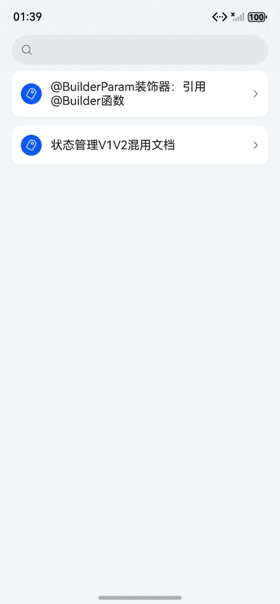
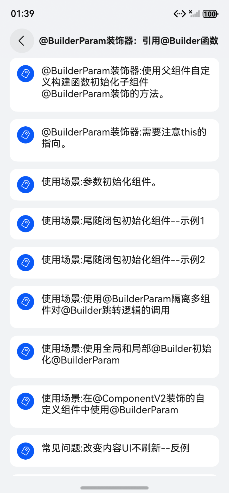
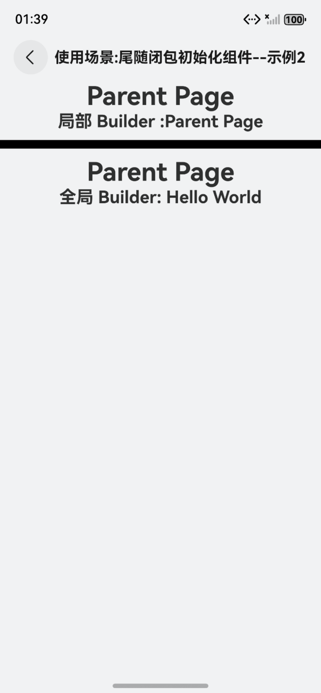

# ArkUI使用组件扩展文档示例

### 介绍

本示例通过使用[ArkUI指南文档](https://gitcode.com/openharmony/docs/tree/master/zh-cn/application-dev/ui)中各场景的开发示例，展示在工程中，帮助开发者更好地理解ArkUI提供的组件及组件属性并合理使用。该工程中展示的代码详细描述可查如下链接：

1. [@BuilderParam装饰器：引用@Builder函数](https://gitcode.com/openharmony/docs/blob/master/zh-cn/application-dev/ui/state-management/arkts-builderparam.md)
2. [状态管理V1V2混用文档](https://gitcode.com/openharmony/docs/blob/master/zh-cn/application-dev/ui/state-management/arkts-v1-v2-mixusage.md)

### 效果预览

| 首页                                 | 列表类组件目录                            | 列表中显示数据示例                            |
|------------------------------------|------------------------------------|------------------------------------|
|  |  |  |

### 使用说明

1. 在主界面，可以点击对应卡片，选择需要参考的组件示例。

2. 在组件目录选择详细的示例参考。

3. 进入示例界面，查看参考示例。

4. 通过自动测试框架可进行测试及维护。

### 工程目录
```
entry/src/main/ets/
|---ParadigmStateRestock
|---pages
|   |---builderParam                		// @BuilderParam装饰器：引用@Builder函数
|   |       |---BuilderParamInitMethod.ets
|   |       |---BuilderParamInitMethodDemo01.ets
|   |       |---BuilderParamInitMethodDemo02.ets
|   |       |---BuilderParamProblemCombinedPositive.ets
|   |       |---BuilderParamProblemMustBuilderPositive.ets
|   |       |---BuilderParamProblemNotRefreshOpposite.ets
|   |       |---BuilderParamProblemNotRefreshPositive.ets
|   |       |---BuilderParamSceneGlobalLocalInit.ets
|   |       |---BuilderParamSceneInComponentV2.ets
|   |       |---BuilderParamSceneInitComponent.ets
|   |       |---BuilderParamSceneJumpLogic.ets
|   |       |---BuilderParamSceneTrailingClosure01.ets
|   |       |---BuilderParamSceneTrailingClosure02.ets
|   |       |---helloworld.ets
|   |       |---index.ets
|   |---mixedStateManageV1V2                       // 状态管理V1V2混用文档 
|   |       |---StateManageMixedParadigmV1ToV2.ets
|   |       |---StateManageMixedParadigmV2ToV1.ets
|   |       |---StateMixedSceneBuiltTypeV1V2NotRecommend.ets
|   |       |---StateMixedSceneBuiltTypeV1V2Recommend.ets
|   |       |---StateMixedSceneBuiltTypeV2V1NotRecommend.ets
|   |       |---StateMixedSceneBuiltTypeV2V1Recommend.ets
|   |       |---StateMixedSceneJsV1V2NotRecommend.ets
|   |       |---StateMixedSceneJsV1V2Recommend.ets
|   |       |---StateMixedSceneJsV2V1NotRecommend.ets
|   |       |---StateMixedSceneJsV2V1Recommend.ets
|   |       |---StateMixedSceneNestedTypeV1V2.ets
|   |       |---StateMixedSceneNestedTypeV2V1.ets
|   |       |---StateMixedSceneObservedClassV1V2.ets
|   |       |---StateMixedSceneObservedClassV2V1.ets
|   |       |---StateMixedSceneTwoBitArrayV1V2.ets
|   |       |---StateMixedSceneTwoBitArrayV2V1.ets
|   |       |---index.ets 
|---pages
|   |---Index.ets                       // 应用主页面
entry/src/ohosTest/
|---ets
|   |---Ability.test.ets                       
|   |---BuilderParam.test.ets                       
|   |---List.test.ets                    
|   |---MixedStateManageV1V2.test.ets                       
```
### 具体实现

### 状态管理V1V2混用

1. **初始化机制**：@BuilderParam装饰的变量只能由@Builder装饰的函数初始化，支持使用组件内部自定义构建函数、全局@Builder函数或父组件的@Builder函数进行赋值，确保构建逻辑的一致性。
2. **参数传递与类型匹配**：支持有参或无参的@Builder方法，要求传递的@Builder函数与@BuilderParam变量的参数类型严格匹配，例如有参的@BuilderParam需需对应接收带相同参数结构的@Builder函数。
3. **尾随闭包使用**：子组件有且仅有一个@BuilderParam时，可通过尾随闭包（组件后紧跟`{}`）初始化，闭包内容将被视为@Builder函数传递，且此场景下组件不支持通用属性。
4. **this指向控制**：直接传递@Builder函数时，this指向子组件；通过箭头函数包裹传递时，this指向宿主组件（如父组件），可通过此特性控制构建逻辑中变量的访问范围。
5. **联合装饰与限制**：与@Require联合使用时，@BuilderParam必须从外部初始化；禁止使用非@Builder类型（如@State变量）赋值，否则会触发编译错误，确保类型安全。

### @BuilderParam装饰器

1. **校验规则调整（API 19+）**：仅保留“V1装饰器与@ObservedV2同时使用报错”的限制，放开“V2装饰器与@Observed混用”“V1->V2传递复杂类型（普通class、Array等）”“V2->V1传递built-in类型”等限制，降低跨版本数据传递门槛。
2. **新增接口能力实现**：`makeV1Observed`将普通class、Array等不可观察对象包装为V1可观察对象（等效@Observed），支持初始化@ObjectLink；`enableV2Compatibility`递归为V1状态变量开启V2观察能力，确保V1变量在@ComponentV2中能响应变化，二者常搭配实现V2->V1数据联动。
3. **V1->V2数据传递实现**：V1状态变量（如@State修饰的@Observed类、Array）需调用`enableV2Compatibility`后传递给V2的@Param，确保V2能观察到V1变量的属性变化（如类属性修改、Array的API调用），避免因观察能力不一致导致UI不刷新。
4. **V2->V1数据传递实现**：V2的@Local变量需先通过`makeV1Observed`包装为V1可观察对象，再调用`enableV2Compatibility`拉齐观察能力，最终传递给V1的@ObjectLink或@State，确保V1能正常响应V2变量的变化（如嵌套类属性修改、二维数组项更新）。
5. **特殊场景适配实现**：对二维数组、嵌套类等复杂结构，需通过`makeV1Observed`逐层处理内层数据（如二维数组的内层数组），再结合`enableV2Compatibility`确保跨版本传递时，各层级数据的变化都能被双方观察到，同时避免V1和V2双重代理导致的性能问题。
### 相关权限

不涉及。

### 依赖

不涉及。

### 约束与限制

1.本示例仅支持标准系统上运行, 支持设备：RK3568。

2.本示例为Stage模型，支持API20版本full-SDK，版本号：6.0.0.107，镜像版本号：OpenHarmony_6.0.0.47 Release。

3.本示例需要使用DevEco Studio 6.0.0.858 Release (Build Version: 5.0.13.200， built on May 13, 2025)及以上版本才可编译运行。

### 下载

如需单独下载本工程，执行如下命令：

````
git init
git config core.sparsecheckout true
code/DocsSample/ArkUISample/ParadigmStateRestock > .git/info/sparse-checkout
git remote add origin https://gitcode.com/openharmony/applications_app_samples.git
git pull origin master
````