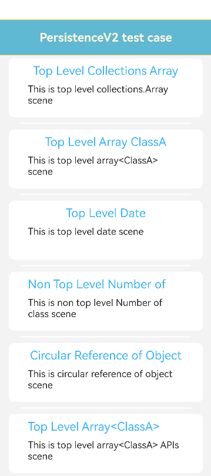
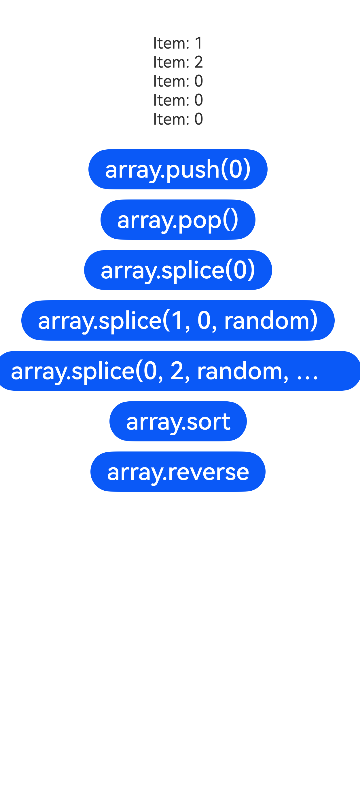

# PersistenceV2 API：PersistenceV2持久化能力增强

## 介绍

PersistenceV2提供状态变量持久化能力，开发者可以通过globalConnect绑定同一个key，在状态变量变化和应用冷启动时，实现持久化能力。在API version 23之前，不支持@Sendable，
collections.Set、collections.Map等容器类型的数据。API version 23之后，支持@Sendable及容器类型的数据持久化，解除单个key只能持久化8K数据的限制，提升开发者的易用。

以下是在PersistenceV2在不同场景中的代码示例及结果说明。

## 工程目录
```
entry/src/main/ets/
├── common
│   └── resource.ets
├── entryability
│   └── EntryAbility.ets
├── entrybackupability
│   └── EntryBackupAbility.ets
└── pages
    ├── CircularReferenceOfObject.ets        // PersistenceV2持久化循环引用对象场景
    ├── Index.ets                            // 页面入口
    ├── NonTopLevelNumberOfClass.ets         // PersistenceV2持久化自定义class中属性为Number场景
    ├── TopLevelArrayClassA.ets              // PersistenceV2持久化Array<ClassA>场景
    ├── TopLevelArrayClassAAPIs.ets          // PersistenceV2持久化Array<ClassA>, 测试各种Array API的场景
    ├── TopLevelCollectionsArray.ets         // PersistenceV2持久化collections.Array<ClassA>的场景          
    ├── TopLevelDate.ets                     // PersistenceV2持久化Date的场景          
entry/src/ohosTest/
├── ets
│   └── test
│       ├── Ability.test.ets
│       ├── PersistenceV2.test.ets      // 测试用例代码
│       └── List.test.ets
└── module.json5
```

## 具体实现

1、从Index页面选择一个使用场景，点击进入。
2、点击页面内test按钮， 进入界面， 杀掉应用，然后再进入，观察界面上的数据是否持久化成功。

## 运行示意图




## 相关权限

不涉及。

## 依赖

不涉及。

## 约束与限制

1.本示例仅支持标准系统上运行, 支持设备：RK3568。

2.本示例为Stage模型，支持API23版本SDK，版本号：6.0.2.23，镜像版本号：OpenHarmony_6.1.0.25。

3.本示例需要使用DevEco Studio 6.0.0 Release (Build Version: 6.0.0.858， built on September 24, 2025)及以上版本才可编译运行。

## 下载

如需单独下载本工程，执行如下命令：

````
git init
git config core.sparsecheckout true
echo code/DocsSample/ArkUISample/PersistenceV2 > .git/info/sparse-checkout
git remote add origin https://gitcode.com/openharmony/applications_app_samples.git
git pull origin master
````