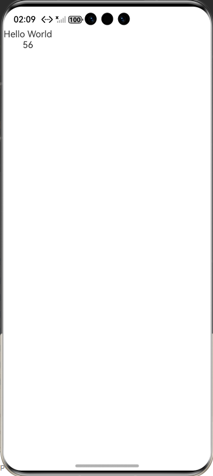
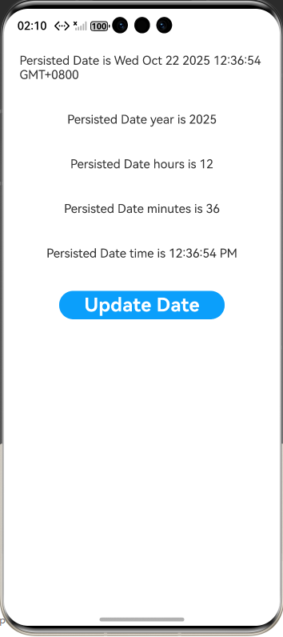
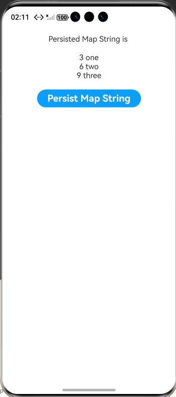

# arkts-persiststorage

## 介绍

本示例展示了PersistentStorage使用，PersistentStorage将选定的AppStorage属性保留在设备磁盘上。应用程序通过API，以决定哪些属性应借助PersistentStorage持久化。PersistentStorage和AppStorage中的属性建立了双向同步，UI和业务逻辑不直接访问PersistentStorage中的属性，所有属性访问都是对AppStorage的访问，AppStorage中的更改会自动同步到PersistentStorage。

PersistentStorage的存储路径为module级别，即哪个module调用了PersistentStorage，数据副本存入对应module的持久化文件中。如果多个module使用相同的key，则数据归属到最先使用PersistentStorage的module里。

PersistentStorage的存储路径在应用第一个ability启动时就已确定，为该ability所属的module。如果一个ability调用了PersistentStorage，并且该ability能被不同的module拉起，那么ability存在多少种启动方式，就会有多少份数据副本。

PersistentStorage功能上耦合了AppStorage，并且数据在不同module中使用也会有问题，因此推荐开发者使用PersistenceV2的globalConnect接口替换掉PersistentStorage的persistProp接口。PersistentStorage向PersistenceV2迁移的方案见PersistentStorage->PersistenceV2。

[PersistentStorage：持久化存储UI状态](https://gitcode.com/openharmony/docs/blob/master/zh-cn/application-dev/ui/state-management/arkts-persiststorage.md)。

## 效果预览

| 首页                                                 | CustomDialogController_CAPI页面                       | OpenCustomDialog_CAPI页面                            |
|----------------------------------------------------|-----------------------------------------------------|----------------------------------------------------|
|  |  |  |

## 使用说明

1. 安装编译生成的hap包，并打开应用；
2. 首页面会出现页面列表，点击此列表项进入对应页面示例界面；

## 工程目录

```
PersistentStorage
entry
└── src
    ├── main
    │   ├── ets
    │   │   ├── entryability
    │   │   │   └── EntryAbility.ets
    │   │   ├── entrybackupability
    │   │   │   └── EntryBackupAbility.ets
    │   │   └── pages
    │   │       ├── Index.ets
    │   │       ├── PageFivePersistedDate.ets //示例5;持久化Date类型变量
    │   │       ├── PageFourMessageChange.ets //示例4：持久化联合类型变量
    │   │       ├── PageOneMessageStorage.ets //示例1：从AppStorage中访问PersistentStorage初始化的属性
    │   │       ├── PageSevenPersistedSet.ets //示例7：持久化Set类型变量
    │   │       ├── PageSixPersistedMap.ets //示例6：持久化Map类型变量
    │   │       ├── PageThreeAppStorage.ets //示例3:在PersistentStorage之后访问AppStorage中的属性
    │   │       └── PageTowPersistentStorage.ets //示例2：应用退出时会保存当前结果。重新启动后，会显示上一次的保存结果
    │   ├── module.json5
    │   └── resources
    │       ├── base
    │       │   ├── element
    │       │   │   ├── color.json
    │       │   │   ├── float.json
    │       │   │   └── string.json
    │       │   ├── media
    │       │   │   ├── background.png
    │       │   │   ├── foreground.png
    │       │   │   ├── layered_image.json
    │       │   │   └── startIcon.png
    │       │   └── profile
    │       │       ├── backup_config.json
    │       │       └── main_pages.json
    │       ├── dark
    │       │   └── element
    │       │       └── color.json
    │       └── rawfile
    ├── mock
    │   └── mock-config.json5
    ├── ohosTest
    │   ├── ets
    │   │   └── test
    │   │       ├── Ability.test.ets
    │   │       ├── Index.test.ets
    │   │       └── List.test.ets
    │   ├── module.json5
    │   └── ohosTest.md
    └── test
        ├── List.test.ets
        └── LocalUnit.test.ets


```
## 具体实现

1. 基础类型持久化实现：在 Ability 的onWindowStageCreate生命周期中，待loadContent回调确认 UI 实例初始化成功后，调用PersistentStorage.persistProp('baseNum', 47)初始化持久化属性；组件内通过@StorageLink('baseNum') baseNum: number = 48与 AppStorage 双向绑定，修改baseNum时会自动同步到 AppStorage，进而触发 PersistentStorage 将新值写入磁盘，重启应用后会优先读取磁盘中保存的值，而非组件默认值 48。
2. Date 类型持久化实现：Ability 层初始化时调用PersistentStorage.persistProp('persistDate', new Date())持久化当前时间；组件内用@StorageLink('persistDate') persistDate: Date = new Date()绑定属性，通过persistDate.setTime(Date.now())等 Date 原生方法修改时间，框架会检测到 Date 对象变化并同步到磁盘，重启后组件展示的仍是上次修改后的时间，而非重新创建的新 Date 对象。
3. Map 类型持久化实现：Ability 层以PersistentStorage.persistProp('persistMap', new Map<number, string>([]))初始化空 Map；组件内通过@StorageLink('persistMap') persistMap: Map<number, string> = new Map()绑定，调用persistMap.set(key, val)添加键值对、persistMap.clear()清空 Map 时，操作会实时同步到磁盘；遍历 Map 需先转为数组Array.from(persistMap.entries())，确保符合 ArkTS 遍历规范，重启后 Map 数据可完整恢复。
4. 初始化顺序避坑实现：严格遵循 “先初始化 PersistentStorage，后操作 AppStorage” 的顺序，在 Ability 的loadContent回调中，先调用PersistentStorage.persistProp('baseNum', 47)读取磁盘值，再通过if (AppStorage.get<number>('baseNum')! > 50) AppStorage.setOrCreate('baseNum', 47)按需修改，避免因先调用AppStorage.setOrCreate创建属性，导致 PersistentStorage 用新创建的默认值覆盖磁盘中保存的历史数据。

## 相关权限

不涉及

## 依赖

不涉及

## 约束和限制

1. 本示例支持标准系统上运行，支持设备：RK3568。

2. 本示例为Stage模型，支持API22版本full-SDK，版本号：6.0.0.47，镜像版本号：OpenHarmony_6.0.0 Release。

3. 本示例已支持使DevEco Studio 6.0.0 Release (Build Version: 6.0.0.858, built on September 24, 2025)及以上版本才可编译运行。

## 下载

如需单独下载本工程，执行如下命令：

```
git init
git config core.sparsecheckout true
echo code/DocsSample/ArkUISample/Prop > .git/info/sparse-checkout
git remote add origin https://gitcode.com/openharmony/applications_app_samples.git
git pull origin master
```
