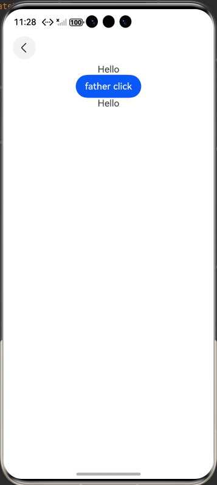
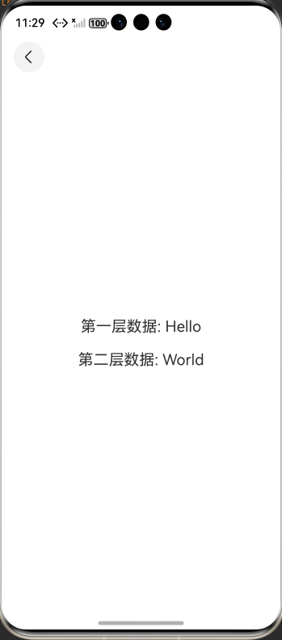

# arkts-prop

## 介绍

本示例展示了如何创建自定义弹窗，设置自定义弹窗的背景颜色、圆角半径、对齐方式、边框颜色、边框样式等功能。
[@Prop装饰器](https://gitcode.com/openharmony/docs/blob/master/zh-cn/application-dev/ui/state-management/arkts-prop.md)。

## 效果预览

| 首页                                              | CustomDialogController_CAPI页面                                  |OpenCustomDialog_CAPI页面                                              |
| ----------------------------------------------------- |--------------------------------------------------------------| ------------------------------------------------------- |
|  |  |  |

## 使用说明

1. 安装编译生成的hap包，并打开应用；
2. 首页面会出现页面列表，点击此列表项进入对应页面示例界面；

## 工程目录

```
ArkTsProp2Samlpe
entry
└── src
    │       ├── main
    │       │   ├── ets
    │       │   │   ├── entryability
    │       │   │   │   └── EntryAbility.ets
    │       │   │   ├── entrybackupability
    │       │   │   │   └── EntryBackupAbility.ets
    │       │   │   └── pages
    │       │   │       ├── Index.ets
    │       │   │       ├── PageEight.ets //示例8：@Prop嵌套场景
    │       │   │       ├── PageEighteen.ets //示例18：@Prop装饰器使用
    │       │   │       ├── PageEleven.ets //示例：装饰Set类型变量使用
    │       │   │       ├── PageFifteen.ets //示例：使用a.b(this.object)形式调用，不会触发UI刷新
    │       │   │       ├── PageFive.ets //示例5：从父组件中的@State类对象属性到@Prop简单类型的同步
    │       │   │       ├── PageFour.ets //示例4：父组件@State数组项到子组件@Prop简单数据类型同步
    │       │   │       ├── PageFourteen.ets //示例14：@Prop需要被初始化，如果没有进行本地初始化的，则必须通过父组件进行初始化
    │       │   │       ├── PageNine.ets //示例9：@Prop嵌套场景的数据结构。
    │       │   │       ├── PageOne.ets  //示例1：@Prop装饰的数据可以观察到以下变化。
    │       │   │       ├── PageSeven.ets //示例7：@Prop本地初始化不和父组件同步
    │       │   │       ├── PageSeventeen.ets //示例17：@Prop嵌套场景使用
    │       │   │       ├── PageSix.ets //示例6：从父组件中的@State类对象属性到@Prop简单类型的同步
    │       │   │       ├── PageSixteen.ets //示例：@Prop嵌套场景
    │       │   │       ├── PageTen.ets //示例10：装饰Map类型变量使用
    │       │   │       ├── PageThirteen.ets //示例13：Prop支持联合类型实例使用
    │       │   │       ├── PageThree.ets//示例3：当装饰的类型是Object或class复杂类型时，可以观察到自身的赋值和第一层的属性的变化。
    │       │   │       ├── PageTow.ets  //示例2：父组件@State到子组件@Prop简单数据类型同步
    │       │   │       └── PageTwelve.ets //示例12：装饰Date类型变量使用
    │       │   ├── module.json5
    │       │   └── resources
    │       │       ├── base
    │       │       │   ├── element
    │       │       │   │   ├── color.json
    │       │       │   │   ├── float.json
    │       │       │   │   └── string.json
    │       │       │   ├── media
    │       │       │   │   ├── background.png
    │       │       │   │   ├── foreground.png
    │       │       │   │   ├── layered_image.json
    │       │       │   │   └── startIcon.png
    │       │       │   └── profile
    │       │       │       ├── backup_config.json
    │       │       │       ├── main_pages.json
    │       │       │       └── router_map.json
    │       │       ├── dark
    │       │       │   └── element
    │       │       │       └── color.json
    │       │       └── rawfile
    │       ├── mock
    │       │   └── mock-config.json5
    │       ├── ohosTest
    │       │   ├── ets
    │       │   │   └── test
    │       │   │       ├── Ability.test.ets
    │       │   │       └── List.test.ets
    │       │   └── module.json5
    │       └── test
    │           ├── List.test.ets
    │           └── LocalUnit.test.ets

```

## 具体实现

1. 简单类型单向同步实现：子组件用@Prop装饰基础类型变量（如@Prop count: number = 0），从父组件@State变量接收初始值；子组件可通过按钮点击等操作本地修改count（如减 1），修改仅作用于子组件，父组件@State变量更新时（如加 1），会覆盖子组件count的本地修改并触发子组件刷新。
2. 数组项同步实现：父组件@State arr: number[] = [1,2,3]，子组件@Prop value: number = 0接收数组项（如Child({ value: this.arr[0] })）；子组件点击修改value不影响父组件数组，父组件替换整个数组（如this.arr = [3,4,5]）时，子组件value会同步更新为新数组对应项，未变更的数组项组件（如值为 3 的项）保持原有状态。
3. 类对象属性同步实现：定义普通类Book（含title、readIt等属性），子组件@Prop book: Book = new Book('', 0)接收父组件@State book实例；子组件点击标记book.readIt = true（标记已读），修改不回传父组件，父组件更新book属性时，子组件@Prop会同步刷新，多子组件接收同一父组件book实例时，各自修改互不干扰。
4. Map 类型同步实现（API 11+）：子组件@Prop value: Map<number, string> = new Map([[0,'a']])接收父组件@State Map；子组件可通过set（添加键值对）、clear（清空）、delete（删除键）等方法修改 Map，也可直接赋值新 Map，父组件修改 Map 时会同步到子组件，双方修改均能触发 UI 刷新，通过ForEach遍历 Map 项展示变化。
5. Set 类型同步实现（API 11+）：子组件@Prop message: Set<number> = new Set([0,1,2])接收父组件@State Set；子组件通过add（新增元素）、clear（清空）、delete（删除元素）修改 Set，父组件更新 Set 时同步到子组件，用ForEach遍历 Set 项（需转为数组Array.from(this.message.entries())），实时展示 Set 的变化。
6. Date 类型同步实现：子组件@Prop selectedDate: Date = new Date('')接收父组件@State parentSelectedDate；子组件可通过setFullYear（修改年份）、setDate（修改日期）或直接赋值新 Date（如this.selectedDate = new Date('2023-09-09')）修改日期，父组件修改日期时同步到子组件，双方修改均能通过DatePicker组件实时展示。
7. 联合类型同步实现（API 11+）：定义类Animals，子组件@Prop animal: Animals | undefined接收父组件@State animal（初始为new Animals('lion')）；子组件可点击将animal设为new Animals('Tiger')或undefined，父组件修改animal属性（如this.animal.name = 'Dog'）或设为undefined时，子组件会同步刷新，通过文本展示animal的类型或属性。
8. 嵌套类同步实现：嵌套类每层用@Observed装饰（如@Observed class Son、@Observed class Father，Father含Son类型属性）；子组件@Prop child: Son = new Son('')接收父组件@State person: Father的son属性；父组件修改this.person.son.title = 'ArkUI'时，子组件child能感知变化并刷新，子组件点击修改child.title不回传父组件。
9. 本地初始化与父组件传值控制实现：@Prop无本地初始化（如@Prop customCounter: number）时，必须从父组件传值（如MyComponent({ customCounter: this.mainCounter })）；有本地初始化（如@Prop customCounter2: number = 5）时，父组件可传值也可不传，传值会覆盖本地初始化值，子组件本地修改customCounter2不影响父组件。
10. 避免属性修改不刷新实现：当@Prop装饰对象类型时，避免直接用a.b(this.object)形式修改属性（如静态方法Score.changeScore1(this.score)），此类操作无法触发 UI 刷新；需先将@Prop对象赋值给临时变量（如let score1 = this.score），再通过临时变量修改属性（如Score.changeScore1(score1)），让对象带上 Proxy 代理，确保修改能触发 UI 刷新。

## 相关权限

不涉及

## 依赖

不涉及

## 约束和限制

1. 本示例支持标准系统上运行，支持设备：RK3568。

2. 本示例为Stage模型，支持API22版本full-SDK，版本号：6.0.0.47，镜像版本号：OpenHarmony_6.0.0 Release。

3. 本示例需要使用DevEco Studio 6.0.0 Release (Build Version: 6.0.0.858, built on September 24, 2025)及以上版本才可编译运行。

## 下载

如需单独下载本工程，执行如下命令：

```
git init
git config core.sparsecheckout true
echo code/DocsSample/ArkUISample/Prop > .git/info/sparse-checkout
git remote add origin https://gitcode.com/openharmony/applications_app_samples.git
git pull origin master
```
