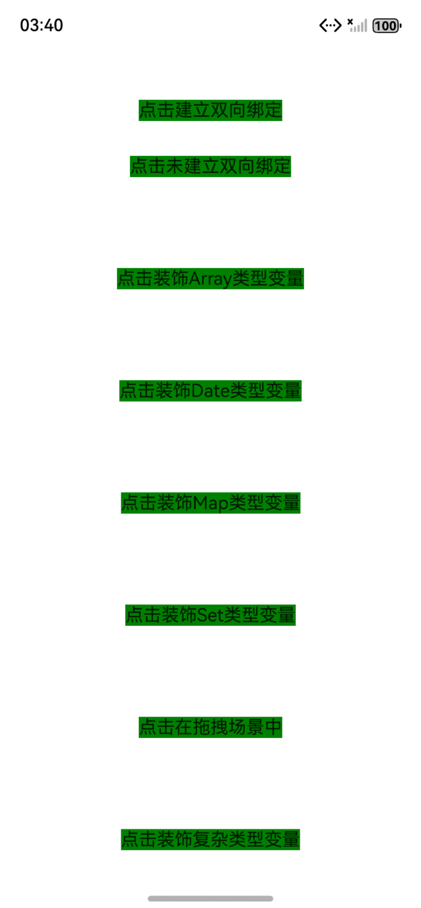
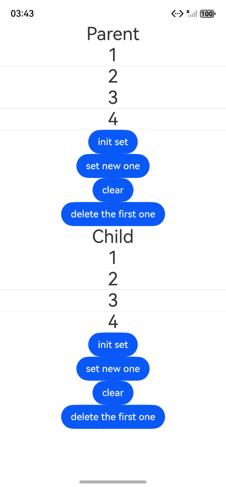

# @Provider装饰器和@Consumer装饰器：跨组件层级双向同步

### 介绍

@Provider和@Consumer用于跨组件层级数据双向同步，可以使得开发者不用拘泥于组件层级。

@Provider和@Consumer属于状态管理V2装饰器，所以只能在@ComponentV2中才能使用，在@Component中使用会编译报错。

1. [@Provider装饰器和@Consumer装饰器：跨组件层级双向同步](https://gitcode.com/openharmony/docs/blob/master/zh-cn/application-dev/ui/state-management/arkts-new-provider-and-consumer.md)

使用说明：
1. 该工程可以选择在模拟器和开发板上运行。
2. 点击构建，即可在生成的应用中点击对应的按钮，观察自定义占位节点的不同应用。
3. 进入”DocsSample/ArkUISample/ProviderConsumer/entry/src/ohosTest/ets/test/index.test.ets“文件，可以对本项目进行UI的自动化测试。
### 效果预览

| 首页                                 | 列表类组件目录                            |
|------------------------------------|------------------------------------|
|  |  |

### 使用说明

1. 在主界面，可以点击对应卡片，选择需要参考的组件示例。

2. 在组件目录选择详细的示例参考。

3. 进入示例界面，查看参考示例。

4. 通过自动测试框架可进行测试及维护。

### 工程目录
```
entry/src/main/ets/
|---entryability
|---homePage
|   |---BuilderNode.ets                    @Consumer在跨BuilderNode场景下和@Provider建立双向同步过程
|   |---CodeFirst.ets                      点击第一段代码
|   |---CodeSecond.ets                     点击第二段代码
|   |---CodeThree.ets                      点击第三段代码
|   |---DecorativeArray.ets                点击装饰Array类型变量
|   |---DecorativeComplex.ets              点击装饰复杂类型变量
|   |---DecorativeDate.ets                 点击装饰Date类型变量
|   |---DecorativeInitialized.ets          点击@Provider和@Consumer装饰的变量可以初始化子组件中@Param装饰的变量
|   |---DecorativeMap.ets                  点击装饰Map类型变量
|   |---DecorativeSet.ets                  点击装饰Set类型变量
|   |---DragDrop.ets                       点击在拖拽场景中
|   |---NoTwowayBinding.ets                点击未建立双向绑定
|   |---ProviderSame.ets                   点击@Provider重名时
|   |---TwowayBinding.ets                  点击未建立双向绑定
|---pages
|   |---Index.ets                       // 应用主页面
entry/src/ohosTest/
|---ets
|   |---index.test.ets                 // 示例代码测试代码
```
### 具体实现

1. 父组件（@ComponentV2）中用@Provider() count: number = 0定义状态（属性名count为默认 key）；
2. 子组件（@ComponentV2）中用@Consumer() count: number = 0声明消费，属性名count与父组件匹配，自动关联父组件的count；
3. 父 / 子组件中添加交互（如按钮点击）修改this.count，验证双向同步：父组件修改后子组件 UI 更新，子组件修改后父组件 UI 也更新。

### 相关权限

不涉及。

### 依赖

不涉及。

### 约束与限制

1.本示例仅支持标准系统上运行, 支持设备：RK3568。

2.本示例为Stage模型，支持API22版本full-SDK，版本号：6.0.0.47，镜像版本号：OpenHarmony_6.0.0 Release。

3.本示例需要使用DevEco Studio 6.0.0 Release (Build Version: 6.0.0.858, built on September 24, 2025)及以上版本才可编译运行。

### 下载

如需单独下载本工程，执行如下命令：

````
git init
git config core.sparsecheckout true
echo code/DocsSample/ArkUISample/ProviderConsumer > .git/info/sparse-checkout
git remote add origin https://gitcode.com/openharmony/applications_app_samples.git
git pull origin master
````