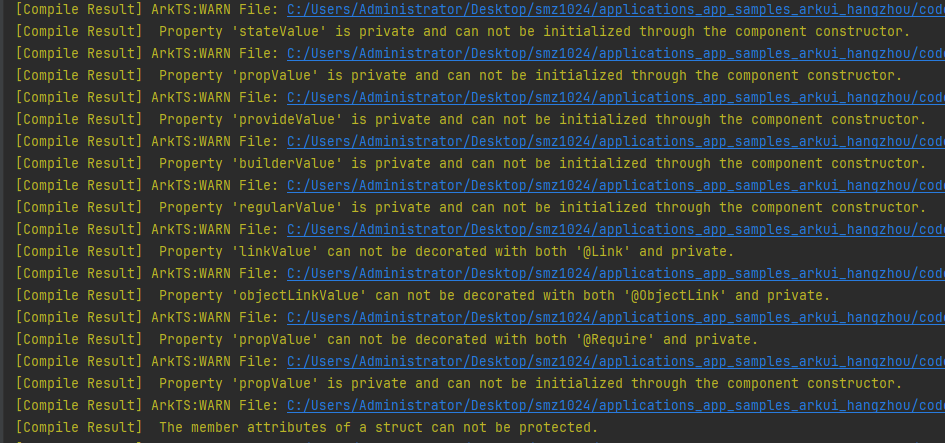

# Restrictions指南文档示例

### 介绍

在状态管理V1版本中，完成自定义组件封装后，调用方难以明确知晓应传入哪些变量作为组件的输入参数。当组件开发者不希望状态变量被外部初始化时，可以使用private限定符来限制当前变量不允许被进行外部初始化。

ArkTS会对自定义组件的成员变量使用的访问限定符private/public/protected进行校验，当不按规范使用访问限定符private/public/protected时，会产生对应的日志信息。

该工程中展示的代码详细描述可查如下链接：
1. [自定义组件成员属性访问限定符使用限制](https://gitcode.com/openharmony/docs/blob/master/zh-cn/application-dev/ui/state-management/arkts-custom-components-access-restrictions.md)。

### 效果预览

| 首页                              |
|---------------------------------|
|  |

### 使用说明

1. 在主界面，可以点击对应卡片，选择需要参考的组件示例。

2. 在组件目录选择详细的示例参考。

3. 进入示例界面，查看参考示例。

4. 通过自动测试框架可进行测试及维护。

### 工程目录
```
entry/src/main/ets/
|---entryability          // 应用入口能力模块：包含EntryAbility，负责应用启动、生命周期管理
|---pages                 // 应用页面模块：存放所有功能页面，按业务模块分类
|   |---linkWithPrivate   // linkWithPrivate权限限制测试模块：验证组件关联时private修饰符的影响
|   |   |---LlinkWithPrivateCorrectCase.ets  // 正确案例页面：组件关联无private修饰符，功能正常
|   |   |---LlinkWithPrivateErrorCase.ets    // 错误案例页面：组件关联加private修饰符，预期输出告警日志
|   |---privateWithLink   // privateWithLink权限限制测试模块：验证@Link/@ObjectLink装饰器加private修饰符的影响
|   |   |---PrivateWithLinkCorrectCase.ets  // 正确案例页面：@Link/@ObjectLink无private修饰符，功能正常
|   |   |---PrivateWithLinkEerrorCase.ets    // 错误案例页面：@Link/@ObjectLink加private修饰符，预期输出告警日志
|   |---privateWithRequire // privateWithRequire权限限制测试模块：验证@Require@Prop装饰器加private修饰符的影响
|   |   |---PrivateWithRequireCorrectCase.ets // 正确案例页面：@Require@Prop无private修饰符，功能正常
|   |   |---PrivateWithRequireErrorCase.ets   // 错误案例页面：@Require@Prop加private修饰符，预期输出告警日志
|   |---protectedInStruct  // protectedInStruct权限限制测试模块：验证组件属性加protected修饰符的影响
|   |   |---ProtectedInStructCorrectCase.ets // 正确案例页面：组件属性无protected修饰符，功能正常
|   |   |---ProtectedInStructErrorCase.ets   // 错误案例页面：组件属性加protected修饰符，预期输出告警日志
|   |---publicWithStorageProp // publicWithStorageProp权限限制测试模块：验证存储相关装饰器加public修饰符的影响
|   |   |---PublicWithStoragePropCorrectCase.ets // 正确案例页面：@LocalStorageProp等无public修饰符，功能正常
|   |   |---PublicWithStoragePropErrorCase.ets   // 错误案例页面：@LocalStorageProp等加public修饰符，预期输出告警日志
|   |---Index.ets           // 应用主页面：提供所有测试模块的导航入口，点击对应文本跳转到目标测试页面
entry/src/ohosTest/
|---ets
|   |---test               // 自动化测试模块：存放所有页面的UI自动化测试代码，与pages目录模块一一对应
|   |   |---LinkWithPrivate.test.ets           // linkWithPrivate模块测试代码：验证LlinkWithPrivateCorrectCase/EerrorCase页面跳转及功能
|   |   |---PrivateWithLink.test.ets           // privateWithLink模块测试代码：验证PrivateWithLinkCorrectCase/EerrorCase页面跳转及功能（原重复标注已修正）
|   |   |---PrivateWithRequire.test.ets        // privateWithRequire模块测试代码：验证PrivateWithRequireCorrectCase/ErrorCase页面跳转及功能
|   |   |---ProtectedInStruct.test.ets         // protectedInStruct模块测试代码：验证ProtectedInStructCorrectCase/ErrorCase页面跳转及功能
|   |   |---PublicWithStorgeProp.test.ets      // publicWithStorageProp模块测试代码（文件名拼写修正：Storge→Storage）：验证PublicWithStoragePropCorrectCase/ErrorCase页面跳转及功能
```

### 具体实现
1. linkWithPrivate 权限限制

正确案例功能封装在 LlinkWithPrivateCorrectCase，源码参考：[LlinkWithPrivateCorrectCase.ets](https://gitcode.com/openharmony/applications_app_samples/blob/master/code/DocsSample/ArkUISample/Restrictions/entry/src/main/ets/pages/linkWithPrivate/LlinkWithPrivateCorrectCase.ets)
* 组件关联配置：父组件通过属性传递方式与子组件建立数据关联，子组件的关联属性未添加 private 修饰符，遵循组件间数据传递规范。
* 状态管理逻辑：父组件使用 @State 修饰核心状态变量，确保状态变更可驱动 UI 刷新，子组件通过常规参数接收状态，实现父子组件状态同步。
* 页面布局设计：父组件采用 Column 布局承载子组件，设置合适的宽高占比确保页面适配，子组件聚焦核心内容渲染，布局简洁清晰。
* 功能验证要点：组件间数据传递无阻塞，页面正常渲染 Hello 文本，无任何权限相关告警日志输出。

错误案例功能封装在 LlinkWithPrivateErrorCase，源码参考：[LlinkWithPrivateErrorCase.ets](https://gitcode.com/openharmony/applications_app_samples/blob/master/code/DocsSample/ArkUISample/Restrictions/entry/src/main/ets/pages/linkWithPrivate/LlinkWithPrivateErrorCase.ets)
* 组件关联配置：父子组件数据传递逻辑与正确案例一致，但子组件的关联属性添加 private 修饰符，触发权限限制校验。
* 状态管理逻辑：父组件状态定义与传递方式不变，子组件虽添加 private 修饰符，但仍可正常接收父组件状态，确保基础功能可用。
* 页面布局设计：保持与正确案例一致的布局结构，Column 布局承载子组件，页面适配效果无差异，核心内容渲染位置统一。
* 功能验证要点：页面正常渲染 Hello 文本，系统输出 private 修饰符使用不当的告警日志，权限限制机制生效。

2. privateWithLink 权限限制

正确案例功能封装在 PrivateWithLinkCorrectCase，源码参考：[LlinkWithPrivateCorrectCase.ets](https://gitcode.com/openharmony/applications_app_samples/blob/master/code/DocsSample/ArkUISample/Restrictions/entry/src/main/ets/pages/privateWithLink/PrivateWithLinkCorrectCase.ets)
* 装饰器组合配置：子组件使用 @Link 修饰字符串类型状态、@ObjectLink 修饰自定义对象类型状态，未添加 private 修饰符。
* 自定义类设计：定义 @Observed 装饰的 PrivateComponentObj 类，封装 count 状态变量，支持 @ObjectLink 装饰器的双向绑定功能。
* 页面渲染逻辑：父组件通过 @State 定义 linkValue 字符串和 objectLinkValue 对象，传递给子组件后，子组件渲染 Hello 文本，状态同步正常。
* 功能验证要点：@Link 和 @ObjectLink 装饰器正常实现数据双向绑定，修改父 / 子组件状态可同步刷新，无权限相关告警。

错误案例功能封装在 PrivateWithLinkEerrorCase，源码参考：[LlinkWithPrivateCorrectCase.ets](https://gitcode.com/openharmony/applications_app_samples/blob/master/code/DocsSample/ArkUISample/Restrictions/entry/src/main/ets/pages/privateWithLink/PrivateWithLinkEerrorCase.ets)
* 装饰器组合配置：子组件的 @Link 和 @ObjectLink 修饰属性均添加 private 修饰符，与装饰器功能产生冲突，触发系统告警。
* 自定义类设计：沿用正确案例的 @Observed 装饰 PrivateComponentObj 类，对象结构与状态变量定义不变，确保案例对比的一致性。
* 页面渲染逻辑：父组件状态传递逻辑不变，子组件接收状态后正常渲染 Hello 文本，基础功能不受修饰符影响。
* 功能验证要点：页面渲染正常，系统输出 @Link/@ObjectLink 与 private 修饰符冲突的告警日志，验证权限限制的准确性。

3. privateWithRequire 权限限制

正确案例功能封装在 PrivateWithRequireCorrectCase，源码参考：[LlinkWithPrivateCorrectCase.ets](https://gitcode.com/openharmony/applications_app_samples/blob/master/code/DocsSample/ArkUISample/Restrictions/entry/src/main/ets/pages/privateWithRequire/PrivateWithRequireCorrectCase.ets)
* 装饰器组合配置：子组件使用 @Require+@Prop 组合装饰器声明属性，@Require 确保属性必传，@Prop 支持状态单向同步，未添加 private 修饰符。
* 属性传递规范：父组件通过组件参数显式传递 propValue 字符串，符合 @Require 装饰器的必传要求，无参数缺失问题。
* 页面布局设计：父子组件均采用 Column 布局，父组件承载子组件并占满屏幕宽度，子组件居中渲染 Hello 文本，视觉效果统一。
* 功能验证要点：@Require+@Prop 组合装饰器正常工作，属性传递完整、状态同步无误，无权限告警日志输出。

错误案例功能封装在 PrivateWithRequireErrorCase，源码参考：[LlinkWithPrivateCorrectCase.ets](https://gitcode.com/openharmony/applications_app_samples/blob/master/code/DocsSample/ArkUISample/Restrictions/entry/src/main/ets/pages/privateWithRequire/PrivateWithRequireErrorCase.ets)
* 装饰器组合配置：子组件的 @Require+@Prop 组合装饰器属性添加 private 修饰符，破坏装饰器原有功能逻辑，触发系统告警。
* 属性传递规范：父组件保持必传参数的传递逻辑，参数类型与格式和正确案例一致，确保测试场景的单一变量性。
* 页面布局设计：布局结构与正确案例完全一致，父子组件宽高配置、文本样式无差异，避免布局影响功能验证。
* 功能验证要点：页面正常渲染 Hello 文本，系统输出 @Require+@Prop 与 private 修饰符冲突的告警日志，权限限制机制有效。

4. protectedInStruct 权限限制

正确案例功能封装在 ProtectedInStructCorrectCase，源码参考：[LlinkWithPrivateCorrectCase.ets](https://gitcode.com/openharmony/applications_app_samples/blob/master/code/DocsSample/ArkUISample/Restrictions/entry/src/main/ets/pages/protectedInStruct/ProtectedInStructCorrectCase.ets)
* 组件属性配置：子组件的 regularValue 属性为默认公有属性，未添加 protected 修饰符，支持父组件直接传递参数。
* 页面渲染逻辑：父组件通过组件参数向子组件传递 regularValue 字符串，子组件接收后渲染 Hello 文本，参数传递无阻碍。
* 访问权限设计：默认公有属性允许跨组件访问，符合组件间数据交互的常规场景，无权限访问限制。
* 功能验证要点：页面正常渲染核心文本，属性传递顺畅，无任何权限相关告警，功能符合预期。

错误案例功能封装在 ProtectedInStructErrorCase，源码参考：[LlinkWithPrivateCorrectCase.ets](https://gitcode.com/openharmony/applications_app_samples/blob/master/code/DocsSample/ArkUISample/Restrictions/entry/src/main/ets/pages/protectedInStruct/ProtectedInStructErrorCase.ets)
* 组件属性配置：子组件的 regularValue 属性添加 protected 修饰符，限制跨组件访问权限，触发系统告警。
* 页面渲染逻辑：父组件参数传递逻辑不变，子组件虽添加 protected 修饰符，但仍可接收参数并渲染 Hello 文本，基础功能正常。
* 访问权限设计：protected 修饰符本应限制外部访问，此处用于验证组件属性的权限限制机制，场景设计贴合测试需求。
* 功能验证要点：页面渲染正常，系统输出组件属性使用 protected 修饰符的告警日志，权限限制校验生效。

5.publicWithStorageProp 权限限制

正确案例功能封装在 PublicWithStoragePropCorrectCase，源码参考：[LlinkWithPrivateCorrectCase.ets](https://gitcode.com/openharmony/applications_app_samples/blob/master/code/DocsSample/ArkUISample/Restrictions/entry/src/main/ets/pages/publicWithStorageProp/PublicWithStoragePropCorrectCase.ets)
* 存储装饰器配置：子组件使用 @LocalStorageProp、@LocalStorageLink、@StorageProp、@StorageLink 四种存储装饰器，未添加 public 修饰符（默认公有）。
* 状态传递设计：父组件通过 @Provide 装饰器提供 consumeValue 状态，子组件通过 @Consume 装饰器接收，实现跨组件状态共享。
* 存储数据关联：装饰器分别关联本地存储和全局存储的键值对，支持数据持久化与多组件共享，状态变更可同步刷新 UI。
* 功能验证要点：存储装饰器正常工作，数据持久化与状态同步无误，@Provide/@Consume 跨组件通信正常，无权限告警。

错误案例功能封装在 PublicWithStoragePropErrorCase，源码参考：[LlinkWithPrivateCorrectCase.ets](https://gitcode.com/openharmony/applications_app_samples/blob/master/code/DocsSample/ArkUISample/Restrictions/entry/src/main/ets/pages/publicWithStorageProp/PublicWithStoragePropErrorCase.ets)
* 存储装饰器配置：子组件的四种存储装饰器属性及 @Consume 属性均添加 public 修饰符，与装饰器默认公有特性冲突，触发告警。
* 状态传递设计：保持与正确案例一致的 @Provide/@Consume 跨组件通信逻辑，确保状态传递机制不受修饰符影响。
* 存储数据关联：存储键值对关联逻辑不变，装饰器仍可正常访问本地 / 全局存储，数据持久化功能正常。
* 功能验证要点：页面正常渲染 Hello 文本，存储功能与跨组件通信正常，系统输出装饰器与 public 修饰符冲突的告警日志，权限限制有效。

### 相关权限

不涉及。

### 依赖

不涉及。

### 约束与限制

1.本示例仅支持标准系统上运行, 支持设备：RK3568。

2.本示例为Stage模型，支持API20版本SDK，版本号：6.0.0.33，镜像版本号：OpenHarmony_6.0.0.33。

3.本示例需要使用DevEco Studio 6.0.0 Canary1 (Build Version: 6.0.0.270， built on May 9, 2025)及以上版本才可编译运行。

### 下载

如需单独下载本工程，执行如下命令：

````
git init
git config core.sparsecheckout true
echo code/DocsSample/ArkUISample/Restrictions > .git/info/sparse-checkout
git remote add origin https://gitcode.com/openharmony/applications_app_samples
git pull origin master
````