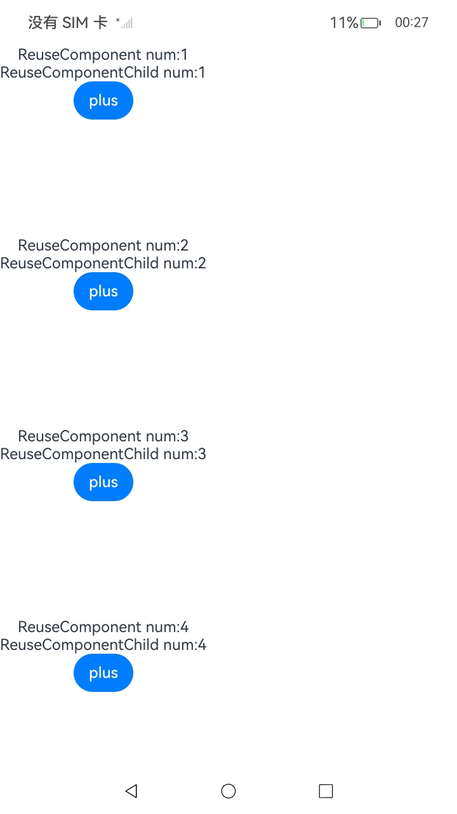
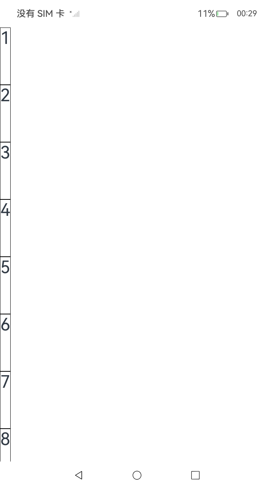
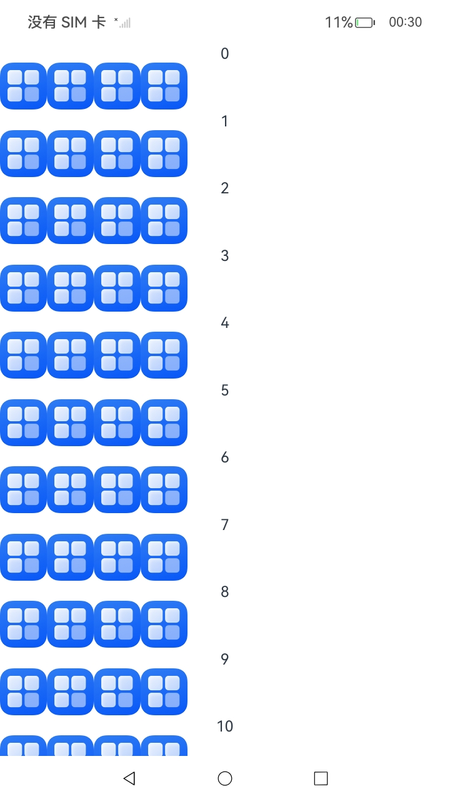
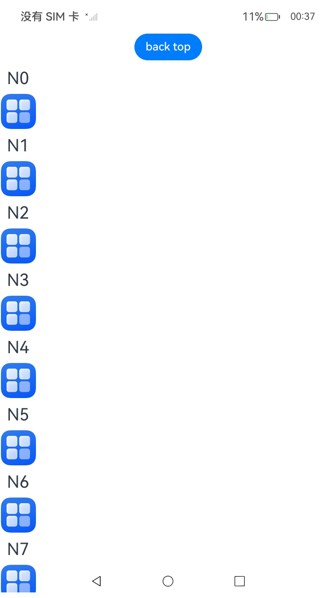
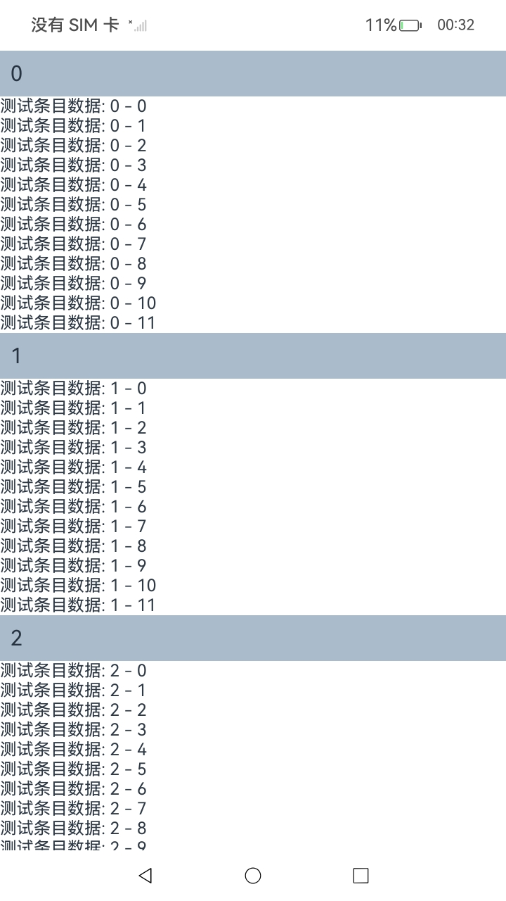
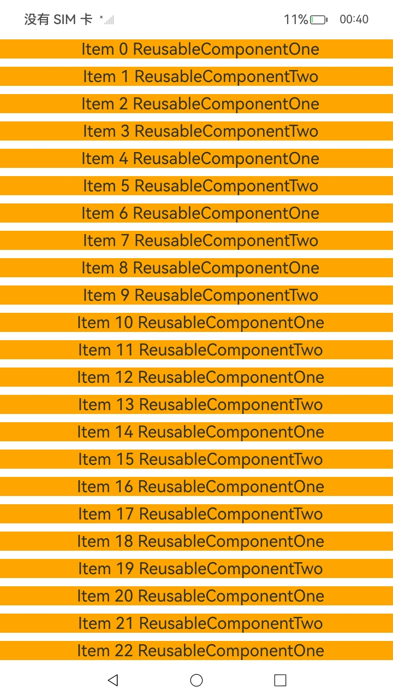
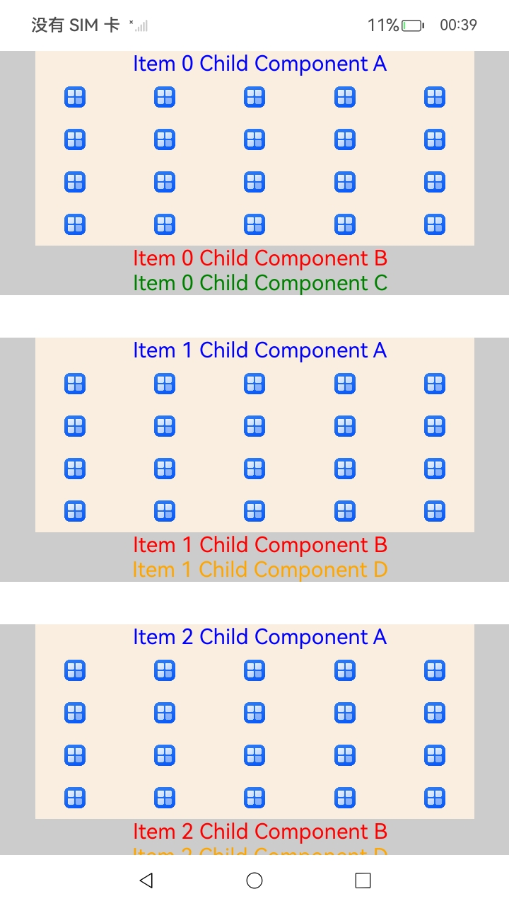

# ArkUI指南文档示例

### 介绍

\@Reusable装饰器标记的自定义组件支持视图节点、组件实例和状态上下文的复用，避免重复创建和销毁，提升性能。

使用\@Reusable装饰器时，表示该自定义组件可以复用。与[\@Component装饰器](arkts-create-custom-components.md#component)结合使用，标记为\@Reusable的自定义组件在从组件树中移除时，组件及其对应的JS对象将被放入复用缓存中。后续创建新自定义组件节点时，将复用缓存中的节点，从而节约组件重新创建的时间。


该工程中展示的代码详细描述可查如下链接：

1. [\@Reusable装饰器：组件复用参考](https://gitcode.com/openharmony/docs/blob/master/zh-cn/application-dev/ui/state-management/arkts-reusable.md)。
### 效果预览

| \@Reusable不支持跟\@ComponentV2搭配使用           |
|--------------------------------------------------|
|  |

|【反例】在子组件的aboutToReuse中，直接修改父组件的状态变量  |
|--------------------------------------------------------|
|            |

| 【正例】在子组件的aboutToReuse中，使用setTimeout，将修改抛出组件复用的作用范围 |
|---------------------------------------------------------------------------|
|                                 |

| ComponentContent不支持传入\@Reusable装饰器装饰的自定义组件|
|--------------------------------------------------------|
| |

| 动态布局更新                              |
|------------------------------------------|
|  |

| 列表滚动配合LazyForEach使用                        |
|---------------------------------------------------|
|  |

| 列表滚动-if使用场景                                 |
|----------------------------------------------------|
|  |

| 列表滚动-Foreach使用场景                        |
|-----------------------------------------------|
|  |

| Grid使用场景                                       |
|---------------------------------------------------|
|  |

| WaterFlow使用场景                                       |
|--------------------------------------------------------|
|  |

| Swiper使用场景                                       |
|-----------------------------------------------------|
|  |

| 列表滚动-ListItemGroup使用场景                              |
|------------------------------------------------------------|
|  |

| 复用组件间存在差异，但类型有限                      |
|--------------------------------------------------|
|  |

| 复用组件间存在多种差异，但通常具备共同的子组件|
|-------------------------------------------|
|  |

### 使用说明

1. 在首页可以查看多种\@Reusable装饰器的使用示例，包括一些基本使用、动态布局更新、列表滚动配合LazyForEach使用、列表滚动-if使用场景、列表滚动-Foreach使用场景、Grid使用场景、WaterFlow使用场景、Swiper使用场景、列表滚动-ListItemGroup使用场景、多种条目类型使用场景、有限变化型和组合型等的示例。

2. 通过自动测试框架可进行测试及维护。

### 工程目录
```
entry/src/main/
|---ets
|   |---pages
|   |   |---Index.ets                                   // 应用主页面
|   |   |---ComponentContentNotSupportReusable.ets      // ComponentContent不支持传入\@Reusable装饰器装饰的自定义组件
|   |   |---DynamicLayoutUpdate.ets                     // 动态布局更新
|   |   |---ListScrollingWithIfStatements.ets           // 列表滚动-if使用场景
|   |   |---ListScrollingWithLazyForEach.ets            // 列表滚动配合LazyForEach使用
|   |   |---ReusableCorrectSample.ets                   // 【正例】在子组件的aboutToReuse中，使用setTimeout，将修改抛出组件复用的作用范围 
|   |   |---ReusableForCustomComponents.ets             // \@Reusable不支持跟\@ComponentV2搭配使用
|   |   |---ReusableForGridUsageScenario.ets            // Grid使用场景
|   |   |---ReusableForListItemGroupUsageScenario.ets   // 列表滚动-ListItemGroup使用场景
|   |   |---ReusableIncorrectSample.ets                 // 【反例】在子组件的aboutToReuse中，直接修改父组件的状态变量
|   |   |---ListScrollingWithForEach.ets                // 列表滚动-Foreach使用场景
|   |   |---ReusableForWaterFlowUsageScenario.ets       // WaterFlow使用场景
|   |   |---ReusableForComposite.ets                    // 复用组件间存在多种差异，但通常具备共同的子组件
|   |   |---ReusableForSwiperUsageScenario.ets          // Swiper使用场景
|   |   |---ReusableForLimitedVariation.ets             // 复用组件间存在差异，但类型有限 
```

### 具体实现

1. \@Reusable不支持跟\@ComponentV2搭配使用，\@ComponentV2组件复用推荐\@ReusableV2装饰器，源码参考：[ReusableForCustomComponents.ets](https://gitcode.com/openharmony/applications_app_samples/blob/master/code/DocsSample/ArkUISample/ReusableComponent/entry/src/main/ets/pages/ReusableForCustomComponents.ets)

    * @Builder加上@Reusable编译报错,不适用于builder。

    * 定义\@build修饰的函数CreativeLoadingDialog

    * 定义\@Component修饰的组件 Crash

    * 定义主页面组件 Index，注册点击事件，当用户点击文本时：创建一个 ComponentContent 实例

2. 被\@Reusable装饰的自定义组件在复用时，会递归调用该自定义组件及其所有子组件的aboutToReuse回调函数。若在子组件的aboutToReuse函数中修改了父组件的状态变量，此次修改将不会生效，请避免此类用法。若需设置父组件的状态变量，可使用setTimeout设置延迟执行，将任务抛出组件复用的作用范围，使修改生效。

    反例：在子组件的aboutToReuse中，直接修改父组件的状态变量。源码参考：[ReusableIncorrectSample.ets](https://gitcode.com/openharmony/applications_app_samples/blob/master/code/DocsSample/ArkUISample/ReusableComponent/entry/src/main/ets/pages/ReusableIncorrectSample.ets)

    * 定义数据源类 IncorrectBasicDataSource 实现 IDataSource

    * 定义主页面组件 IncorrectIndex, 里面调用可复用组件IncorrectReuseComponent

    正例：在子组件的aboutToReuse中，使用setTimeout，将修改抛出组件复用的作用范围。源码参考：[ReusableCorrectSample.ets](https://gitcode.com/openharmony/applications_app_samples/blob/master/code/DocsSample/ArkUISample/ReusableComponent/entry/src/main/ets/pages/ReusableCorrectSample.ets)

    * 定义数据源类 BasicDataSource 实现 IDataSource

    * 定义主页面组件 Index, 里面调用可复用组件ReuseComponent

3. ComponentContent不支持传入\@Reusable装饰器装饰的自定义组件。源码参考：[ComponentContentNotSupportReusable.ets](https://gitcode.com/openharmony/applications_app_samples/blob/master/code/DocsSample/ArkUISample/ReusableComponent/entry/src/main/ets/pages/ComponentContentNotSupportReusable.ets)

    * 定义\@build修饰的函数CreativeLoadingDialog

    * 定义可复用组件 Crash (如果注释掉就可以正常弹出弹窗，如果加上@Reusable就直接crash。)

    * 定义主页面组件 Index，注册点击事件，当用户点击文本时：创建一个 ComponentContent 实例

4. 动态布局更新，重复创建与移除视图可能引起频繁的布局计算，从而影响帧率。采用组件复用可以避免不必要的视图创建与布局计算，提升性能。示例中，将Child自定义组件标记为复用组件，通过Button点击更新Child，触发复用。 源码参考：[DynamicLayoutUpdate.ets](https://gitcode.com/openharmony/applications_app_samples/blob/master/code/DocsSample/ArkUISample/ReusableComponent/entry/src/main/ets/pages/DynamicLayoutUpdate.ets) 

    * 定义Message类.

    * 定义可复用组件组件 Child

    * 定义主页面组件 Index，注册点击事件，触发child修改message

5. 列表滚动配合LazyForEach使用。当应用展示大量数据的列表并进行滚动操作时，频繁创建和销毁列表项视图可能导致卡顿和性能问题。使用列表组件的组件复用机制可以重用已创建的列表项视图，提高滚动流畅度。示例代码将CardView自定义组件标记为复用组件，List上下滑动，触发CardView复用。 源码参考：[ListScrollingWithLazyForEach.ets](https://gitcode.com/openharmony/applications_app_samples/blob/master/code/DocsSample/ArkUISample/ReusableComponent/entry/src/main/ets/pages/ListScrollingWithLazyForEach.ets)

    * 定义数据源类 MyDataSource  实现 IDataSource

    * 定义可复用组件 CardView 

    * 定义主页面组件 ReuseDemo，List上下滑动，触发CardView复用

6. 列表滚动-if使用场景。示例代码将OneMoment自定义组件标记为复用组件。当List上下滑动时，会触发OneMoment的复用。设置reuseId可为复用组件分配复用组，相同reuseId的组件将在同一复用组中复用。单个复用组件无需设置reuseId。使用reuseId标识复用组件，可避免重复执行if语句的删除和重新创建逻辑，提高复用效率和性能。源码参考：[ListScrollingWithIfStatements.ets](https://gitcode.com/openharmony/applications_app_samples/blob/master/code/DocsSample/ArkUISample/ReusableComponent/entry/src/main/ets/pages/ListScrollingWithIfStatements.ets)  

    * 定义组件FriendMoment 

    * 定义可复用组件 OneMoment  

    * 定义数据源类 BasicDataSource 实现 IDataSource

    * 定义数据源类 MyDataSource 继承 BasicDataSource

    * 定义主页面组件 Index，使用reuseId标识复用组件，可避免重复执行if语句的删除和重新创建逻辑

7. 列表滚动-Foreach使用场景。使用Foreach创建可复用的自定义组件，由于Foreach渲染控制语法的全展开属性，导致复用组件无法复用。示例中点击update，数据刷新成功，但滑动列表时，ListItemView无法复用。点击clear，再次点击update，ListItemView复用成功，因为一帧内重复创建多个已被销毁的自定义组件。源码参考：[ListScrollingWithForEach.ets](https://gitcode.com/openharmony/applications_app_samples/blob/master/code/DocsSample/ArkUISample/ReusableComponent/entry/src/main/ets/pages/ListScrollingWithForEach.ets) 

    * 定义数据源类 BasicDataSource 实现 IDataSource

    * 定义可复用组件 ListItemView  

    * 定义\@Observed修饰的组件 ListItemObject 

    * 定义主页面组件 Index 展示列表

8. Grid使用场景。示例中使用@Reusable装饰器修饰GridItem中的自定义组件ReusableChildComponent，即表示其具备组件复用的能力。源码参考：[ReusableForGridUsageScenario.ets](https://gitcode.com/openharmony/applications_app_samples/blob/master/code/DocsSample/ArkUISample/ReusableComponent/entry/src/main/ets/pages/ReusableForGridUsageScenario.ets)

    * 定义数据源类 MyDataSource 实现 IDataSource

    * 定义可复用组件 ReusableChildComponent

    * 定义主页面组件 MyComponent，使用可复用自定义组件ReusableChildComponent

9. WaterFlow使用场景。在WaterFlow滑动场景中，FlowItem及其子组件频繁创建和销毁。可以将FlowItem中的组件封装成自定义组件，并使用@Reusable装饰器修饰，实现组件复用。源码参考：[ReusableForWaterFlowUsageScenario.ets](https://gitcode.com/openharmony/applications_app_samples/blob/master/code/DocsSample/ArkUISample/ReusableComponent/entry/src/main/ets/pages/ReusableForWaterFlowUsageScenario.ets) 

    * 定义数据源类 WaterFlowDataSource  实现 IDataSource

    * 定义可复用组件 ReusableFlowItem 

    * 定义主页面组件 Index，使用可复用自定义组件ReusableFlowItem

10. Swiper使用场景。在Swiper滑动场景中，条目中的子组件频繁创建和销毁。可以将这些子组件封装成自定义组件，并使用@Reusable装饰器修饰，以实现组件复用。源码参考：[ReusableForSwiperUsageScenario.ets](https://gitcode.com/openharmony/applications_app_samples/blob/master/code/DocsSample/ArkUISample/ReusableComponent/entry/src/main/ets/pages/ReusableForSwiperUsageScenario.ets)

    * 定义数据源类 BasicDataSource 实现 IDataSource

    * 定义数据源类 MyDataSource 继承 BasicDataSource

    * 定义可复用组件 QuestionSwiperItem 

    * 定义主页面组件 Index，使用可复用自定义组件QuestionSwiperItem

11. 列表滚动-ListItemGroup使用场景。可以视作特殊List滑动场景，将ListItem需要移除重建的子组件封装成自定义组件，并使用@Reusable装饰器修饰，使其具备组件复用能力。
源码参考：[ReusableForListItemGroupUsageScenario.ets](https://gitcode.com/openharmony/applications_app_samples/blob/master/code/DocsSample/ArkUISample/ReusableComponent/entry/src/main/ets/pages/ReusableForListItemGroupUsageScenario.ets)

    * 定义数据源类 DataSrc1 实现 IDataSource

    * 定义数据源类 DataSrc2 实现 IDataSource 

    * 定义可复用组件 Inner 

    * 定义主页面组件 ListItemGroupAndReusable，使用可复用自定义组件Inner

12. 多种条目类型使用场景。

    有限变化型：用组件间存在差异，但类型有限。例如，可以通过显式设置两个reuseId或使用两个自定义组件来实现复用。源码参考：[ReusableForLimitedVariation.ets](https://gitcode.com/openharmony/applications_app_samples/blob/master/code/DocsSample/ArkUISample/ReusableComponent/entry/src/main/ets/pages/ReusableForLimitedVariation.ets)

    * 定义数据源类 LimitedMyDataSource 实现 IDataSource

    * 定义可复用组件 ReusableComponent 

    * 定义主页面组件 LimitedIndex，使用可复用自定义组件ReusableComponent

    组合型：复用组件间存在多种差异，但通常具备共同的子组件。将三种复用组件以组合型方式转换为Builder函数后，内部的共享子组件将统一置于父组件MyComponent之下。复用这些子组件时，缓存池在父组件层面实现共享，减少组件创建过程中的资源消耗。源码参考：[ReusableForComposite.ets](https://gitcode.com/openharmony/applications_app_samples/blob/master/code/DocsSample/ArkUISample/ReusableComponent/entry/src/main/ets/pages/ReusableForComposite.ets)

    * 定义数据源类 MyDataSource 实现 IDataSource

    * 定义可复用组件 ChildComponentA 

    * 定义可复用组件 ChildComponentB

    * 定义可复用组件 ChildComponentC

    * 定义可复用组件 ChildComponentD

    * 定义主页面组件 MyComponent，根据不同条件使用不同的可复用组件组合


### 相关权限

不涉及。

### 依赖

不涉及。

### 约束与限制

1.本示例仅支持标准系统上运行, 支持设备：RK3568。

2.本示例为Stage模型，支持API20版本SDK，版本号：6.0.0.41，镜像版本号：OpenHarmony_6.0.0.41。

3.本示例需要使用DevEco Studio 6.0.0 Release (Build Version: 6.0.0.858, built on September 24, 2025)及以上版本才可编译运行。

### 下载

如需单独下载本工程，执行如下命令：

````
git init
git config core.sparsecheckout true
echo code/DocsSample/ArkUISample/ReusableComponent > .git/info/sparse-checkout
git remote add origin https://gitcode.com/openharmony/applications_app_samples.git
git pull origin master
````