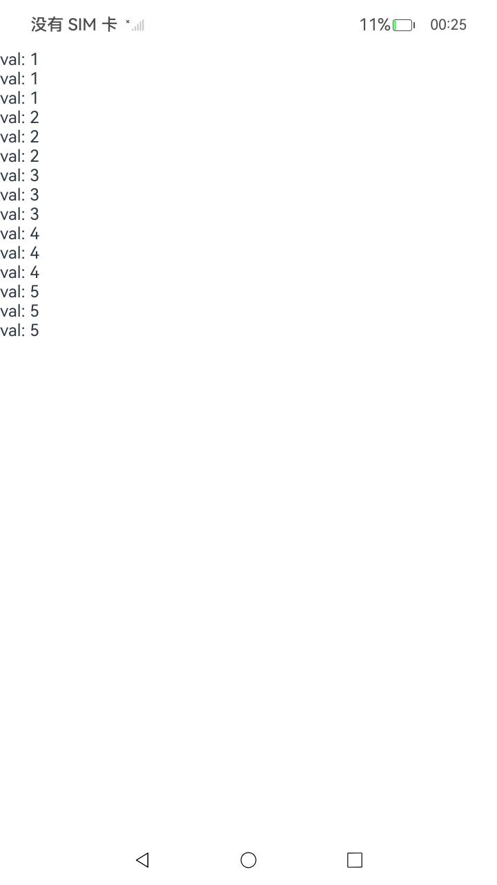
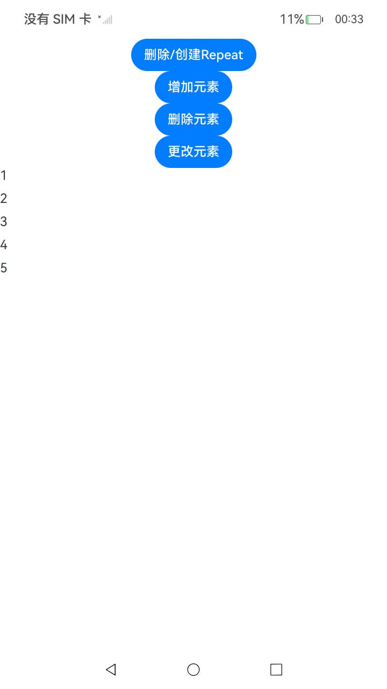

# ArkUI使用@ReusableV2装饰器：组件复用指南文档示例

### 介绍

本示例通过使用[ArkUI指南文档](https://docs.openharmony.cn/pages/v6.0/zh-cn/application-dev/ui/state-management/arkts-basic-syntax-overview.md)中各场景的开发示例，展示在工程中，帮助开发者更好地理解ArkUI提供的组件及组件属性并合理使用。该工程中展示的代码详细描述可查如下链接：

### 1.[线性容器(Column)](https://docs.openharmony.cn/pages/v6.0/zh-cn/application-dev/reference/apis-arkui/arkui-ts/ts-container-column.md)

### 2.[文本显示器(Text)](https://docs.openharmony.cn/pages/v5.1/en/application-dev/reference/apis-arkui/arkui-ts/ts-basic-components-text.md)

### 3.[Button](https://docs.openharmony.cn/pages/v4.1/zh-cn/application-dev/reference/apis-arkui/arkui-ts/ts-basic-components-button.md)

### 4.[@ReusableV2装饰器：组件复用](https://gitcode.com/openharmony/docs/blob/master/zh-cn/application-dev/ui/state-management/arkts-new-reusableV2.md)

## 预览效果







## 具体实现
1. 基本功能与适用范围
   核心作用：优化组件性能，减少反复创建销毁组件的开销
   适用范围：仅能装饰 @ComponentV2 标记的 V2 自定义组件
   主要特性：
   组件回收回收至复用池而非销毁
   复用池中的组件自动冻结，不响应状态变化
   复用时前自动重置状态变量，确保组件纯净性
   启用方式：在 @ComponentV2 前添加 @ReusableV2 装饰器
2. 生命周期与状态管理
   关键生命周期：
   aboutToRecycle()：组件被回收时调用
   aboutToReuse()：组件被复用时调用
   状态重置规则：
   @Local：使用定义时的初始值
   @Param：使用外部传入值或本地初始值
   @Computed：重新计算
   @Monitor：重置并触发回调
   自动冻结机制：回收期间组件自动冻结，不响应状态变化
3. 使用方式与配置
   基本语法：
   @ReusableV2
   @ComponentV2
   struct MyComponent {
   // 组件实现
   }
   复用选项配置：
   ReusableV2Component()
   .reuse({ reuseId: () => 'custom-id' })
   默认行为：未指定 reuseId 时使用组件名作为默认 ID


## 使用说明

### 1.在进入主页面后，点击页面按钮进行查看

## 工程目录结构


```
├─ AppScope
│  ├─ app.json5
│  └─ resources
│     └─ base
│        ├─ element
│        │  └─ string.json
│        └─ media
│           ├─ background.png
│           ├─ foreground.png
│           └─ layered_image.json
├─ code-linter.json5
├─ entry
│  ├─ hvigorfile.ts
│  ├─ obfuscation-rules.txt
│  ├─ oh-package.json5
│  └─ src
│     ├─ main
│     │  ├─ ets
│     │  │  ├─ common      // 复用组件
│     │  │  │  ├─ NormalV2Component.ets
│     │  │  │  ├─ ReusableV2Component.ets
│     │  │  │  ├─ ReusableV2Component1.ets
│     │  │  │  ├─ ReusableV2Component2.ets
│     │  │  │  ├─ ReusableV2Component3.ets
│     │  │  │  ├─ ReusableV2Component4.ets
│     │  │  │  ├─ ReusableV2Component5.ets
│     │  │  │  ├─ ReusableV2Component6.ets
│     │  │  │  ├─ ReusableV2Component7.ets
│     │  │  │  ├─ ReusableV2Component8.ets
│     │  │  │  └─ ReusableV2Component9.ets
│     │  │  ├─ entryability
│     │  │  │  └─ EntryAbility.ets
│     │  │  ├─ entrybackupability
│     │  │  │  └─ EntryBackupAbility.ets
│     │  │  ├─ pages
│     │  │  │  └─ Index.ets   // 主页面
│     │  │  └─ view
│     │  │     ├─ Page1.ets   // 装饰器说明
│     │  │     ├─ Page10.ets  // 接口说明
│     │  │     ├─ Page11.ets  // 使用限制
│     │  │     ├─ Page12.ets  // V1和V2支持部分混用场景
│     │  │     ├─ Page13.ets  // 回收与复用的生命周期
│     │  │     ├─ Page2.ets   // 复用阶段的冻结
│     │  │     ├─ Page3.ets   // 复用前的组件内状态变量重置
│     │  │     ├─ Page4.ets   // 简化复用前的组件内状态变量重置
│     │  │     ├─ Page5.ets   // 在if组件中使用通过改变if组件的条件可以控制组件回收/复用。
│     │  │     ├─ Page6.ets   // 在Repeat组件中使用
│     │  │     ├─ Page7.ets   // 在Repeat组件非懒加载场景的each属性中使用
│     │  │     ├─ Page8.ets  // 在ForEach组件中使用
│     │  │     └─ Page9.ets  // 在LazyForEach组件中使用
│     │  ├─ module.json5
│     │  └─ resources
│     │     ├─ base
│     │     │  ├─ element
│     │     │  │  ├─ color.json
│     │     │  │  ├─ float.json
│     │     │  │  └─ string.json
│     │     │  ├─ media
│     │     │  │  ├─ background.png
│     │     │  │  ├─ foreground.png
│     │     │  │  ├─ layered_image.json
│     │     │  │  └─ startIcon.png
│     │     │  └─ profile
│     │     │     ├─ backup_config.json
│     │     │     └─ main_pages.json
│     │     ├─ dark
│     │     │  └─ element
│     │     │     └─ color.json
│     │     └─ rawfile
│     ├─ mock
│     │  └─ mock-config.json5
│     ├─ ohosTest
│     │  ├─ ets
│     │  │  └─ test
│     │  │     ├─ Ability.test.ets
│     │  │     ├─ index.test.ets
│     │  │     └─ List.test.ets
│     │  └─ module.json5
│     └─ test
│        ├─ List.test.ets
│        └─ LocalUnit.test.ets
├─ hvigor
│  └─ hvigor-config.json5
├─ hvigorfile.ts
├─ oh-package-lock.json5
├─ oh-package.json5
├─ README_zh.md
└─ screenshots  // 预览图片
   └─ device
      ├─ image1.png
      ├─ image2.png
      └─ image3.png

```

`````
### 相关权限

不涉及。

### 依赖

不涉及。

### 约束与限制

1.本示例仅支持标准系统上运行, 支持设备：RK3568。

2.本示例为Stage模型，支持API20版本SDK，版本号：6.0.0.33，镜像版本号：OpenHarmony_6.0.0.33。

3.本示例需要使用DevEco Studio 6.0.0 Canary1 (Build Version: 6.0.0.270， built on May 9, 2025)及以上版本才可编译运行。

### 下载

如需单独下载本工程，执行如下命令：

````
git init
git config core.sparsecheckout true
echo code/DocsSample/ArkUISample/ReusableV2 > .git/info/sparse-checkout
git remote add origin https://gitcode.com/openharmony/applications_app_samples.git
git pull origin master
````
`````