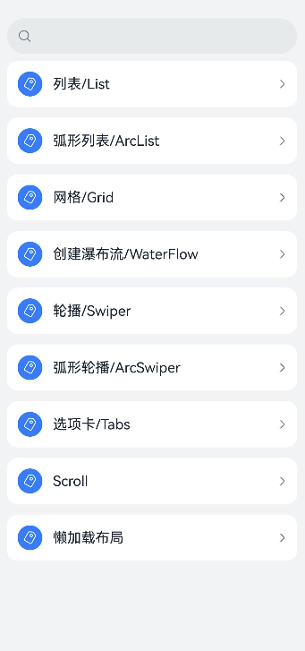

# ArkUI使用滚动类指南文档示例

### 介绍

本示例通过使用[ArkUI指南文档](https://gitcode.com/openharmony/docs/tree/master/zh-cn/application-dev/ui)中各场景的开发示例，展示在工程中，帮助开发者更好地理解ArkUI提供的组件及组件属性并合理使用。该工程中展示的代码详细描述可查如下链接：

1. [创建列表 (List)](https://gitcode.com/openharmony/docs/blob/master/zh-cn/application-dev/ui/arkts-layout-development-create-list.md)。
2. [弧形列表 (ArcList)](https://gitcode.com/openharmony/docs/blob/master/zh-cn/application-dev/ui/arkts-layout-development-create-arclist.md)（圆形屏幕推荐使用）。
3. [创建网格 (Grid/GridItem)](https://gitcode.com/openharmony/docs/blob/master/zh-cn/application-dev/ui/arkts-layout-development-create-grid.md)。
4. [创建瀑布流 (WaterFlow)](https://gitcode.com/openharmony/docs/blob/master/zh-cn/application-dev/ui/arkts-layout-development-create-waterflow.md)。
5. [创建轮播 (Swiper)](https://gitcode.com/openharmony/docs/blob/master/zh-cn/application-dev/ui/arkts-layout-development-create-looping.md)。
6. [创建弧形轮播 (ArcSwiper)](https://gitcode.com/openharmony/docs/blob/master/zh-cn/application-dev/ui/arkts-layout-development-arcswiper.md)（圆形屏幕推荐使用）。
7. [选项卡 (Tabs)](https://gitcode.com/openharmony/docs/blob/master/zh-cn/application-dev/ui/arkts-navigation-tabs.md)。
8. [创建懒加载布局 (LazyColumnLayout/LazyVGridLayout/LazyVWaterFlowLayout)](https://gitcode.com/openharmony/docs/blob/master/zh-cn/application-dev/ui/arkts-layout-development-create-lazy-layout.md)。

### 效果预览

| 首页                               |
|------------------------------------|
|  |

### 使用说明

1. 在主界面，可以点击对应页面，选择需要参考的组件示例。

2. 在组件目录选择详细的示例参考。

3. 进入示例界面，查看参考示例。

4. 通过自动测试框架可进行测试及维护。

### 工程目录
```
entry/src/main/ets/
|---entryability
|---pages
|   |---arcList                             //弧形列表
|   |       |---ArcListAcrScrollBar.ets
|   |       |---ArcListArcIndexerBar.ets
|   |       |---arcListBuiltInScrollerBar.ets
|   |       |---ArcListContents.ets
|   |       |---ArcListCreate.ets
|   |       |---ArcListCrown.ets
|   |       |---ArcListShow.ets
|   |       |---ArcListSideSlip.ets
|   |       |---ArcListStyles.ets
|   |       |---ArcLongList.ets
|   |       |---index.ets
|   |---arcSwiper                           //弧形轮播
|   |       |---ArcSwiperAction.ets
|   |       |---ArcSwiperHorizontal.ets
|   |       |---ArcSwiperSideSlip.ets
|   |       |---ArcSwiperStyles.ets
|   |       |---ArcSwiperToggle.ets
|   |       |---ArcSwiperVertical.ets
|   |       |---index.ets
|   |---grid                                //网格
|   |       |---DataInGrid.ets
|   |       |---GridCalculator.ets
|   |       |---GridColumnsGap.ets
|   |       |---GridDataSource.ets
|   |       |---GridLayout.ets
|   |       |---GridScrollbar.ets
|   |       |---GridSideToSide.ets
|   |       |---index.ets
|   |       |---LongGrid.ets
|   |       |---ScrollableGrid.ets
|   |       |---ScrollPositionGrid.ets
|   |---lazyLayout                          //懒加载布局
|   |       |---Index.ets
|   |       |---LazyColumnLayoutNestedLazyLayout.ets
|   |       |---LazyColumnLayoutSample.ets
|   |       |---LazyLayoutGroup.ets
|   |       |---LazyVGridLayoutSample.ets
|   |       |---LazyVWaterFlowLayoutSample.ets
|   |       |---ListNestedLazyLayout.ets
|   |---list                                //列表
|   |       |---AddListItem.ets
|   |       |---CollapseAndExpand.ets
|   |       |---ControlledScrollPositionList.ets
|   |       |---CustomListStyle.ets
|   |       |---DataInList.ets
|   |       |---DeleteListItem.ets
|   |       |---GroupedList.ets
|   |       |---Index.ets
|   |       |---ListChatRoom.ets
|   |       |---ListDataSource.ets
|   |       |---ListIteration.ets
|   |       |---ListLayout.ets
|   |       |---LongList.ets
|   |       |---ResponsiveScrollPositionList.ets
|   |       |---StickyHeaderList.ets
|   |       |---SupportSlidingHand.ets
|   |       |---SwipeableListItem.ets
|   |       |---TaggedListItems.ets
|   |       |---ToDo.ets
|   |       |---ToDoListItem.ets
|   |---scroll                              //滚动
|   |       |---Index.ets
|   |       |---ScrollModifier
|   |       |---ScrollSnap
|   |---swiper                              //轮播
|   |       |---index.ets
|   |       |---SwiperAndTabsLinkage.ets
|   |       |---SwiperAutoPlay.ets
|   |       |---SwiperCustomAnimation.ets
|   |       |---SwiperDigitIndicatorIgnoreComponentSize.ets
|   |       |---SwiperDirection.ets
|   |       |---SwiperIgnoreComponentSize.ets
|   |       |---SwiperIndicatorStyle.ets
|   |       |---SwiperLoop.ets
|   |       |---SwiperMultiPage.ets
|   |       |---SwiperPageSwitchMethod.ets
|   |       |---SwiperVisibleContentPosition.ets
|   |---tabs                                //选项卡
|   |       |---AgeFriendlyTabs.ets
|   |       |---BottomTabBar.ets
|   |       |---ContentPageNoAndTabLinkage.ets
|   |       |---ContentWillChange.ets
|   |       |---CustomTabBar.ets
|   |       |---FixedTabBar.ets
|   |       |---index.ets
|   |       |---NumberOfCachesTabBar.ets
|   |       |---ScrollableTabBar.ets
|   |       |---SideTabBar.ets
|   |       |---SwipeLockedTabBar.ets
|   |       |---TabsLayout.ets
|   |       |---TopTabBar.ets
|   |---waterFlow                           //瀑布流
|   |       |---index.ets
|   |       |---WaterFlowDataSource.ets
|   |       |---WaterFlowDynamicSwitchover.ets
|   |       |---WaterFlowGroupingMixing.ets
|   |       |---WaterFlowInfiniteScrolling.ets
|   |       |---WaterFlowInfiniteScrollingEarly.ets
|---pages
|   |---Index.ets                       // 应用主页面
entry/src/ohosTest/
|---ets
|   |---index.test.ets                       // 示例代码测试代码
```

### 具体实现

1. 列表 (List)：使用List组件实现列表布局，通过listDirection设置列表方向，配置divider、scrollBar等样式属性，配合ForEach/LazyForEach遍历数据源渲染ListItem，支持分组吸顶、滚动位置控制、列表项增删、展开折叠、滑动交互等功能。
2. 弧形列表 (ArcList)（圆形屏幕推荐使用）：使用ArcList组件按垂直方向线性排列ArcListItem，配置arcDirection、loop、autoPlay等样式属性，支持弧形滚动条、索引栏快速导航和LazyForEach长列表懒加载。
3. 网格 (Grid)：使用Grid组件构建网格布局，通过columnsTemplate和rowsTemplate设置行列数与占比，支持不规则网格项、水平可滚动网格、翻页滚动、外部滚动条联动和LazyForEach懒加载。
4. 瀑布流 (WaterFlow)：使用WaterFlow容器组件构建瀑布流布局，配合LazyForEach实现懒加载和无限滚动，支持动态切换列数、混合分组高度和提前加载优化。
5. 轮播 (Swiper)：使用Swiper组件实现轮播效果，配置loop循环、autoPlay自动播放、自定义指示器样式、多页显示、自定义过渡动画、方向切换等属性。
6. 弧形轮播 (ArcSwiper)（圆形屏幕推荐使用）：使用ArcSwiper组件实现弧形轮播，配置arcDirection样式，支持水平/垂直方向切换、侧滑手势和ArcSwiperController操作交互。
7. 选项卡 (Tabs)：使用Tabs容器包裹多个TabContent子组件，通过barPosition设置导航栏位置，barMode设置固定或可滚动模式，支持自定义页签、页签与内容联动、切换拦截和页面缓存控制。
8. 滚动 (Scroll)：使用Scroll组件实现通用滚动容器，包含ScrollSnap（滚动翻页对齐）和ScrollModifier（滚动修饰）两个子示例，分别展示了在List、Grid、WaterFlow、Scroll中的滚动吸附和滚动修饰效果。
9. 懒加载布局（LazyColumnLayout/LazyVGridLayout/LazyVWaterFlowLayout）：在Scroll或List内使用LazyVGridLayout、LazyVWaterFlowLayout、LazyColumnLayout三种懒加载布局容器，配置columnsTemplate、rowsGap、columnsGap、space、alignItems、header、footer、sticky等布局属性，支持多种布局容器混合组合使用，各容器使用独立LazyForEach数据源，通过onVisibleIndexesChange回调实现触底加载更多数据。

### 相关权限

1. Tabs选项卡中使用适老化功能需要配置系统权限：
    - 配置原因：使用abilityManager.updateConfiguration接口更新配置需要系统权限。
    - 配置方法：在module.json5中配置ohos.permission.UPDATE_CONFIGURATION权限，并在签名中配置系统权限。

### 依赖

不涉及。

### 约束与限制

1.本示例仅支持标准系统上运行, 支持设备：RK3568。

2.本示例为Stage模型，支持API26版本SDK，版本号：26.0.0，镜像版本号：OpenHarmony 7.0.0.27。

3.本示例需要使用DevEco Studio 6.0.2 Release (Build Version: 6.0.2.650, built on March 27, 2026)及以上版本才可编译运行。

### 下载

如需单独下载本工程，执行如下命令：

````
git init
git config core.sparsecheckout true
echo code/DocsSample/ArkUISample/ScrollableComponent > .git/info/sparse-checkout
git remote add origin https://gitcode.com/openharmony/applications_app_samples.git
git pull origin master
````