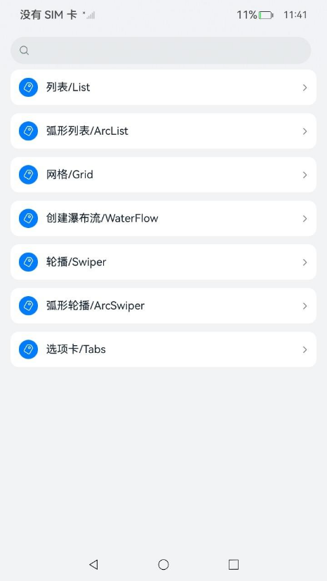

# ArkUI使用滚动类指南文档示例

### 介绍

本示例通过使用[ArkUI指南文档](https://gitcode.com/openharmony/docs/tree/master/zh-cn/application-dev/ui)中各场景的开发示例，展示在工程中，帮助开发者更好地理解ArkUI提供的组件及组件属性并合理使用。该工程中展示的代码详细描述可查如下链接：

1. [创建列表 (List)](https://gitcode.com/openharmony/docs/blob/master/zh-cn/application-dev/ui/arkts-layout-development-create-list.md)。
2. [弧形列表 (ArcList)](https://gitcode.com/openharmony/docs/blob/master/zh-cn/application-dev/ui/arkts-layout-development-create-arclist.md)（圆形屏幕推荐使用）
3. [创建网格 (Grid/GridItem)](https://gitcode.com/openharmony/docs/blob/master/zh-cn/application-dev/ui/arkts-layout-development-create-grid.md)。
4. [创建瀑布流 (WaterFlow)](https://gitcode.com/openharmony/docs/blob/master/zh-cn/application-dev/ui/arkts-layout-development-create-waterflow.md)
5. [创建轮播 (Swiper)](https://gitcode.com/openharmony/docs/blob/master/zh-cn/application-dev/ui/arkts-layout-development-create-looping.md)。
6. [创建弧形轮播 (ArcSwiper)](https://gitcode.com/openharmony/docs/blob/master/zh-cn/application-dev/ui/arkts-layout-development-arcswiper.md)（圆形屏幕推荐使用）
7. [选项卡 (Tabs)](https://gitcode.com/openharmony/docs/blob/master/zh-cn/application-dev/ui/arkts-navigation-tabs.md)
### 效果预览

| 首页                                 | 列表类组件目录                            | 列表中显示数据示例                            |
|------------------------------------|------------------------------------|------------------------------------|
|  |  |  |

 缓存数预览图
 
 标签与内容不联动预览图
 
### 使用说明

1. 在主界面，可以点击对应页面，选择需要参考的组件示例。

2. 在组件目录选择详细的示例参考。

3. 进入示例界面，查看参考示例。

4. 通过自动测试框架可进行测试及维护。

### 工程目录
```
entry/src/main/ets/
|---entryability
|---pages
|   |---arcList                             //弧形列表  
|   |       |---ArcListAcrScrollBar.ets
|   |       |---ArcListArcIndexerBar.ets
|   |       |---arcListBuiltInScrollerBar.ets
|   |       |---ArcListContents.ets
|   |       |---ArcListCreate.ets
|   |       |---ArcListCrown.ets
|   |       |---ArcListShow.ets
|   |       |---ArcListSideSlip.ets
|   |       |---ArcListStyles.ets
|   |       |---ArcLongList.ets
|   |       |---index.ets
|   |---arcSwiper                            //弧形轮播 
|   |       |---ArcSwiperAction.ets
|   |       |---ArcSwiperHorizontal.ets
|   |       |---ArcSwiperSideSlip.ets
|   |       |---ArcSwiperStyles.ets
|   |       |---ArcSwiperToggle.ets
|   |       |---ArcSwiperVertical.ets
|   |       |---index.ets
|   |---grid                                 //网格  
|   |       |---DataInGrid.ets
|   |       |---GridCalculator.ets
|   |       |---GridDataSource.ets
|   |       |---GridLayout.ets
|   |       |---GridScrollbar.ets
|   |       |---GridSideToSide.ets
|   |       |---index.ets
|   |       |---LongGrid.ets
|   |       |---ScrollableGrid.ets
|   |       |---ScrollPosition.ets
|   |---list                                 //列表
|   |       |---AddListItem.ets
|   |       |---CollapseAndExpand.ets
|   |       |---ControlledScrollPositionList.ets
|   |       |---CustomListStyle.ets
|   |       |---DataInList.ets
|   |       |---DeleteListItem.ets
|   |       |---GroupedList.ets
|   |       |---index.ets
|   |       |---ListChatRoom.ets
|   |       |---ListDataSource.ets
|   |       |---ListIteration.ets
|   |       |---ListLayout.ets
|   |       |---LongList.ets
|   |       |---ResponsiveScrollPositionList.ets
|   |       |---StickyHeaderList.ets
|   |       |---SupportSlidingHand.ets
|   |       |---SwipeListItem.ets
|   |       |---TaggedListItems.ets
|   |---swiper                               //轮播
|   |       |---index.ets
|   |       |---SwiperAndTabsLinkage.ets
|   |       |---SwiperAutoPlay.ets
|   |       |---SwiperCustomAnimation.ets
|   |       |---SwiperDigitIndicatorIgnoreComponentSize.ets
|   |       |---SwiperDirection.ets
|   |       |---SwiperIgnoreComponentSize.ets
|   |       |---SwiperIndicatorStyle.ets
|   |       |---SwiperLoop.ets
|   |       |---SwiperMultiPage.ets
|   |       |---SwiperPageSwitchMethod.ets
|   |       |---SwiperVisibleContentPosition.ets
|   |---tabs                                 //选项卡
|   |       |---AgeFriendlyTabs.ets  
|   |       |---BottomTabBar.ets
|   |       |---ContentWillChange.ets 
|   |       |---CustomTabBar.ets
|   |       |---FixedTabBar.ets
|   |       |---index.ets
|   |       |---ScrollableTabBar.ets
|   |       |---SideTabBar.ets
|   |       |---SwipeLockedTabBar.ets
|   |       |---TabsLayout.ets
|   |       |---TopTabBar.ets
|   |---waterFlow                             //瀑布流
|   |       |---AgeFriendlyTabs.ets  
|   |       |---BottomTabBar.ets
|   |       |---ContentWillChange.ets 
|   |       |---CustomTabBar.ets
|   |       |---FixedTabBar.ets
|   |       |---index.ets
|   |       |---WaterFlowDataSource.ets
|   |       |---WaterFlowDynamicSwitchover.ets
|   |       |---WaterFlowGroupingMixing.ets
|   |       |---WaterFlowInfiniteScrolling.ets
|   |       |---WaterFlowInfiniteScrollingEarly.ets   
|---pages
|   |---Index.ets                       // 应用主页面
entry/src/ohosTest/
|---ets
|   |---index.test.ets                       // 示例代码测试代码
```
### 具体实现

1. 初始化List，可设置space（列表项间距）控制项间距离。
2. 每个ListItem内通过容器组件（如Row/Column）组合内容（如头像 + 文字）。
3. 配置divider添加分隔线（设置粗细、颜色、左右边距），并通过scrollBar(BarState.Auto)开启按需显示的滚动条。
4. 固定List的高度，确保超出时触发滚动。
5. 定义数据源（如TodoItem模型类，含id/title/isCompleted等属性，id用于ForEach的唯一 key）。
6. 在List内用ForEach遍历数据源，每个循环项生成ListItem，并绑定数据（如文字显示title，复选框关联isCompleted）。
7. 添加交互逻辑（如 “删除” 按钮触发数组filter移除对应项，“新增” 按钮触发数组push添加新项）。
8. 配置divider和scrollBar，保证列表样式和滚动功能。
9. 定义分组数据源（如GroupData接口，含groupName（分组标题）和items（组内子项数组））。
10. 弧形列表 (ArcList)（圆形屏幕推荐使用） 
    固定List的高度，确保超出时触发滚动。
    使用弧形列表可以通过在ArcList组件中按垂直方向线性排列子组件ArcListItem，可以为弧形列表中的每一项提供独立视图。此外，可以使用循环渲染来迭代一组列表项，或结合任意数量的单个视图与ForEach结构，构建复杂的弧形列表。ArcList组件支持多种渲染控制方式，包括条件渲染、循环渲染和懒加载，以生成子组件。
    定义数据源（如TodoItem模型类，含id/title/isCompleted等属性，id用于ForEach的唯一 key）。
11. 创建瀑布流（WaterFlow）
    在List内用ForEach遍历数据源，每个循环项生成ListItem，并绑定数据（如文字显示title，复选框关联isCompleted）。
    ArkUI提供了WaterFlow容器组件，用于构建瀑布流布局。WaterFlow组件支持条件渲染、循环渲染和懒加载等方式生成子组件

## 具体实现

1. 弧形列表 (ArcList)（圆形屏幕推荐使用）
   使用弧形列表可以通过在ArcList组件中按垂直方向线性排列子组件ArcListItem，可以为弧形列表中的每一项提供独立视图。此外，可以使用循环渲染来迭代一组列表项，或结合任意数量的单个视图与ForEach结构，构建复杂的弧形列表。ArcList组件支持多种渲染控制方式，包括条件渲染、循环渲染和懒加载，以生成子组件。
2. 创建瀑布流（WaterFlow）
   ArkUI提供了WaterFlow容器组件，用于构建瀑布流布局。WaterFlow组件支持条件渲染、循环渲染和懒加载等方式生成子组件

## 具体实现
1. 基本结构与布局。构成：使用Tabs容器包裹多个TabContent子组件。
    - 页签设置：每个TabContent通过.tabBar('页签名称')方法设置其对应的导航页签。
    - 布局类型：通过barPosition参数决定导航栏位置。
    - 顶部导航：BarPosition.Start (默认)
    - 底部导航：BarPosition.End
    - 侧边导航：需额外设置.vertical(true)，并通常配合barWidth或barHeight调整尺寸。
2. 导航栏模式控制
    - 禁止滑动切换：设置.scrollable(false)。
    - 固定导航栏：设置.barMode(BarMode.Fixed)，页签均分宽度，适用于分类固定的场景（如底部导航）。
    - 滚动导航栏：设置.barMode(BarMode.Scrollable)，页签可横向滚动，适用于分类较多的场景（如顶部导航）。
3. 自定义导航栏
    - 当默认的下划线样式不满足需求时（如需要图文组合），可使用@Builder构建自定义页签函数。
    - 在自定义函数中，通过判断currentIndex与页签索引是否相等，来动态改变选中与未选中状态的样式（如图标、文字颜色）。
    - 将自定义的@Builder函数通过.tabBar(this.builderFunc(...))方式赋给TabContent。
4. 页签与内容联动
    - 监听页签切换：使用Tabs的.onSelected((index: number) => { ... })方法，在回调中更新用于判断选中状态的索引值（如selectIndex），以实现自定义页签与内容页的同步高亮。
5. 高级控制功能
    - 切换拦截：使用.onContentWillChange回调函数，可根据业务逻辑决定是否允许切换到目标页签（返回true允许，返回false阻止）。
    - 页面缓存控制 (API 19+)：使用.cachedMaxCount(maxCount, TabsCacheMode)接口。用于控制最大缓存的子页面数量，避免一次性加载所有页面带来的性能问题，采用懒加载机制。缓存模式TabsCacheMode决定缓存策略（如缓存两侧页面或最近切换的页面）。

### 相关权限
1. tabs选项卡中支持适老化AgeFriendlyTabs组件需要配置系统权限：
    - 配置原因：
    - import { abilityManager, Configuration } from '@kit.AbilityKit';
    - abilityManager.updateConfiguration需要做以下配置
    - 配置方法：
    - 在module.json5中配置ohos.permission.UPDATE_CONFIGURATION权限。
    - 在签名中需要配置系统权限。

### 依赖

不涉及。

### 约束与限制

1.本示例仅支持标准系统上运行, 支持设备：RK3568。

2.本示例为Stage模型，支持API20版本full-SDK，版本号：6.0.0.47，镜像版本号：OpenHarmony_6.0.0 Release。

3.本示例需要使用DevEco Studio 6.0.0 Release (Build Version: 6.0.0.858, built on September 24, 2025)及以上版本才可编译运行。

### 下载

如需单独下载本工程，执行如下命令：

````
git init
git config core.sparsecheckout true
echo code/DocsSample/ArkUISample/ScrollableComponent > .git/info/sparse-checkout
git remote add origin https://gitcode.com/openharmony/applications_app_samples.git
git pull origin master
````