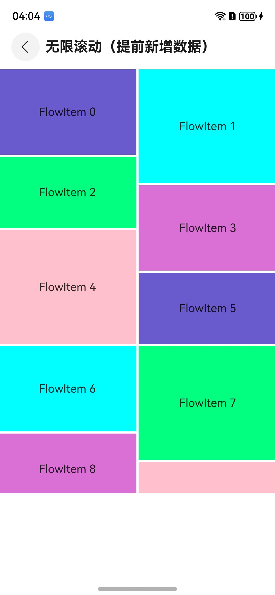

# ArkUI 滚动类 NDK 示例（ScrollableNDK）

### 介绍

本工程以`ArkUI` + `NDK(C-API)` 的方式实现滚动类组件示例，演示 `原生节点（Native Node）` 的创建、复用、懒加载与 ETS 侧对接。

### 效果预览

| 首页                                  | 列表类组件目录                            | 列表中显示数据示例                            |
|-------------------------------------|------------------------------------|------------------------------------|
|  |  |  |

### 使用说明

1. 在主界面，可以点击对应卡片，选择需要参考的组件示例。

2. 在组件目录选择详细的示例参考。

3. 进入示例界面，查看参考示例。

4. 通过自动测试框架可进行测试及维护。

### 工程目录
```
entry/src/main
+---cpp
|   |   CMakeLists.txt
|   |   napi_init.cpp
|   |   
|   +---common                                   公共
|   |       ArkUIConstants.h
|   |       ArkUINode.h
|   |       ArkUINodeAdapter.h
|   |       ArkUIScrollEvent.h
|   |       ArkUIUtils.h
|   |       
|   +---components
|   |   +---grid                                  网格
|   |   |   |   GridNode.h
|   |   |   |   
|   |   |   \---examples
|   |   |           ScrollableGrid.cpp
|   |   |           ScrollableGrid.h
|   |   |           
|   |   +---list                                   列表
|   |   |   |   ListItemGroupNode.h
|   |   |   |   ListItemSwipe.h
|   |   |   |   ListNode.h
|   |   |   |   
|   |   |   \---examples
|   |   |           AlphabetIndexedList.cpp
|   |   |           AlphabetIndexedList.h
|   |   |           
|   |   +---refresh                                 刷新
|   |   |   |   RefreshNode.h
|   |   |   |   
|   |   |   \---examples
|   |   |           RefreshList.cpp
|   |   |           RefreshList.h
|   |   |           
|   |   +---scroll                                  滚动
|   |   |   |   ScrollNode.h
|   |   |   |   
|   |   |   \---examples
|   |   |           ScrollableInfiniteScroll.cpp
|   |   |           ScrollableInfiniteScroll.h
|   |   |           
|   |   \---waterflow                                瀑布流
|   |       |   WaterFlowNode.h
|   |       |   WaterFlowSection.h
|   |       |   
|   |       \---examples
|   |               WaterFlowInfiniteScrollingEarly.cpp
|   |               WaterFlowInfiniteScrollingEarly.h
|   |               
|   \---types
|       \---libentry
|               Index.d.ts
|               oh-package.json5
|               
+---ets
|   +---common
|   |       Card.ets
|   |       Resource.ets
|   |       Route.ets
|   |       
|   +---entryability
|   |       EntryAbility.ets
|   |       
|   +---entrybackupability
|   |       EntryBackupAbility.ets
|   |       
|   \---pages
|       |   Index.ets
|       |   
|       +---grid
|       |       Index.ets
|       |       ScrollableGrid.ets
|       |       
|       +---list
|       |       AlphabetIndexedList.ets
|       |       Index.ets
|       |       
|       +---refresh
|       |       Index.ets
|       |       RefreshList.ets
|       |       
|       +---scroll
|       |       Index.ets
|       |       ScrollableInfiniteScroll.ets
|       |       
|       \---waterflow
|               Index.ets
|               WaterFlowDataSource.ets
|               WaterFlowInfiniteScrollingEarly.ets
|               
```

### 相关权限

不涉及。

### 依赖

不涉及。

### 约束与限制

1.本示例仅支持标准系统上运行, 支持设备：RK3568。

2.本示例为Stage模型，支持API20版本full-SDK，版本号：6.0.0.47，镜像版本号：OpenHarmony_6.0.0 Release。

3.本示例需要使用DevEco Studio 6.0.0 beta5 (Build Version: 6.0.0.848, built on September 12, 2025)及以上版本才可编译运行。

### 下载

如需单独下载本工程，执行如下命令：

````
git init
git config core.sparsecheckout true
echo code/DocsSample/ArkUIDocSample/ScrollableNDK > .git/info/sparse-checkout
git remote add origin https://gitcode.com/openharmony/applications_app_samples.git
git pull origin master
````