# ArkUI绘制几何图形指南文档示例

### 介绍

本示例通过使用[ArkUI指南文档](https://gitcode.com/openharmony/docs/tree/master/zh-cn/application-dev/ui)中各场景的开发示例，展示在工程中，帮助开发者更好地理解ArkUI提供的组件及组件属性并合理使用。该工程中展示的代码详细描述可查如下链接：

1. [绘制几何图形](https://gitcode.com/openharmony/docs/blob/master/zh-cn/application-dev/ui/arkts-geometric-shape-drawing.md)。


### 效果预览

| 抗锯齿开启与关闭效果                    | 正常绘制圆和圆环效果             | 设置组件填充区域颜色效果                 | 设置网格效果，实现图像局部扭曲效果                                            |
| ------------------------------------ | --------------------------------------------- | --------------------------------------------------- | --------------------------------------------------- |
| 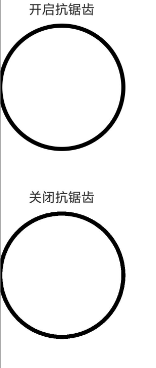 | 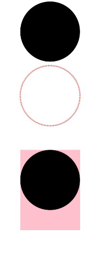 | 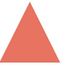 | 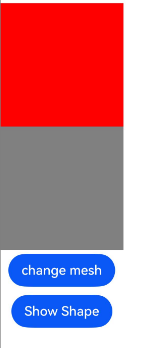 |

| 绘制简单图形效果                        | 绘制封闭路径效果                 | 设置组件边框颜色效果                     | 设置线条拐角绘制样式效果                                           |
| ------------------------------------ | --------------------------------------------- | --------------------------------------------------- | --------------------------------------------------- |
| 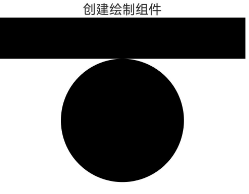 | 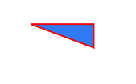 | 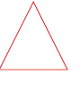 |  |

| 设置斜接长度与边框宽度比值的极限值效果       | 设置边框透明度效果            | 通过形状视口对图形进行放大与缩小效果   | 在viewPort中创建圆效果                   | 在viewPort中创建圆效果                                            |
| ------------------------------------ | --------------------------------------------- | --------------------------------------------------- | --------------------------------------------------- | --------------------------------------------------- |
| 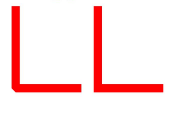 | 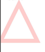 | 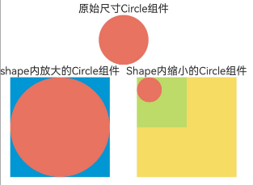 |  | 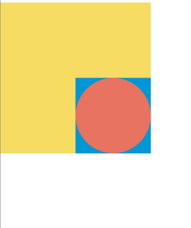 |

### 使用说明

1. 在主界面，可以点击对应页面，选择需要参考的组件示例。

2. 在组件目录选择详细的示例参考。

3. 进入示例界面，查看参考示例。

4. 通过自动测试框架可进行测试及维护。

### 工程目录
```
entry/src/main/ets/
├── entryability
│   └── EntryAbility.ets
├── entrybackupability
│   └── EntryBackupAbility.ets
└── pages
    ├── AntiAlias.ets             // 通过antiAlias设置是否开启抗锯齿
    ├── CircleExample.ets         // 绘制圆和圆环
    ├── Fill.ets                  // 通过fill可以设置组件填充区域颜色
    ├── Index.ets
    ├── Mesh.ets                  // 通过mesh设置网格效果
    ├── Shape.ets                 // 形状视口viewPort
    ├── ShapeExample.ets          // 绘制封闭路径
    ├── Stroke.ets                // 通过stroke可以设置组件边框颜色
    ├── StrokeLineJoin.ets        // 通过strokeLineJoin可以设置线条拐角绘制样式
    ├── StrokeMiterLimit.ets      // 通过strokeMiterLimit设置斜接长度与边框宽度比值的极限值
    ├── StrokeOpacity.ets         // 通过strokeOpacity可以设置边框透明度
    ├── ViewPort1.ets             // 形状视口viewPort1
    ├── ViewPort2.ets             // 形状视口viewPort2
    └── ViewPort3.ets             // 形状视口viewPort3
entry/src/ohosTest/
├── ets
│   └── test
│       ├── Ability.test.ets
│       ├── Index.test.ets        // 测试用例代码
│       └── List.test.ets
└── module.json5
```
### 具体实现

1. 形状视口viewPort指定用户空间中的一个矩形，该矩形映射到为关联的SVG元素建立的视区边界。viewPort属性的值包含x、y、width和height四个可选参数，x和y表示视区的左上角坐标，width和height表示其尺寸。

2. 绘制组件支持通过各种属性更改组件样式。通过fill可以设置组件填充区域颜色。通过stroke可以设置组件边框颜色。通过strokeOpacity可以设置边框透明度。通过strokeLineJoin可以设置线条拐角绘制样式。通过strokeMiterLimit设置斜接长度与边框宽度比值的极限值。通过antiAlias设置是否开启抗锯齿，默认值为true（开启抗锯齿）。通过mesh设置网格效果，实现图像局部扭曲。

### 相关权限

不涉及。

### 依赖

不涉及。

### 约束与限制

1.本示例仅支持标准系统上运行, 支持设备：RK3568。

2.本示例为Stage模型，支持API20版本SDK，版本号：6.0.0.33，镜像版本号：OpenHarmony_6.0.0.33。

3.本示例需要使用DevEco Studio 6.0.0 Release (Build Version: 6.0.0.858， built on September 24, 2025)及以上版本才可编译运行。

### 下载

如需单独下载本工程，执行如下命令：

````
git init
git config core.sparsecheckout true
echo code/DocsSample/ArkUISample/ShapeDrawing > .git/info/sparse-checkout
git remote add origin https://gitcode.com/openharmony/applications_app_samples.git
git pull origin master
````