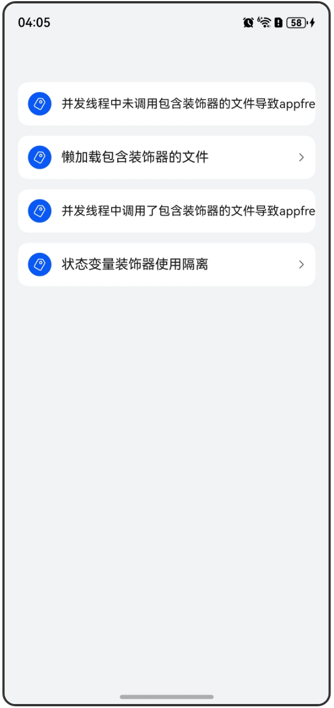

# 应用内状态管理和其他常见问题

## 介绍
本示例通过使用[ArkUI指南文档](https://gitcode.com/openharmony/docs/tree/master/zh-cn/application-dev/ui)中各场景的开发示例，展示在工程中，帮助开发者更好地理解ArkUI提供的组件及组件属性并合理使用。该工程中展示的代码详细描述可查如下链接：

[应用内状态变管理和其他常见问题](https://gitcode.com/openharmony/docs/blob/master/zh-cn/application-dev/ui/state-management/arkts-state-management-faq-application-and-others.md)。

## 示例文档
[MVVM模式（V2）](https://gitcode.com/openharmony/docs/blob/master/zh-cn/application-dev/ui/state-management/arkts-mvvm-v2.md)。
   
## 效果预览
|首页                                   |
|----------------------------------------------|
||

使用说明
1. 在主界面，可以点击对应卡片，选择需要参考的组件示例。
2. 在对应的卡片页面中，点击按钮“New Worker”。
3. 查看日志，反例有对应的报错信息，正例有对应的日志信息。

## 工程目录

```
/src
├── /main
│   ├── /ets
│   │   ├── /entryability
│   │   ├── /entrybackupability
│   │   ├── /pages
│   │   │   ├── DecUseIsolationNeg.ets
│   │   │   ├── DecUseIsolationNPos.ets
│   │   │   ├── Index.ets
│   │   │   ├── LazyImportFuncNeg.ets
│   │   │   ├── LazyImportFuncPos.ets
│   │   │   ├── LazyImportNeg.ets
│   │   │   ├── LazyImportObservedNeg.ets
│   │   │   ├── LazyImportObservedPos.ets
│   │   │   ├── LazyImportPos.ets
│   │   │   ├── UseIsolationAdditionPos.ets       
│   │   │   ├── UseIsolationFuncNeg.ets
│   │   │   ├── UseIsolationFuncPos.ets
│   │   │   ├── UseIsolationObservedNeg.ets
│   │   │   └── UseIsolationObservedPos.ets
│   │   ├── /wokers
│   │   │   ├── LazyImportWorkerNeg.ets
│   │   │   ├── LazyImportWorkerPos.ets
│   │   │   ├── UseIsolationWorkerNeg.ets
│   │   │   └── UseIsolationWorkerPos.ets
│   └── /resources
│       ├── ...
├─── ... 
```

## 具体实现

1. 并发线程中未调用包含装饰器的文件导致appfreeze，是由于并发线程在逐层解析文件依赖时，最终会加载到定义@Observed装饰器的文件，从而触发该错误。
2. 懒加载包含装饰器的文件可以避免1中对应的问题，子线程则不会加载到对应文件。
3. 并发线程中调用了包含装饰器的文件导致appfreeze，使用懒加载已无法解决该问题，并发线程逐层解析文件依赖时，最终会加载到定义@Observed装饰器的文件，从而触发该错误。
4. 状态变量装饰器使用隔离可以解决上述问题。

## 相关权限
不涉及。

## 依赖
不涉及。

## 约束与限制
本示例已适配API version 20及以上版本SDK。

## 下载
如需单独下载本工程，执行如下命令：
```
git init
git config core.sparsecheckout true
echo code/DocsSample/ArkUISample/StateManagementFAQApplication > .git/info/sparse-checkout
git remote add origin https://gitcode.com/openharmony/applications_app_samples.git
git pull origin master
```
