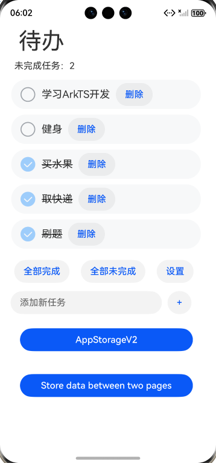

# MVVM模式（状态管理V2）示例

### 介绍
本教程通过一个简单的待办事项应用示例，逐步引入了状态管理V2装饰器，并通过代码重构实现了MVVM架构。最终，将数据、逻辑和视图分层，使得代码结构更加清晰、易于维护。具体介绍链接：

1. [MVVM模式（状态管理V2）](https://gitcode.com/openharmony/docs/blob/master/zh-cn/application-dev/ui/state-management/arkts-mvvm-V2.md)。
2. [AppStorageV2: 应用全局UI状态存储](https://gitcode.com/openharmony/docs/blob/master/zh-cn/application-dev/ui/state-management/arkts-new-appstoragev2.md)指南文档中示例代码片段的工程化，主要目标是实现指南中示例代码需要与sample工程文件同源。
   
### 效果预览
|TodoList页面                                   | AppStorageV2应用按钮                           | 使用AppStorageV2                               | 在两个页面之间存储数据                                  |
|----------------------------------------------|-----------------------------------------------|----------------------------------------------|----------------------------------------------|
|||  |  |

使用说明
1. 点击任务切换任务完成状态；
2. 点击删除、输入添加新任务完成任务增删；
3. 点击全部完成、全部未完成更新所有任务完成状态；
4. 点击设置，更新是否显示已完成任务。
5. 点击AppStorageV2，查看存储全局UI状态状态变量。

### 工程目录
```
/src
├── /main
│   ├── /ets
│   │   ├── /entryability
│   │   ├── /model                       //重构后的Model层
│   │   │   ├── TaskListModel.ets
│   │   │   └── TaskModel.ets
│   │   ├── /pages                       //通过状态管理V2版本实现ViewModel
│   │   │   ├── BasicPage.ets
│   │   │   ├── LocalPage.ets
│   │   │   ├── ParamPage.ets
│   │   │   ├── EventPage.ets
│   │   │   ├── RepeatPage.ets
│   │   │   ├── ObservedV2TracePage.ets
│   │   │   ├── MonitorComputedPage.ets
│   │   │   ├── AppStorageV2Page.ets
│   │   │   ├── PersistenceV2Page.ets
│   │   │   ├── BuilderPage.ets
│   │   │   ├── AppStorageV2.ets         //使用AppStorageV2
│   │   │   ├── PageOne.ets              //在PageOne和PageTwo两个页面之间存储数据Sample
│   │   │   ├── PageTwo.ets 
│   │   │   ├── Sample.ets               //Sample数据页面               
│   │   │   ├── SettingPage.ets          //设置页
│   │   │   └── TodoListPage.ets         //重构后的主页面
│   │   ├── /settingability
│   │   ├── /view                        //重构后的View层
│   │   │   ├── BottomView.ets
│   │   │   ├── ListView.ets
│   │   │   └── TitleView.ets
│   │   ├── /viewmodel                   //重构后的ViewModel层
│   │   │   ├── TaskListViewModel.ets
│   │   │   └── TaskViewModel.ets
│   └── /resources
│       ├── ...
├─── ... 
```

### 具体实现

一、基础状态管理（@Local、@Param、@Event实现组件内及父子组件数据交互）
1. 组件内部状态管理：使用@Local装饰器标记组件内状态变量（如isFinish、tasks），变量变化时自动触发UI刷新；
2. 父子组件数据传递：子组件通过@Param接收父组件传入的值（如taskName），默认只读；@Param @Once允许子组件本地更新传入的初始值（如isFinish）；
3. 子组件向父组件输出：子组件用@Event定义事件（如deleteTask），触发时通知父组件执行对应逻辑（如删除任务）。

二、复杂状态观测与计算（@ObservedV2、@Trace、@Monitor、@Computed实现深层状态管理）
1. 嵌套对象状态观测：@ObservedV2装饰类（如Task），@Trace装饰类内需要观测的属性（如isFinish），实现多层嵌套属性变化的深度监听；
2. 状态变化监听：@Monitor装饰方法（如onTaskFinished），指定监听路径（如'task.isFinish'），属性变化时触发回调记录状态变更；
3. 计算属性：@Computed装饰getter方法（如tasksUnfinished），依赖属性变化时自动重新计算（如过滤未完成任务数量），减少重复计算。

三、全局状态与持久化（AppStorageV2、PersistenceV2实现跨页面共享与数据持久化）
1. 跨页面状态共享：通过AppStorageV2.connect(Setting, 'Setting', 初始化函数)连接全局状态，多页面共享Setting类的showCompletedTask属性（如控制是否显示已完成任务）；
2. 数据持久化：使用PersistenceV2.connect(TaskList, 'TaskList', 初始化函数)将任务数据持久化到磁盘，应用重启后数据不丢失；
3. 初始数据加载：在aboutToAppear生命周期中，若PersistenceV2中无数据，从rawfile的defaultTasks.json加载初始任务并存储。

四、MVVM架构重构（Model、View、ViewModel分层实现）
1. Model层：TaskModel定义任务数据结构，TaskListModel提供任务加载业务逻辑（如从文件加载初始任务）；
2. ViewModel层：TaskViewModel封装单个任务的状态与更新逻辑（如updateIsFinish），TaskListViewModel管理任务列表（加载、增删、批量更新状态）；
3. View层：TitleView展示标题与未完成数，ListView渲染任务列表，BottomView提供操作按钮，各View通过@Param接收ViewModel数据并响应交互。

五、AppStorageV2: 应用全局UI状态存储
1. 使用AppStorageV2，AppStorageV2使用connect接口即可实现对AppStorageV2中数据的修改和同步，如果修改的数据被@Trace装饰，该数据的修改会同步更新UI。
2. 在两个页面之间存储数据，先定义Sample数据页面，然后在Page1和Page2之间实现数据存储。

### 相关权限
不涉及。

### 依赖
不涉及。

### 约束与限制
1. 本示例支持标准系统上运行，支持设备：RK3568等。
2. 本示例支持API22版本SDK，版本号：6.0.2.54。
3. 本示例已支持使DevEco Studio 6.0.0 Release 编译运行。

### 下载
如需单独下载本工程，执行如下命令：
```
git init
git config core.sparsecheckout true
echo code/DocsSample/ArkUISample/StateMgmtV2MVVM > .git/info/sparse-checkout
git remote add origin https://gitcode.com/openharmony/applications_app_samples.git
git pull origin master
```
