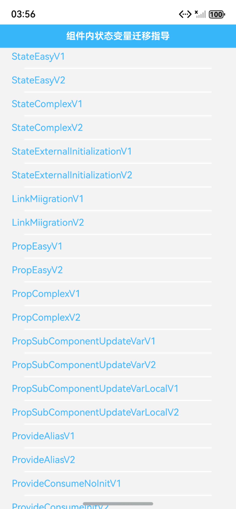

# 组件内状态变量迁移指导指南文档示例

### 介绍

本示例通过使用[ArkUI指南文档](https://gitcode.com/openharmony/docs/tree/master/zh-cn/application-dev/ui)中各场景的开发示例，展示在工程中，帮助开发者更好地理解ArkUI提供的组件及组件属性、状态管理并合理使用。该工程中展示的代码详细描述可查如下链接：

[组件内状态变量迁移指导](https://gitcode.com/tianlongdevcode/docs_zh/blob/master/zh-cn/application-dev/ui/state-management/arkts-v1-v2-migration-inner-component.md)。


### 1. [组件内状态变量迁移指导]
### 效果预览

| 列表                                 |  示例 
|------------------------------------|--------------------------------------|
|  |    |

### 使用说明

1. 在主界面，可以点击对应卡片，选择需要参考的组件示例。

2. 在组件目录选择详细的示例参考。

3. 进入示例界面，查看参考示例。

4. 通过自动测试框架可进行测试及维护。

### 工程目录
```
entry/src/main/ets/
|---entryability
|---pages
|   |---componentstatemigration                             //组件内状态变量迁移指导
|   |       |---StateEasyV1.ets    //V1 @State装饰器
|   |       |---StateEasyV2.ets    //V2 @Local装饰器
|   |       |---StateComplexV1.ets    //V1 @State装饰器
|   |       |---StateComplexV2.ets   //V2 @ObservedV2和@Trace装饰器
|   |       |---StateExternalInitializationV1.ets    //V1 @State装饰器
|   |       |---StateExternalInitializationV2.ets    //V2 @Param和@Once装饰器
|   |       |---LinkMiigrationV1.ets    //V1 @Link装饰器
|   |       |---LinkMiigrationV2.ets     //V2 @Param和@Event装饰器
|   |       |---PropEasyV1.ets     //V1 @Prop装饰器
|   |       |---PropEasyV2.ets     //V2 @Param装饰器
|   |       |---PropComplexV1.ets    //V1 @Prop装饰器
|   |       |---PropComplexV2.ets    //V2 @Param装饰器
|   |       |---PropSubComponentUpdateVarV1.ets    //V1 @Prop装饰器
|   |       |---PropSubComponentUpdateVarV2.ets    //V2 @Param和@Once装饰器
|   |       |---PropSubComponentUpdateVarLocalV1.ets    //V1 @Prop装饰器
|   |       |---PropSubComponentUpdateVarLocalV2.ets     //V2 @Param和@Once、@Monitor装饰器
|   |       |---ProvideAliasV1.ets    //V1 @Provide和@Consume装饰器
|   |       |---ProvideAliasV2.ets    //V2 @Provider和@Consumer装饰器
|   |       |---ProvideConsumeNoInitV1.ets    //V1 @@Provide和@Consume装饰器
|   |       |---ProvideConsumeInitV2.ets    //V2 @Provider和@Consumer装饰器
|   |       |---ProvideParentInitV1.ets    //V1 @Provide和@Consume装饰器
|   |       |---ProvideParentNoInitV2.ets    //V2 @Provider和@Consumer装饰器
|   |       |---ProvideNoAllowOverrideV1.ets   /V1 @Provide和@Consume装饰器
|   |       |---ProvideAllowOverrideV2.ets    //V2 @Provider和@Consumer装饰器
|   |       |---WatchSingleVarV1.ets    /V1 @Watch 装饰器
|   |       |---WatchSingleVarV2.ets   //V2 @Monitor装饰器
|   |       |---WatchMoreVarV1.ets     /V1 @Watch 装饰器
|   |       |---WatchMoreVarV2.ets    //V2 @Monitor装饰器
|   |       |---ComputedV1.ets     /V1 @State装饰器
|   |       |---ComputedV2.ets     //V2 @Computed装饰器
|---pages
|   |---Index.ets                       // 应用主页面
entry/src/ohosTest/
|---ets
|   |---ComponentStateMigration.test.ets           // 组件内状态变量迁移指导示例代码测试代码
```

### 具体实现

1. 复杂类型迁移需补全观察能力
   
   V1 的 @State 可直接观察复杂对象第一层属性变化，V2 的 @Local 仅观察对象自身。实际改造时，需先在复杂类上添加 @ObservedV2 装饰器，再在需追踪的属性上标注 @Trace，例如 Child 类的 value 属性，确保对象内部变化能触发 UI 更新。

2. 双向/单向绑定逻辑需重构
   
   双向绑定（V1@Link）迁移时，需拆分为 V2 的 @Param（父到子传值）+@Event（子触发父更新），通过子组件调用 @Event 回调修改父组件状态；单向绑定（V1@Prop）若需子组件修改值，需用 @Param+@Once 组合，若需父组件后续更新仍同步子组件，需额外搭配 @Monitor 监听父值变化并覆写子组件本地变量。

3. 计算与监听能力需适配新装饰器

   V1 无计算属性时重复的表达式（如拼接姓名），V2 需定义 @Computed 修饰的 getter 方法（如 fullName），实现一次计算多处复用；变量监听（V1@Watch）迁移为 V2@Monitor 后，可在单个回调中监听多个变量（如同时监听 apple 和 orange），并通过 monitor.value () 获取变化前后的值，减少回调函数数量。

### 相关权限

不涉及。

### 依赖

不涉及。

### 约束与限制

1.本示例仅支持标准系统上运行, 支持设备：RK3568。

2.本示例为Stage模型，支持API21版本SDK，版本号：6.0.0.33，镜像版本号：OpenHarmony_6.0.0.33。

3.本示例需要使用DevEco Studio 6.0.0 Release (Build Version: 6.0.0.858， built on September 24, 2025)及以上版本才可编译运行。

### 下载

如需单独下载本工程，执行如下命令：

````
git init
git config core.sparsecheckout true
echo code/DocsSample/ArkUISample/StateMigrationProject > .git/info/sparse-checkout
git remote add origin https://gitCode.com/openharmony/applications_app_samples.git
git pull origin master
````