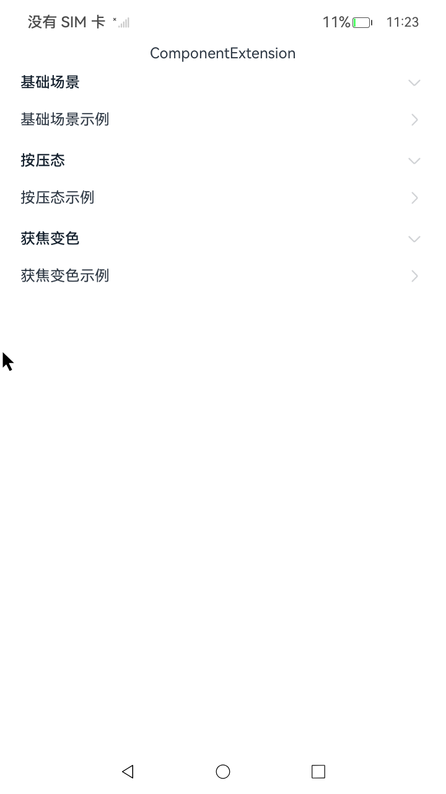
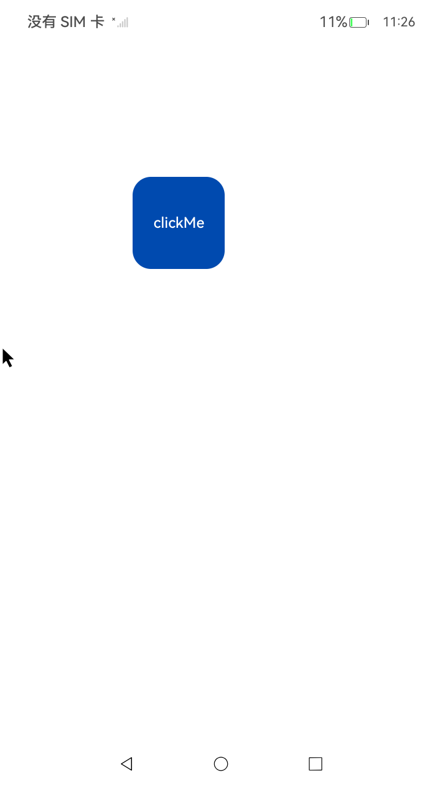

# 手势响应指南

### 介绍

1. 本示例通过使用[ArkUI指南文档](https://gitcode.com/openharmony/docs/tree/master/zh-cn/application-dev/ui)
中各场景的开发示例，展示在工程中，帮助开发者更好地理解ArkUI提供的组件及组件属性并合理使用。
2. 单击作为常用的手势，可以方便地使用onClick接口实现。尽管被称为事件，它实际上是基本手势类型，等同于将count配置为1的TapGesture，即单击手势。
3. 组合手势由多种单一手势组合而成，通过在GestureGroup中使用不同的GestureMode来声明该组合手势的类型，支持顺序识别、并行识别和互斥识别三种类型。
4. 多层级手势事件指父子组件嵌套时，父子组件均绑定了手势或事件。在该场景下，手势或者事件的响应受到多个因素的影响，相互之间发生传递和竞争，容易出现预期外的响应。
5. 手势冲突是指多个手势识别器在同一组件或重叠区域同时识别时产生竞争，导致识别结果不符合预期。

### 示例文档
[stateStyles：多态样式](https://gitcode.com/openharmony/docs/blob/master/zh-cn/application-dev/ui/state-management/arkts-statestyles.md)

### 效果预览

| 首页                                 | 交互类组件目录                            | 多态样式示例                             |
|------------------------------------|------------------------------------|------------------------------------|
|  |  |  |

### 使用说明

1. 在主界面，可以点击对应卡片，选择需要参考的组件示例。

2. 在组件目录选择详细的示例参考。

3. 进入示例界面，查看参考示例。

4. 通过自动测试框架可进行测试及维护。

### 工程目录

```
entry/src/main/ets/
|---entryability
|---pages
|   |---FocusStyle                            //多态样式    
|   |       |---CompWithInlineStateStyles.ets   
|   |---NormalStyle                                
|   |       |---MyComponent.ets   
|   |---StateStyle                              
|   |       |---StateStylesSample.ets            
|---pages
|   |---Index.ets                       // 应用主页面
entry/src/ohosTest/
|---ets
|   |---index.test.ets                       // 示例代码测试代码
```

### 具体实现

1. stateStyles 通过为组件的不同内部状态（如 normal、focused、pressed 等）。
2. 绑定对应的样式规则，实现动态的多态视觉效果，其使用方式是在组件上调用。
3. stateStyles({}) 方法，传入一个以状态名为键的对象，每个状态内通过链式调用设置通用样式属性，从而在用户交互时自动切换外观，提升用户体验。

### 相关权限

不涉及。

### 依赖

不涉及。

### 约束与限制

1.本示例仅支持标准系统上运行, 支持设备：RK3568。

2.本示例为Stage模型，支持API14版本SDK，版本号：5.0.2.57，镜像版本号：OpenHarmony_5.0.2.57。

3.本示例需要使用DevEco Studio NEXT Developer Preview2 (Build Version: 5.0.5.306， built on December 12, 2024)及以上版本才可编译运行。

### 下载

如需单独下载本工程，执行如下命令：

````
git init
git config core.sparsecheckout true
echo code/DocsSample/ArkUISample/EventProject > .git/info/sparse-checkout
git remote add origin https://gitcode.com/openharmony/applications_app_samples.git
git pull origin master
````