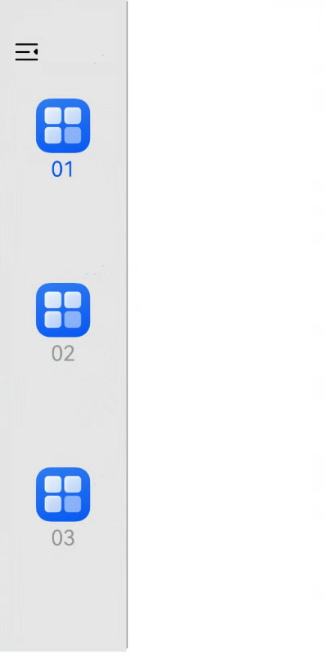
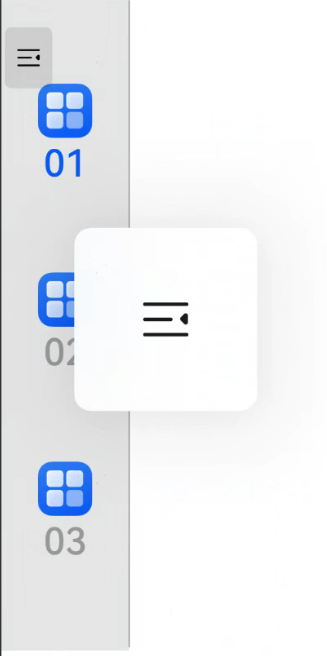
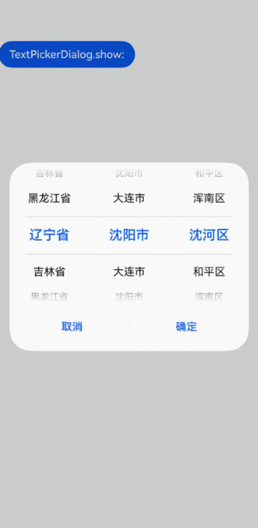

# 支持适老化

## 介绍

系统字体被放大后，应用应确保整体布局不出现错乱，组件不出现重叠。可以根据业务需要限制跟随的字体最大档位、改变布局来更好的适配更大字体等。本文旨在指导应用如何跟随系统字体大小和跟随到的最大倍数。

本示例为[支持适老化](https://gitcode.com/openharmony/docs/blob/master/zh-cn/application-dev/ui/arkui-support-for-aging-adaptation.md)的配套示例工程。 

本示例展示了适配适老化的组件及触发方式。

## 效果预览

| 系统字体为一倍(适老化能力开启前)               | 系统字体为1.75倍(适老化能力开启后)    |
| -------------------------------------------- | ---------------------------------- |
||  |
||  |

## 使用说明
1. 安装编译生成的hap包，并打开应用；
2. SideBarContainer组件通过长按控制按钮触发适老化弹窗。在系统字体为1倍的情况下，长按控制按钮不能弹窗。在系统字体大于1倍的情况下，长按控制按钮可以弹窗；
3. TextPickerDialog组件通过设置系统字体大小触发适老化弹窗。在系统字体为1倍的情况下，适老化不触发；在系统字体大于1倍的情况下，适老化触发；

## 工程目录

```
AppScope
    └── Index.ets
    └── resources/base/profile
            └── configuration.json

entry/src/main/ets/
└── pages
    └── Index.ets (获取文本界面)
    ├── SideBarContainer.ets
    └── TextPickerDialog.ets
```

## 具体实现

1. 长按系统组件触发：SideBarContainer组件通过长按控制按钮触发适老化弹窗。源码参考[SideBarContainer.ets](https://gitcode.com/openharmony/applications_app_samples/blob/master/code/DocsSample/ArkUISample/SupportingAgingFriendly/entry/src/main/ets/pages/SideBarContainer.ets)

    * 使用SideBarContainer提供侧边栏可以显示和隐藏的侧边栏容器，通过子组件定义侧边栏和内容区

    * 在SideBarContainer组件里面定义一些按钮

    * 在按钮的点击回调里面设置对应的字体大小

2. 设置系统字体默认放大：TextPickerDialog组件通过设置系统字体大小触发适老化弹窗。源码参考[TextPickerDialog.ets](https://gitcode.com/openharmony/applications_app_samples/blob/master/code/DocsSample/ArkUISample/SupportingAgingFriendly/entry/src/main/ets/pages/TextPickerDialog.ets)

    * 定义一个按钮，点击触发显示地区选项

    * 定义一些按钮设置字体倍数

    * 在按钮的点击回调里面设置对应的字体大小

## 相关权限

不涉及

## 依赖

不涉及

## 约束和限制

1. 本示例支持标准系统上运行，支持设备：RK3568;

2. 本示例支持API20版本SDK，版本号：6.0.0.36;
   
3. 本示例已支持使DevEco Studio 5.0.5 Release (构建版本：5.0.13.100，构建 2025年4月25日)编译运行

## 下载

如需单独下载本工程，执行如下命令：

```
git init
git config core.sparsecheckout true
echo code/DocsSample/ArkUISample/SupportingAgingFriendly > .git/info/sparse-checkout
git remote add origin https://gitcode.com/openharmony/applications_app_samples.git
git pull origin master
```