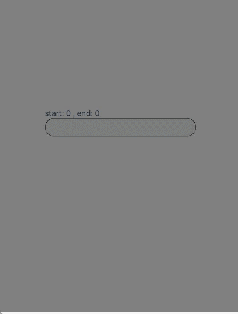

# TextAreaEventNDK

## 介绍

本示例为使用NDK接口构建UI->使用文本->[监听输入框事件](https://gitee.com/openharmony/docs/blob/master/zh-cn/application-dev/ui/ndk-textarea-event.md)的配套示例工程。 

本示例展示了输入框输入、选中以及选中菜单。

## 效果预览

| 预览                                      | 
| -------------------------------------------- | 


## 使用说明
1. 安装编译生成的hap包，并打开应用；
2. 在输入框内输入一段文字；
3. 长按文字进行选中；


## 工程目录

```
TextAreaEventNDK
entry/src/main/ets/
└── pages
    └── Index.ets (获取输入框界面)
entry/src/main/
├── cpp
│   ├── types
│   │   └── libentry
│   │       └── Index.d.ts (NDK函数对应的js映射)
│   ├── CMakeLists.txt (CMake脚本)
|   ├── manager.cpp (创建输入框实现CPP文件)
|   ├── manager.h
│   └── napi_init.cpp (NDK函数)
└── resources
    ├── base
    │   ├── element
    │   │   ├── color.json
    │   │   ├── float.json
    │   │   └── string.json
    │   └── media
```

## 相关权限

不涉及

## 依赖

不涉及

## 约束和限制

1. 本示例支持标准系统上运行，支持设备：RK3568;

2. 本示例支持API20版本SDK，版本号：6.0.0.36;
   
3. 本示例已支持使DevEco Studio 5.0.5 Release (构建版本：5.0.13.100，构建 2025年4月25日)编译运行

## 下载

如需单独下载本工程，执行如下命令：

```
git init
git config core.sparsecheckout true
echo code/DocsSample/ArkUISample/TextAreaEventNDK > .git/info/sparse-checkout
git remote add origin https://gitee.com/openharmony/applications_app_samples.git
git pull origin master
```