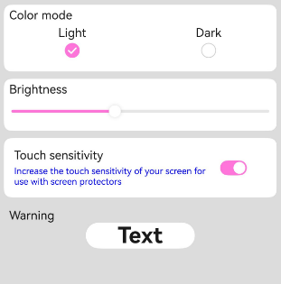

# ArkUI设置应用内主题换肤指南文档示例

### 介绍

本示例通过使用[ArkUI指南文档](https://gitcode.com/openharmony/docs/tree/master/zh-cn/application-dev/ui)中各场景的开发示例，展示在工程中，帮助开发者更好地理解ArkUI提供的组件及组件属性并合理使用。该工程中展示的代码详细描述可查如下链接：

1. [设置应用内主题换肤](https://gitcode.com/openharmony/docs/blob/master/zh-cn/application-dev/ui/theme_skinning.md)。


### 效果预览
| 组件自定义主题色效果图                                 | 局部页面自定义主题风格效果图                                    | 局部深浅色效果图                                            |
| ------------------------------------ | --------------------------------------------- | --------------------------------------------------- |
|  |  |  |

### 使用说明

1. 在主界面，可以点击对应页面，选择需要参考的组件示例。

2. 在组件目录选择详细的示例参考。

3. 进入示例界面，查看参考示例。

4. 通过自动测试框架可进行测试及维护。

### 工程目录
```
entry/src/main/ets/
├── common
│   └── Resource.ets
├── entryability
│   └── EntryAbility.ets
├── entrybackupability
│   └── EntryBackupAbility.ets
└── pages
    ├── Index.ets
    ├── Theme1
    │   ├── AppTheme.ets              // 自定义主题色
    │   └── Theme1.ets                // 设置应用内组件自定义主题色
    ├── Theme2
    │   └── Theme2.ets                // 应用局部页面自定义主题风格
    ├── Theme3
    │   └── Theme3.ets                // 设置应用页面局部深浅色
    └── common
        └── Index.ets
entry/src/ohosTest/
├── ets
│   └── test
│       ├── Ability.test.ets
│       ├── Index.test.ets            // 测试用例代码
│       └── List.test.ets
└── module.json5
```

### 具体实现

‌1. 自定义主题色配置‌
创建自定义颜色类实现CustomColors接口，定义品牌色、警示色等主题属性，仅需复写需要修改的部分，未修改内容将继承系统默认设置。

‌2. 主题设置时机‌
在页面build前通过ThemeControl.setDefaultTheme()设置自定义主题色，确保在组件渲染前应用主题配置。

‌3. 组件主题响应机制‌
在自定义组件中使用onWillApplyTheme回调函数获取当前生效的Theme对象，实现主题色的动态应用。

‌4. UIAbility中的主题设置‌
在UIAbility的onWindowStageCreate()方法中调用ThemeControl.setDefaultTheme()，统一设置应用内组件的自定义主题色。

‌5. 局部主题应用‌
支持在单个页面或组件级别应用自定义主题，通过设置组件的backgroundColor等属性绑定主题色变量，实现局部深浅色切换效果

### 相关权限

不涉及。

### 依赖

不涉及。

### 约束与限制

1.本示例仅支持标准系统上运行, 支持设备：RK3568。

2.本示例为Stage模型，支持API20版本SDK，版本号：6.0.0.33，镜像版本号：OpenHarmony_6.0.0.33。

3.本示例需要使用DevEco Studio 6.0.0 Release (Build Version: 6.0.0.858， built on September 24, 2025)及以上版本才可编译运行。

### 下载

如需单独下载本工程，执行如下命令：

````
git init
git config core.sparsecheckout true
echo code/DocsSample/ArkUISample/ThemeSkinning > .git/info/sparse-checkout
git remote add origin https://gitcode.com/openharmony/applications_app_samples.git
git pull origin master
````