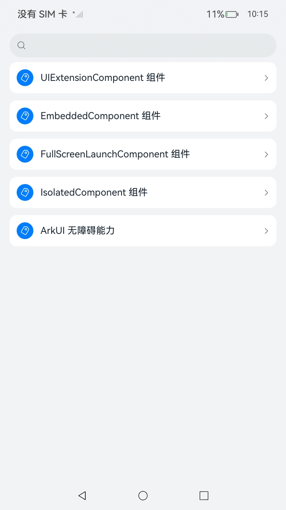

# 使用UIExtension控件与ArkUI无障碍指南文档示例

### 介绍

本示例通过使用[ArkUI指南文档](https://gitcode.com/openharmony/docs/tree/master/zh-cn/application-dev/ui)中各场景的开发示例，展示在工程中，帮助开发者更好地理解UIExtension控件与ArkUI无障碍属性并合理使用。该工程中展示的代码详细描述可查如下链接：

1. [跨进程应用能力扩展（UIExtension，仅对系统应用开放）](https://gitcode.com/openharmony/docs/blob/OpenHarmony-5.1.0-Release/zh-cn/application-dev/ui/arkts-ui-extension-components.md)。
2. [同应用进程嵌入式组件 (EmbeddedComponent)](https://gitcode.com/openharmony/docs/blob/OpenHarmony-5.1.0-Release/zh-cn/application-dev/ui/arkts-embedded-components.md)。
3. [全屏启动原子化服务组件（FullScreenLaunchComponent）](https://gitcode.com/openharmony/docs/blob/OpenHarmony-5.1.0-Release/zh-cn/application-dev/ui/arkts-FullScreenComponent.md)。
4. [跨线程嵌入式组件 (IsolatedComponent，仅对系统应用开放)](https://gitcode.com/openharmony/docs/blob/OpenHarmony-5.1.0-Release/zh-cn/application-dev/ui/arkts-isolated-components.md)。
5. [支持无障碍](https://gitcode.com/openharmony/docs/blob/OpenHarmony-5.1.0-Release/zh-cn/application-dev/ui/arkts-universal-attributes-accessibility.md)。

### 效果预览

| 首页选项目录                                 | Isolated目录                            | Isolated示例                            | Embedded示例                           
|------------------------------------|------------------------------------|------------------------------------|--------------------------------------|
|  |  |  |  |

### 使用说明

1. 在主界面，可以点击对应卡片，选择需要参考的组件示例。

2. 在组件目录选择详细的示例参考。

3. 进入示例界面，查看参考示例。

4. 通过自动测试框架可进行测试及维护。

### 工程目录
```
entry/src/main/ets/
|---entryability
|---pages
|   |---EmbeddedComponent                   // EmbeddedComponent 组件
|   |       |---Embedded.ets
|   |       |---Extension.ets
|   |       |---Index.ets
|   |---FullScreenLaunchComponent           // FullScreenLaunchComponent 组件
|   |       |---FullScreenLaunch.ets
|   |       |---Index.ets
|   |---IsolatedComponent                   // IsolatedComponent 组件
|   |       |---Extension.ets
|   |       |---Index.ets
|   |       |---Isolated.ets
|   |---UIExtensionComponent                // UIExtensionComponent 组件
|   |       |---Extension.ets
|   |       |---Index.ets
|   |       |---UIExtension.ets
|   |---UniversalAttributesAccessibility    // ArkUI 无障碍能力
|   |       |---AccessibilityFocusDrawLevel.ets
|   |       |---AccessibilityGroup.ets
|   |       |---AccessibilityText.ets
|   |       |---Index.ets
|---pages
|   |---Index.ets                           // 应用主页面
entry/src/ohosTest/
|---ets
|   |---index.test.ets                      // 示例代码测试代码
```

### 具体实现

1. 引入必要头文件，包括日志、ArkUI 节点、元能力 Want 等接口定义。
2. 定义错误和终止事件回调函数 onError、onTerminated，暂为空实现。
3. 实现嵌入式组件创建函数 embeddedNode：
4. 获取 NAPI 回调参数，提取节点内容句柄。
5. 获取 ArkUI 节点 API 接口，创建嵌入式组件节点。
6. 构造元能力 Element，包含包名、能力名等信息，创建 Want 对象并设置为组件属性。
7. 创建嵌入式组件选项，绑定事件回调并设置为组件属性。
8. 设置组件宽高属性
9. 创建Column容器，设置属性并将嵌入式组件作为字节点添加
10. Column容器添加到节点内容

### 相关权限

允许系统方舟运行时引擎在受限模式下执行动态下发的方舟字节码。

[ohos.permission.RUN_DYN_CODE](https://gitcode.com/openharmony/docs/blob/master/zh-cn/application-dev/security/AccessToken/permissions-for-all.md#ohospermissionrun_dyn_code)

### 依赖

不涉及。

### 约束与限制

1.本示例仅支持标准系统上运行, 支持设备：RK3568。

2.本示例为Stage模型，支持API20版本SDK，版本号：6.0.0.35，镜像版本号：OpenHarmony_6.0.0.35。

3.本示例需要使用DevEco Studio 5.0.3 Release (Build Version: 5.0.9.300, built on March 13, 2025)及以上版本才可编译运行。

4.本示例类型为系统应用，需要使用Full SDK，使用Full SDK时需要手动从镜像站点获取，并在DevEco Studio中替换，具体操作可参考[替换指南](https://gitcode.com/openharmony/docs/blob/master/zh-cn/application-dev/faqs/full-sdk-switch-guide.md)。

5.本示例涉及相关权限为system_core级别(相关权限级别可通过[权限定义列表](https://gitcode.com/openharmony/docs/blob/master/zh-cn/application-dev/security/AccessToken/permissions-for-all.md)查看)，需要手动配置对应级别的权限签名(具体操作可查看[应用包签名工具概述](https://gitcode.com/openharmony/docs/blob/master/zh-cn/application-dev/security/hapsigntool-overview.md#%E5%BA%94%E7%94%A8%E5%8C%85%E7%AD%BE%E5%90%8D%E5%B7%A5%E5%85%B7%E6%A6%82%E8%BF%B0))。

6.本示例类型为系统应用，需要手动配置对应级别的应用类型("app-feature": "hos_system_app")。具体可参考profile配置文件[bundle-info对象内部结构](https://gitcode.com/openharmony/docs/blob/master/zh-cn/application-dev/security/app-provision-structure.md#bundle-info%E5%AF%B9%E8%B1%A1%E5%86%85%E9%83%A8%E7%BB%93%E6%9E%84)。

### 下载

如需单独下载本工程，执行如下命令：

````
git init
git config core.sparsecheckout true
echo code/DocsSample/ArkUISample/UIExtensionAndAccessibility > .git/info/sparse-checkout
git remote add origin https://gitcode.com/openharmony/applications_app_samples.git
git pull origin master
````