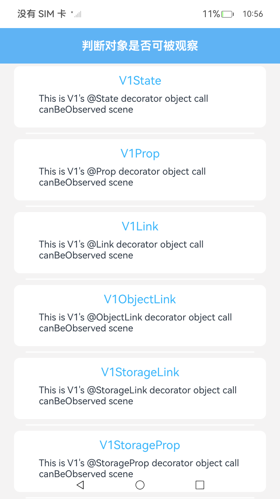
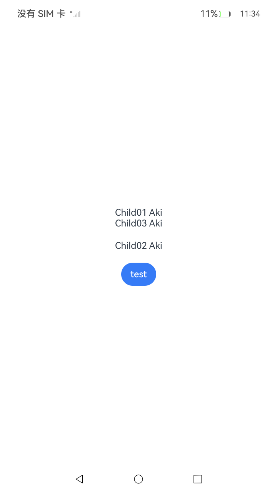

# canBeObserved接口：判断对象是否为可被观察对象

### 介绍

开发和调试过程中，开发者会遇到：修改对象的值UI页面不刷新的问题，在较为复杂的业务中排查起来很不方便。因此提供[canBeObserved接口](https://gitcode.com/openharmony/docs/blob/master/zh-cn/application-dev/reference/apis-arkui/js-apis-stateManagement.md#canbeobserved23)，开发者使用该接口不仅可以判断对象是否为可被观察的对象，还可以获取到对象关联的组件信息。
以下是在V1、V2不同场景中的代码示例及结果说明。

### 工程目录
```
entry/src/main/ets/
├── common
│   └── resource.ets
├── entryability
│   └── EntryAbility.ets
├── entrybackupability
│   └── EntryBackupAbility.ets
└── pages
    ├── V1AndV2Compatibility.ets        // v1使用enableV2Compatiblity方法封装对象传入v2组件
    ├── V1BuiltIn.ets                   // v1 built-in类型数据使用场景
    ├── V1Link.ets                      // v1@Link装饰器使用场景
    ├── V1LocalStorageLink.ets          // v1@LocalStorageLink装饰器使用场景
    ├── V1LocalStorageProp.ets          // v1@LocalStorageProp装饰器使用场景
    ├── V1MakeV1Observed.ets            // v1使用makeV1Observed方法封装对象场景                 
    ├── V1ObjectLink.ets                // v1@ObjectLink装饰器使用场景               
    ├── V1Prop.ets                      // v1@Prop装饰器使用场景        
    ├── V1ProvideAndConsume.ets         // v1@Provide和@Consume装饰器使用场景        
    ├── V1State.ets                     // v1@State装饰器使用场景        
    ├── V1StorageLink.ets               // v1@StorageLink装饰器使用场景        
    ├── V1StorageProp.ets               // v1@StorageProp装饰器使用场景        
    ├── V2BuiltIn.ets                   // v2 built-in类型数据使用场景        
    ├── V2Computed.ets                  // v2@Computed装饰器使用场景        
    ├── V2Local.ets                     // v2@Local装饰器使用场景        
    ├── V2MakeObserved.ets              // v2使用makeObserved方法封装对象场景      
    ├── V2Monitor.ets                   // v2@Monitor装饰器使用场景        
    ├── V2Param.ets                     // v2@Param装饰器使用场景    
    ├── V2ProviderAndConsumer.ets       // v2@Provider和@Consumer装饰器使用场景            
    └── Index.ets                       // 页面入口
entry/src/ohosTest/
├── ets
│   └── test
│       ├── Ability.test.ets
│       ├── CanBeObserved.test.ets      // 测试用例代码
│       └── List.test.ets
└── module.json5
```

### 具体实现

1、从Index页面选择一个使用场景，点击进入。
2、点击页面内test按钮，观察控制台输出日志，日志过滤关键字：CanBeObserved。

### 运行示意图




### 相关权限

不涉及。

### 依赖

不涉及。

### 约束与限制

1.本示例仅支持标准系统上运行, 支持设备：RK3568。

2.本示例为Stage模型，支持API23版本SDK，版本号：6.0.2.23，镜像版本号：OpenHarmony_6.1.0.25。

3.本示例需要使用DevEco Studio 6.0.0 Release (Build Version: 6.0.0.858， built on September 24, 2025)及以上版本才可编译运行。

### 下载

如需单独下载本工程，执行如下命令：

````
git init
git config core.sparsecheckout true
echo code/DocsSample/ArkUISample/UIUtilsCanBeObserved > .git/info/sparse-checkout
git remote add origin https://gitcode.com/openharmony/applications_app_samples.git
git pull origin master
````