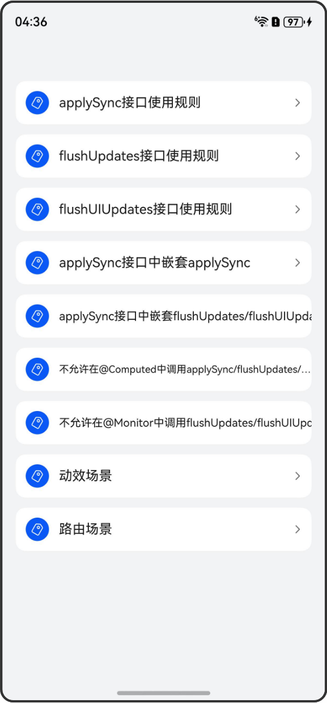

# applySync/flushUpdates/flushUIUpdates接口：同步刷新

## 介绍

本工程帮助开发者更好地理解applySync/flushUpdates/flushUIUpdates三个接口的使用场景。该工程中展示的代码详细描述可查如下链接：

[applySync/flushUpdates/flushUIUpdates接口：同步刷新](https://gitcode.com/openharmony/docs/blob/master/zh-cn/application-dev/ui/state-management/arkts-new-applySync-flushUpdates-flushUIUpdates.md)

## 效果预览

|首页                                   |
|----------------------------------------------|
||

## 使用说明

执行测试用例会先打开相应界面，然后点击按钮或图标，演示接口的使用效果。

## 工程目录
```
entry/src/
├── main
│   ├── ets
│   │   ├── entryability
│   │   ├── entrybackupability
│   │   ├── pages
│   │   │   ├── AnimateToUse.ets
│   │   │   ├── ApplySyncNestApplySync.ets
│   │   │   ├── ApplySyncNestOthers.ets
│   │   │   ├── ApplySyncUse.ets
│   │   │   ├── CallInComputed.ets
│   │   │   ├── CallInMonitor.ets
│   │   │   ├── FlushUIUpdatesUse.ets
│   │   │   ├── FlushUpdatesUse.ets
│   │   │   ├── Index.ets
│   │   │   ├── PageUse.ets       
│   │   │   └── PageTransitionTwo.ets
│   └── resources
│       ├── ...
├─── ... 
```

## 具体实现

1. applySync接口用于同步刷新指定的状态变量，该接口接收一个闭包函数，仅刷新闭包函数内的修改。

2. flushUpdates接口用于同步刷新在调用该函数之前所有的状态变量修改。

3. flushUIUpdates接口用于同步刷新在调用该函数之前所有的UI节点，但不会执行@Computed计算和@Monitor回调。

4. 在applySync闭包函数中嵌套调用applySync，内层的applySync将会被跳过并返回undefined。

5. 在applySync闭包函数中调用flushUpdates或flushUIUpdates接口将不起作用。

6. 不支持在@Computed装饰的getter方法中调用applySync、flushUpdates和flushUIUpdates接口，否则运行时会报错。

7. 不支持在@Monitor回调函数中调用flushUpdates和flushUIUpdates接口，否则运行时会报错。

8. 使用同步刷新接口可以实现状态管理V2与动画连用时的预期效果。

9. 使用同步刷新接口可以实现路由场景下的转场动效。

## 相关权限

不涉及。

## 依赖

不涉及。

## 约束与限制

1.本示例已适配API version 22及以上版本SDK。

## 下载

如需单独下载本工程，执行如下命令：

```
git init
git config core.sparsecheckout true
echo code/DocsSample/ArkUISample/UpdateDirtySync/ > .git/info/sparse-checkout
git remote add origin https://gitcode.com/openharmony/applications_app_samples.git
git pull origin master
```