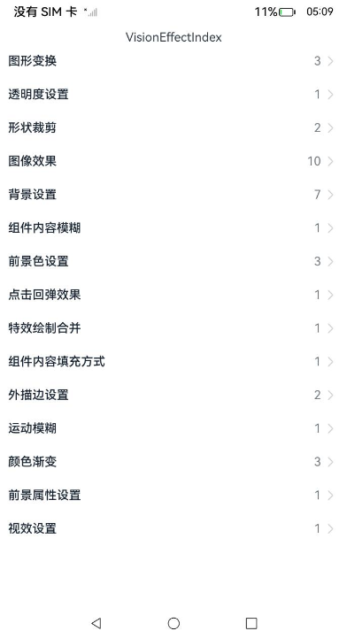

# ArkUI使用视效组件指南文档示例

### 介绍

本示例通过使用[ArkUI指南文档](https://gitee.com/openharmony/docs/tree/master/zh-cn/application-dev/ui)中各场景的开发示例，展示在工程中，帮助开发者更好地理解ArkUI提供的组件及组件属性并合理使用。该工程中展示的代码详细描述可查如下链接：

1. [图形变换](https://gitee.com/openharmony/docs/blob/master/zh-cn/application-dev/reference/apis-arkui/arkui-ts/ts-universal-attributes-transformation.md)。
2. [透明度设置](https://gitee.com/openharmony/docs/blob/master/zh-cn/application-dev/reference/apis-arkui/arkui-ts/ts-universal-attributes-opacity.md)。
3. [形状裁剪](https://gitee.com/openharmony/docs/blob/master/zh-cn/application-dev/reference/apis-arkui/arkui-ts/ts-universal-attributes-sharp-clipping.md)。
4. [图像效果](https://gitee.com/openharmony/docs/blob/master/zh-cn/application-dev/reference/apis-arkui/arkui-ts/ts-universal-attributes-image-effect.md)
5. [背景设置](https://gitee.com/openharmony/docs/blob/master/zh-cn/application-dev/reference/apis-arkui/arkui-ts/ts-universal-attributes-background.md)
6. [组件内容模糊](https://gitee.com/openharmony/docs/blob/master/zh-cn/application-dev/reference/apis-arkui/arkui-ts/ts-universal-attributes-foreground-blur-style.md)
7. [前景色设置](https://gitee.com/openharmony/docs/blob/master/zh-cn/application-dev/reference/apis-arkui/arkui-ts/ts-universal-attributes-foreground-color.md)
8. [点击回弹效果](https://gitee.com/openharmony/docs/blob/master/zh-cn/application-dev/reference/apis-arkui/arkui-ts/ts-universal-attributes-click-effect.md)
9. [特效绘制合并](https://gitee.com/openharmony/docs/blob/master/zh-cn/application-dev/reference/apis-arkui/arkui-ts/ts-universal-attributes-use-effect.md)
10. [组件内容填充方式](https://gitee.com/openharmony/docs/blob/master/zh-cn/application-dev/reference/apis-arkui/arkui-ts/ts-universal-attributes-renderfit.md)
11. [外描边设置](https://gitee.com/openharmony/docs/blob/master/zh-cn/application-dev/reference/apis-arkui/arkui-ts/ts-universal-attributes-outline.md)
12. [运动模糊](https://gitee.com/openharmony/docs/blob/master/zh-cn/application-dev/reference/apis-arkui/arkui-ts/ts-universal-attributes-motionBlur.md)
13. [颜色渐变](https://gitee.com/openharmony/docs/blob/master/zh-cn/application-dev/reference/apis-arkui/arkui-ts/ts-universal-attributes-gradient-color.md)
14. [前景属性设置](https://gitee.com/openharmony/docs/blob/master/zh-cn/application-dev/reference/apis-arkui/arkui-ts/ts-universal-attributes-foreground-effect.md)
15. [视效设置](https://gitee.com/openharmony/docs/blob/master/zh-cn/application-dev/reference/apis-arkui/arkui-ts/ts-universal-attributes-filter-effect.md)


### 效果预览

| 首页                                 |
|------------------------------------|
|  |

### 使用说明

1. 在主界面，可以点击对应卡片，选择需要参考的组件示例。

2. 在组件目录选择详细的示例参考。

3. 进入示例界面，查看参考示例。

4. 通过自动测试框架可进行测试及维护。

### 工程目录
```
entry/src/main/ets/
|---entryability
|---pages
|   |---background                       //背景设置 
|   |   |---template1
|   |   |   |---Index.ets
|   |   |---template2
|   |   |   |---Index.ets
|   |   |---template3
|   |   |   |---Index.ets
|   |   |---template4
|   |   |   |---Index.ets
|   |   |---template5
|   |   |   |---Index.ets
|   |   |---template6
|   |   |   |---Index.ets
|   |   |---template7
|   |   |   |---Index.ets
|   |---clickEffect                      //点击回弹效果
|   |   |---template1
|   |   |   |---Index.ets
|   |---clip                             //形状裁剪
|   |   |---template1
|   |   |   |---Index.ets
|   |   |---template2
|   |   |   |---Index.ets
|   |---foregroundBlurStyle              //组件内容模糊
|   |   |---template1
|   |   |   |---Index.ets
|   |---foregroundColor                  //前景色设置
|   |   |---template1
|   |   |   |---Index.ets
|   |   |---template2
|   |   |   |---Index.ets
|   |   |---template3
|   |   |   |---Index.ets
|   |---foregroundEffect                 //前景属性设置
|   |   |---template1
|   |   |   |---Index.ets   
|   |---imageEffect                      //图像效果
|   |   |---template1
|   |   |   |---Index.ets     
|   |   |---template2
|   |   |   |---Index.ets    
|   |   |---template3
|   |   |   |---Index.ets    
|   |   |---template4
|   |   |   |---Index.ets    
|   |   |---template5
|   |   |   |---Index.ets    
|   |   |---template6
|   |   |   |---Index.ets    
|   |   |---template7
|   |   |   |---Index.ets    
|   |   |---template8
|   |   |   |---Index.ets    
|   |   |---template9
|   |   |   |---Index.ets    
|   |   |---template10
|   |   |   |---Index.ets       
|   |---linearGradient                   //颜色渐变
|   |   |---template1
|   |   |   |---Index.ets          
|   |   |---template2
|   |   |   |---Index.ets     
|   |   |---template3
|   |   |   |---Index.ets        
|   |---motionBlur                       //运动模糊
|   |   |---template1
|   |   |   |---Index.ets          
|   |---opacity                          //透明度设置
|   |   |---template1
|   |   |   |---Index.ets           
|   |---outline                          //外描边设置
|   |   |---template1
|   |   |   |---Index.ets       
|   |   |---template2
|   |   |   |---Index.ets       
|   |---renderFit                        //组件内容填充方式
|   |   |---template1
|   |   |   |---Index.ets        
|   |---transform                        //图形变换
|   |   |---template1
|   |   |   |---Index.ets       
|   |   |---template2
|   |   |   |---Index.ets       
|   |   |---template3
|   |   |   |---Index.ets       
|   |---useEffect                        //特效绘制合并
|   |   |---template1
|   |   |   |---Index.ets      
|   |---visualEffect                     //视效设置
|   |   |---template1
|   |   |   |---Index.ets      
|---pages
|   |---Index.ets                       // 应用主页面
entry/src/ohosTest/
|---ets
|   |---test
|   |   |---Background.test.ets                      // 背景设置示例代码测试代码
|   |   |---ClickEffect.test.ets                     // 点击回弹效果示例代码测试代码
|   |   |---Clip.test.ets                            // 形状裁剪示例代码测试代码
|   |   |---ForegroundBlurStyle.test.ets             // 组件内容模糊示例代码测试代码
|   |   |---ForegroundColor.test.ets                 // 前景色设置示例代码测试代码
|   |   |---ForegroundEffect.test.ets                // 前景属性设置示例代码测试代码
|   |   |---ImageEffect.test.ets                     // 图像效果示例代码测试代码
|   |   |---LinearGradient.test.ets                  // 颜色渐变示例代码测试代码
|   |   |---MotionBlur.test.ets                      // 运动模糊示例代码测试代码
|   |   |---Opacity.test.ets                         // 透明度设置示例代码测试代码
|   |   |---OutLine.test.ets                         // 外描边设置示例代码测试代码
|   |   |---RenderFit.test.ets                       // 组件内容填充方式示例代码测试代码
|   |   |---Transform.test.ets                       // 图形变换示例代码测试代码
|   |   |---UseEffect.test.ets                       // 特效绘制合并示例代码测试代码
|   |   |---VisualEffect.test.ets                    // 视效设置示例代码测试代码
```

### 相关权限

不涉及。

### 依赖

不涉及。

### 约束与限制

1.本示例仅支持标准系统上运行, 支持设备：RK3568。

2.本示例为Stage模型，支持API18版本SDK，版本号：5.1.0.56，镜像版本号：OpenHarmony_5.1.0.56。

3.本示例需要使用DevEco Studio 6.0.0 Canary1 (Build Version: 6.0.0.270， built on May 9, 2025)及以上版本才可编译运行。


### 下载

如需单独下载本工程，执行如下命令：

````
git init
git config core.sparsecheckout true
echo code/DocsSample/ArkUIDocSample/VisionEffect > .git/info/sparse-checkout
git remote add origin https://gitee.com/openharmony/applications_app_samples.git
git pull origin master
````