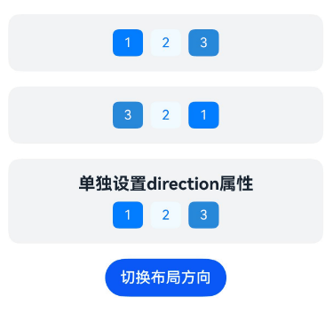
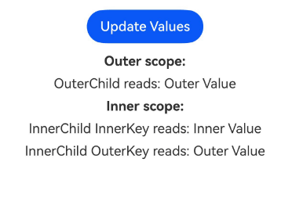

# WithEnv示例

## 介绍

本示例展示了ArkUI中[WithEnv组件](https://gitcode.com/openharmony/docs/blob/master/zh-cn/application-dev/reference/apis-arkui/arkui-ts/ts-container-withenv.md)的开发示例。WithEnv是一个用于建立局部环境作用域的容器组件，其子组件可在该作用域内读写环境变量，且不会影响作用域之外的组件。通过本示例，开发者可以学习如何使用WithEnv实现局部字体缩放、局部布局方向、自定义环境变量传递以及嵌套作用域等典型开发场景。该工程中展示的代码详细描述可查链接[WithEnv](https://gitcode.com/openharmony/docs/blob/master/zh-cn/application-dev/reference/apis-arkui/arkui-ts/ts-container-withenv.md)。


## 效果预览

| 设置局部字体缩放                                         | 设置局部布局方向                                       |
|-----------------------------------------------------|----------------------------------------------------|
|    |   |

| 设置自定义环境变量                                           | 嵌套作用域                                              |
|-----------------------------------------------------|----------------------------------------------------|
|    |   |

## 使用说明

1. 在主界面，可以点击对应卡片，选择需要参考的示例。

2. 进入设置局部字体缩放示例，学习如何通过 `WritableEnvKey.FONT_SCALE` 在 WithEnv 作用域内单独设置字体缩放比例（0.5x / 1.0x / 1.5x），且不影响作用域之外的文本。

3. 进入设置局部布局方向示例，学习如何通过 `WritableEnvKey.DIRECTION` 在 WithEnv 作用域内单独设置 LTR / RTL 布局方向，并支持动态切换。

4. 进入设置自定义环境变量示例，学习如何通过 `CustomEnvKey.create()` 创建自定义环境变量键，在 WithEnv 上使用 `customEnv()` 注入值，子组件使用 `@CustomEnv()` 装饰器接收，实现父子组件间的值传递与联动刷新。

5. 进入嵌套作用域示例，学习多个 WithEnv 嵌套使用时，内层作用域如何继承外层作用域的环境变量，以及如何通过同名键覆盖或新增键。

## 工程目录
```
entry/src/main/ets/
|---entryability
|   |---EntryAbility.ets                       // 应用入口Ability
|---entrybackupability
|   |---EntryBackupAbility.ets                 // 备份恢复Ability
|---pages
|   |---MainPage.ets                           // 应用主页面，导航菜单
|   |---developmentDemo                        // 开发示例
|   |       |---FontScale.ets                  // 设置局部字体缩放
|   |       |---LayoutDirection.ets            // 设置局部布局方向
|   |       |---CustomEnv.ets                  // 设置自定义环境变量
|   |---specifications                         // 规格示例
|           |---NestedScopes.ets               // 嵌套作用域
entry/src/ohosTest/
|---ets
|   |---test
|   |   |---WithEnv.test.ets                   // WithEnv测试代码
|   |   |---Ability.test.ets                   // Ability测试代码
|   |   |---List.test.ets                      // 列表测试代码
```

## 具体实现

1. 启动app进入主界面，选择局部字体缩放、局部布局方向、自定义环境变量或嵌套作用域示例，然后点击进入详细的示例页面。

2. 局部字体缩放示例展示了通过 `WithEnv().env(WritableEnvKey.FONT_SCALE, scale)` 在作用域内单独控制字体缩放比例（0.5x / 1.0x / 1.5x），作用域内文本随之缩放而作用域之外不受影响，源码参考[entry/src/main/ets/pages/developmentDemo/](./entry/src/main/ets/pages/developmentDemo/FontScale.ets)

3. 局部布局方向示例展示了通过 `env(WritableEnvKey.DIRECTION, direction)` 单独设置作用域内 Row 等组件的布局方向（LTR / RTL），并可点击按钮在两种方向间动态切换，同时演示了直接设置 `direction` 属性与通过环境变量设置的区别，源码参考[entry/src/main/ets/pages/developmentDemo/](./entry/src/main/ets/pages/developmentDemo/LayoutDirection.ets)

4. 自定义环境变量示例展示了通过 `CustomEnvKey.create()` 创建自定义环境变量键、在 WithEnv 上使用 `customEnv()` 注入值、子组件使用 `@CustomEnv()` 装饰器接收值的完整链路，点击按钮更新注入值即可联动刷新子组件显示，源码参考[entry/src/main/ets/pages/developmentDemo/](./entry/src/main/ets/pages/developmentDemo/CustomEnv.ets)

5. 嵌套作用域示例展示了 WithEnv 嵌套使用时，外层注入的环境变量可被子组件读取，内层作用域既能读取外层变量也能通过 `customEnv()` 新增自己的变量，体现了作用域的继承与隔离特性，源码参考[entry/src/main/ets/pages/specifications/](./entry/src/main/ets/pages/specifications/NestedScopes.ets)

## 相关权限

不涉及。

## 依赖

不涉及。

## 约束与限制

1. 本示例仅支持标准系统上运行，支持设备：RK3568。

2. 本示例支持API26版本SDK，SDK版本号(API Version 26 Release)。

3. 本示例需要使用DevEco Studio 6.0.2 Release (Build Version: 6.0.2.640, built on January 19, 2026)以上版本才可编译运行。

## 下载

如需单独下载本工程，执行如下命令：

````
git init
git config core.sparsecheckout true
echo code/DocsSample/ArkUISample/WithEnv > .git/info/sparse-checkout
git remote add origin https://gitCode.com/openharmony/applications_app_samples.git
git pull origin master
````
