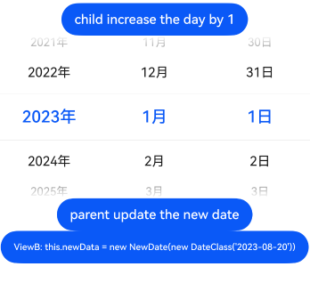
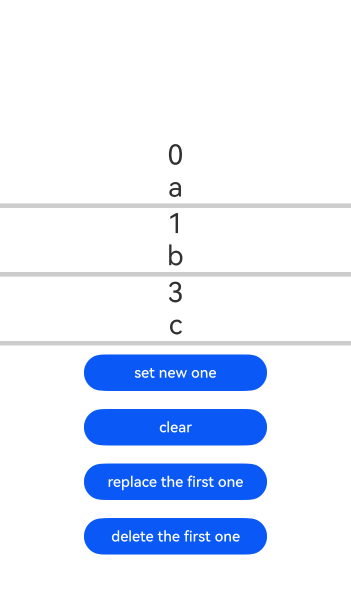
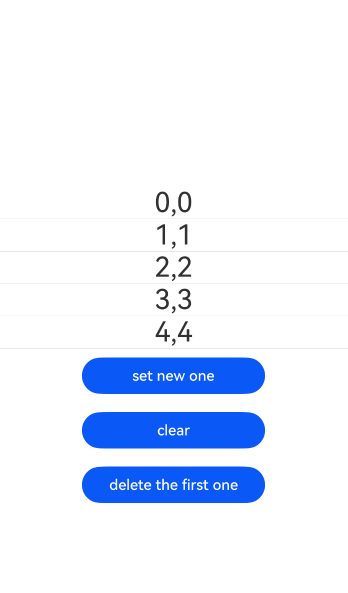

# ArkUI使用@Observed装饰器和@ObjectLink装饰器指南文档示例

### 介绍

本示例通过使用[ArkUI指南文档](https://gitcode.com/openharmony/docs/tree/master/zh-cn/application-dev/ui)中各场景的开发示例，展示在工程中，帮助开发者更好地理解ArkUI提供的组件及组件属性并合理使用。该工程中展示的代码详细描述可查如下链接：

1. [@Observed装饰器和@ObjectLink装饰器：嵌套类对象属性变化](https://gitcode.com/openharmony/docs/blob/master/zh-cn/application-dev/ui/state-management/arkts-observed-and-objectlink.md)

### 效果预览


| 首页                                   | 继承于Date的class                        |
|--------------------------------------|--------------------------------------|
|            |           |
| 继承Map类                               | 继承Set类                               |
| ------------------------------------ | ------------------------------------ |
|           |           |

### 具体实现

1. **基础嵌套对象观察实现**：用@Observed装饰所有层级的嵌套类（如内层Book类、外层Bag类），确保多层属性可被感知；子组件通过@ObjectLink声明对应@Observed类的变量（禁止本地初始化，仅父组件传参），允许修改变量属性但禁止改变变量本身；父组件用@State存储@Observed类实例，将嵌套属性传给子组件，修改属性时子组件 UI 同步刷新，示例中父组件改bag.book.name或子组件改book.name，子组件文本均会更新。
2. **对象数组与复杂结构观察实现**：对象数组场景下，用@Observed装饰数组项类（如Info），父组件@State存该类数组，通过ForEach循环将数组项传给子组件（子组件@ObjectLink接收），支持数组增删（push/shift）和数组项属性修改触发刷新；二维数组需定义继承Array的@Observed类（如ObservedArray<T>），父组件存二维数组并传内层数组给子组件；继承 Map/Set（API 11+）时，用@Observed装饰自定义 Map/Set 类，子组件@ObjectLink接收实例，调用set/clear/add等方法可触发 UI 刷新。
3. **问题解决与约束遵循实现**：解决嵌套属性更改失效问题，需给所有层级嵌套类加@Observed，并拆分组件让每层嵌套对象都被@ObjectLink接收（如外层组件传ParentCounter，内层组件传ParentCounter.subCounter）；遵循@ObjectLink约束：禁止在@Entry组件使用、禁止本地初始化、禁止给变量赋值（仅改属性），类型需显式为@Observed装饰类，整体替换变量需在父组件修改数据源（如父组件改bag.book为新Book实例）


### 使用说明

1. **装饰器需成对配合且覆盖全嵌套层级**：@Observed仅用于装饰类（含嵌套类），需给所有要观察属性变化的层级类加该装饰（如嵌套对象中，内层`Book`类和外层`Bag`类均需@Observed）；@ObjectLink仅用于子组件装饰变量，类型必须是@Observed装饰的类，二者需配合使用才能观察深层属性变化，单独使用无法实现嵌套数据监听。

2. **@ObjectLink有严格的初始化与操作限制**：变量禁止本地初始化，仅能通过父组件构造参数传入；禁止在@Entry装饰的组件中使用；仅允许修改变量的属性（如`this.book.name = "TS"`），禁止对变量本身赋值（如`this.book = new Book("TS")`，会打断同步链并报错）。

3. **复杂结构需按场景适配处理**：对象数组场景，需用@Observed装饰数组项类，父组件用@State存数组、通过ForEach传数组项给子组件@ObjectLink；二维数组需定义继承Array的@Observed类（如`ObservedArray<T>`），或API19+用`UIUtils.makeV1Observed`包装数组；API11+支持@Observed装饰继承Map/Set的类，子组件@ObjectLink接收后可通过`set`/`add`等方法触发UI刷新。

4. **嵌套属性刷新失效需检查两层关键点**：若属性修改后UI不刷新，先确认所有嵌套层级的类是否都加了@Observed（漏加会导致深层属性无法观察）；再检查是否拆分组件让每层嵌套对象都被@ObjectLink接收（如复杂嵌套中，需拆出子组件接收内层`SubCounter`，而非仅用外层组件接收`ParentCounter`）。

### 工程目录
```
entry/src/main/ets/
|---entryability                
|---pages
|   |---objectLinkusagescenarios
|   |    |---CompleteExampleTwoDimensionalArray.ets
|   |    |---InheritFromMapClass.ets
|   |    |---InheritFromSetClass.ets
|   |    |---NestedObject.ets
|   |    |---ObjectArray.ets
|   |    |---ObjectLinkSupportsUnionTypes.ets
|   |    |---TwoDimensionalArray.ets
|   |---ObservedAndObjectLinkFAQs
|   |    |---BasicNesting.ets
|   |    |---ClickEventJack.ets
|   |    |---ComplexMethodsNesting.ets
|   |    |---ComplexNestingComplete.ets
|   |    |---DelayedChange.ets
|   |    |---DifferencesPropObjectLink.ets
|   |    |---NotTriggerUIRefresh.ets
|   |    |---ObjectLinkDataSourceUpdate.ets
|   |---overview
|   |    |---DecoratorDescription.ets
|   |    |---ObservationChangeInheritance.ets
|   |---restrictiveconditions
|   |    |---ReadOnlyVariable.ets
|   |    |---RestrictiveConditionsObserved.ets
|   |---Index.ets                       // 应用主页面入口
entry/src/ohosTest/
|---ets
|   |---index.test.ets                  // 示例代码测试代码
```

### 相关权限

不涉及。

### 依赖

不涉及。

### 约束与限制

1.本示例仅支持标准系统上运行, 支持设备：RK3568。

2.本示例为Stage模型，支持API20版本SDK，版本号：6.0.0.47，镜像版本号：OpenHarmony_6.0.0.47。

3.本示例需要使用DevEco Studio NEXT Developer Preview2 (Build Version: 6.0.0.47， built on October 21, 2025)及以上版本才可编译运行。

### 下载

如需单独下载本工程，执行如下命令：

````  
git init
git config core.sparsecheckout true
echo code/DocsSample/ArkUISample/arktsobservedandobjectlink > .git/info/sparse-checkout
git remote add origin https://gitcode.com/openharmony/applications_app_samples.git
git pull origin master
````