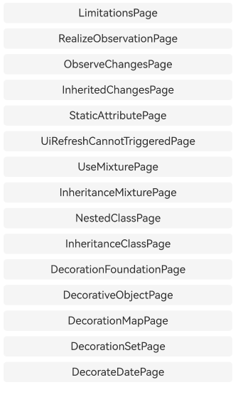
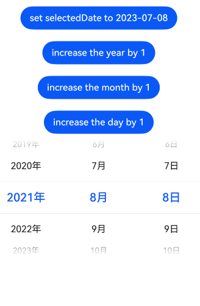

# ArkUI使用@ObservedV2装饰器和@Trace装饰器：类属性变化观测指南文档示例

### 介绍

本示例通过使用[ArkUI指南文档](https://gitcode.com/openharmony/docs/tree/master/zh-cn/application-dev/ui)
中各场景的开发示例，展示在工程中，帮助开发者更好地理解ArkUI提供的组件及组件属性并合理使用。该工程中展示的代码详细描述可查如下链接：

1. [@ObservedV2装饰器和@Trace装饰器：类属性变化观测](https://gitcode.com/openharmony/docs/blob/master/zh-cn/application-dev/ui/state-management/arkts-new-observedV2-and-trace.md)

### 效果预览

| 首页                       | @Trace装饰Date类型             |
|--------------------------|----------------------------|
|  |  |

### 使用说明

1. **强制搭配使用**：@ObservedV2（类装饰器）与 @Trace（成员属性装饰器）必须配合使用，单独使用无任何观测效果；仅被 @Trace
   装饰的属性变化时，会触发关联 UI 组件刷新，未装饰属性无法触发 UI 刷新。

2. **支持场景与类型**：适配嵌套类、继承类场景，嵌套类需同时用 @ObservedV2 装饰类和 @Trace 装饰属性；支持装饰
   number、string、数组、Map、Set、Date 等类型，数组 / 集合可观测 push、set、clear 等特定 API 操作带来的变化。

3. **实例化与混用限制**：被装饰的类需通过 new 操作符实例化后才具备观测能力，不支持 JSON.stringify 序列化；禁止与
   @Observed、@Track、@State 等 V1 装饰器混合使用，且 @ObservedV2 不能装饰自定义组件、@Trace 不能用于 struct。

4. **继承与静态属性规则**：继承类中，父类或子类的 @Trace 装饰属性均具备观测能力；类的静态属性被 @Trace 装饰后，其变化也可触发
   UI 刷新，无需额外配置。

### 工程目录

```
entry/src/main/ets/
|---entryability                
|---pages
|   |---overview
|   |    |---InheritedChanges.ets
|   |    |---Limitations.ets
|   |    |---ObserveChanges.ets
|   |    |---RealizeObservation.ets
|   |    |---StaticAttribute.ets
|   |---usagerestrictions
|   |    |---InheritanceMixture.ets
|   |    |---UiRefreshCannotTriggered.ets
|   |    |---UseMixture.ets
|   |---usagescenarios
|   |    |---DecorateDate.ets
|   |    |---DecorationFoundation.ets
|   |    |---DecorationMap.ets
|   |    |---DecorationSet.ets
|   |    |---DecorativeObject.ets
|   |    |---InheritanceClass.ets
|   |    |---NestedClass.ets
|   |---Index.ets                       // 应用主页面入口
entry/src/ohosTest/
|---ets
|   |---index.test.ets                  // 示例代码测试代码
```

### 具体实现

1. **基础计数器实现**：用 @ObservedV2 装饰计数器类，@Trace 装饰计数属性（如 number 类型的 count），在 UI 组件中绑定该属性并设置点击事件，通过修改
   count 值触发 UI 自动刷新，无需额外状态管理装饰器。

2. **嵌套对象计数实现**：在嵌套类结构中，外层类与内层类均用 @ObservedV2 装饰，内层类的计数属性用 @Trace 装饰，UI
   直接绑定内层属性，修改该属性时可跨层级触发关联组件刷新，无需拆分自定义组件。

3. **数组 / 集合计数实现**：用 @Trace 装饰数组或 Set 类型属性，通过 push、add 等支持的 API 修改集合元素数量，UI
   绑定集合长度属性，集合变化时自动同步刷新长度显示，适配批量计数场景。

4. **继承类计数实现**：在继承体系中，父类用 @ObservedV2 装饰并通过 @Trace 定义基础计数属性，子类继承父类后可直接复用该计数属性，修改子类实例的计数属性时，仍能正常触发
   UI 刷新，简化继承场景开发。

### 相关权限

不涉及。

### 依赖

不涉及。

### 约束与限制

1.本示例仅支持标准系统上运行, 支持设备：RK3568。

2.本示例为Stage模型，支持API20版本SDK，版本号：6.0.0.47，镜像版本号：OpenHarmony_6.0.0.47。

3.本示例需要使用DevEco Studio NEXT Developer Preview2 (Build Version: 6.0.0.47， built on October 21, 2025)及以上版本才可编译运行。

### 下载

如需单独下载本工程，执行如下命令：

````  
git init
git config core.sparsecheckout true
echo code/DocsSample/ArkUISample/arktsobservedv2andtrace > .git/info/sparse-checkout
git remote add origin https://gitcode.com/openharmony/applications_app_samples.git
git pull origin master
````