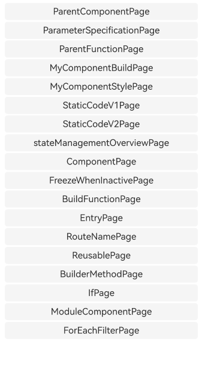

# ArkUI创建自定义组件与状态管理概述指南文档示例

### 介绍

本示例通过使用[ArkUI指南文档](https://gitcode.com/openharmony/docs/tree/master/zh-cn/application-dev/ui)中各场景的开发示例，展示在工程中，帮助开发者更好地理解ArkUI提供的组件及组件属性并合理使用。该工程中展示的代码详细描述可查如下链接：

1. [创建自定义组件](https://gitcode.com/openharmony/docs/blob/master/zh-cn/application-dev/ui/state-management/arkts-create-custom-components.md)

### 效果预览


| 首页                       | 状态变量                 |
|--------------------------|----------------------|
|  |  |


### 使用说明

1. 组件创建与入口配置：创建自定义组件需基于struct结构并添加@Component装饰器，且必须实现build()函数描述 UI 布局；若需作为页面入口，需额外添加@Entry装饰器，单个页面仅能设置一个入口组件，可通过routeName配置命名路由名称。

2. 参数与状态管理规范：实例化子组件时，可在父组件中直接传入参数初始化子组件的成员变量；使用@State等装饰器声明状态变量，通过修改状态变量的值驱动 UI 自动刷新，禁止在build()函数内直接修改状态变量，避免引发循环渲染。

3. UI 编写与样式设置规则：build()函数内编写 UI 需保证根节点唯一，入口组件的根节点必须为容器组件；禁止使用本地变量、switch语法及直接打印日志，条件判断需用if语句实现。自定义组件的通用样式可通过 “.” 链式调用设置，样式实际作用于组件外层的隐形容器而非组件内部元素。

4. 组件复用与跨文件引用：带@Reusable装饰器的组件可在多个父组件中重复实例化；若需跨文件使用自定义组件，需在组件所在文件用export关键字导出，再在目标文件中通过import语句引入后即可使用。

### 工程目录
```
entry/src/main/ets/
|---entryability
|---component                              
│   |--- BuilderMethod.ets     
│   |--- BuildFunction.ets      
│   |--- Component.ets      
│   |--- Entry.ets  
│   |--- ForEachFilter.ets  
│   |--- FreezeWhenInactive.ets     
│   |--- If.ets       
│   |--- ModuleComponent.ets  
│   |--- MyComponentBuild.ets   
│   |--- MyComponentStyle.ets    
│   |--- ParameterSpecification.ets     
│   |--- ParentComponent.ets       
│   |--- ParentFunction.ets       
│   |--- Reusable.ets       
│   |--- RouteName.ets       
│   |--- StaticCodeV1.ets      
│   |--- StaticCodeV2.ets                    
|---pages
|   |---Index.ets                       // 应用主页面
|---managementoverview
|   |---stateManagementOverview.ets        
entry/src/ohosTest/
|---ets
|   |---index.test.ets                  // 示例代码测试代码
```

### 具体实现
1. 组件示例卡片交互实现：先创建主界面入口组件，通过容器布局（如网格、行列布局）搭建组件示例卡片的展示结构。为每个卡片绑定点击事件，点击后可通过命名路由跳转（利用@Entry装饰器的routeName配置）或状态变量控制视图切换，直接定位到对应的组件示例详情页面，实现从入口到具体示例的快速访问。

2. 组件参数初始化与跨组件通信实现：子组件提前声明需要外部配置的成员变量，父组件在构建自身 UI 时，创建子组件实例并传入对应参数，按照装饰器的规则完成子组件的初始化。对于跨组件函数调用，父组件将需要被触发的业务函数作为参数传递给子组件，子组件在合适的交互场景（如按钮点击）中调用该函数，实现父子组件间的逻辑联动。

3. 自定义组件样式配置实现：自定义组件创建完成后，无需在组件内部单独定义通用样式，而是在父组件中使用该自定义组件时，通过 “.” 链式调用的方式，直接为组件添加尺寸、背景色、边距等通用样式。这些样式实际作用于组件外层的隐形容器，既简化了样式配置流程，又能灵活调整组件在不同场景下的展示效果。

### 相关权限

不涉及。

### 依赖

不涉及。

### 约束与限制

1.本示例仅支持标准系统上运行, 支持设备：RK3568。

2.本示例为Stage模型，支持API20版本SDK，版本号：6.0.0.47，镜像版本号：OpenHarmony_6.0.0.47。

3.本示例需要使用DevEco Studio NEXT Developer Preview2 (Build Version: 6.0.0.47， built on October 21, 2025)及以上版本才可编译运行。

### 下载

如需单独下载本工程，执行如下命令：

````
git init
git config core.sparsecheckout true
echo code/DocsSample/ArkUISample/createCustomComponents > .git/info/sparse-checkout
git remote add origin https://gitcode.com/openharmony/applications_app_samples.git
git pull origin master
````