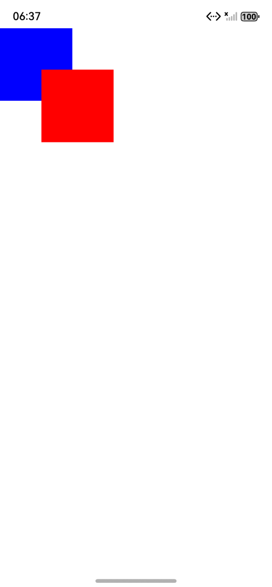
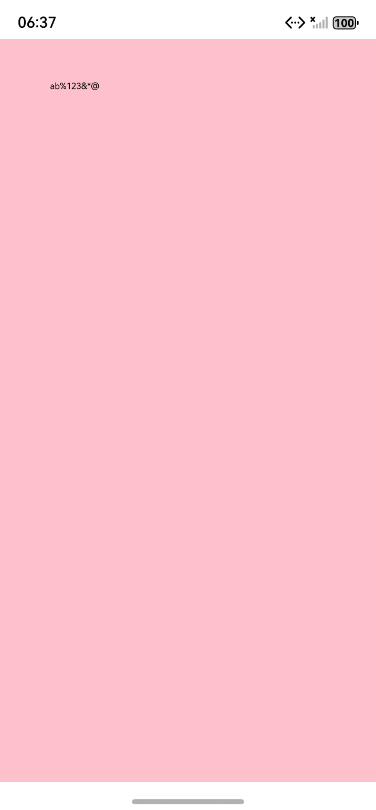

# UI国际化指南文档示例

### 介绍

本示例展示了[UI国际化](https://gitcode.com/openharmony/docs/blob/master/zh-cn/application-dev/ui/arkts-internationalization.md)的使用方法：

使用说明：
1. 该工程可以选择在模拟器和开发板上运行。
2. 点击构建，即可在生成的应用中点击对应的按钮，观察自定义占位节点的不同应用。
3. 进入”DocsSample/ArkUISample/internationalization/entry/src/ohosTest/ets/test/index.test.ets“文件，可以对本项目进行UI的自动化测试。
### 效果预览

| 界面布局和边框设置                                 | 自定义绘制Canvas组件                            |
|------------------------------------|------------------------------------|
|  |  |

### 使用说明

1. 在主界面，可以点击对应卡片，选择需要参考的组件示例。

2. 在组件目录选择详细的示例参考。

3. 进入示例界面，查看参考示例。

4. 通过自动测试框架可进行测试及维护。

### 工程目录
```
entry/src/main/ets/
|---entryability
|---homePage
|   |---CustomizeCanvasComponentDrawing.ets     //点击自定义绘制Canvas组件
|   |---InterfaceLayoutBorderSettings.ets       //点击界面布局和边框设置
|---pages
|   |---Index.ets                       // 应用主页面
entry/src/ohosTest/
|---ets
|   |---index.test.ets                 // 示例代码测试代码
```
### 具体实现

1. 组件属性替换：将position({x: 20})改为position({start: 20})，marginLeft: 10改为marginStart: 10，borderRightWidth: 2改为borderEndWidth: 2，确保方向随语言自适应。
2. 控制组件方向：若需强制 RTL，给组件设置.direction(Direction.Rtl)；若需跟随系统语言，设置.direction(Direction.Auto)（系统语言为 RTL 时自动镜像）。
3. 验证默认适配组件：如 Swipe、TextInput 等已支持镜像，无需手动调整，仅需确认自定义布局的方向词替换完整。
4. 订阅事件：调用commonEventManager.subscribe，在回调中获取语言变化通知。
5. 触发 UI 更新：在回调内修改@State/@Link状态变量（如重新赋值this.title = $r('app.string.page_title')），状态变化会自动触发组件重绘。

### 相关权限

不涉及。

### 依赖

不涉及。

### 约束与限制

1.本示例仅支持标准系统上运行, 支持设备：RK3568。

2.本示例为Stage模型，支持API20版本SDK，版本号：6.0.0.47，镜像版本号：OpenHarmony_6.0.0.47。

3.本示例需要使用DevEco Studio 6.0.0 Release (Build Version: 6.0.0.858， built on September 24, 2025)及以上版本才可编译运行。

### 下载

如需单独下载本工程，执行如下命令：

````
git init
git config core.sparsecheckout true
echo code/DocsSample/ArkUISample/GradientEffect > .git/info/sparse-checkout
git remote add origin https://gitcode.com/openharmony/applications_app_samples.git
git pull origin master
````