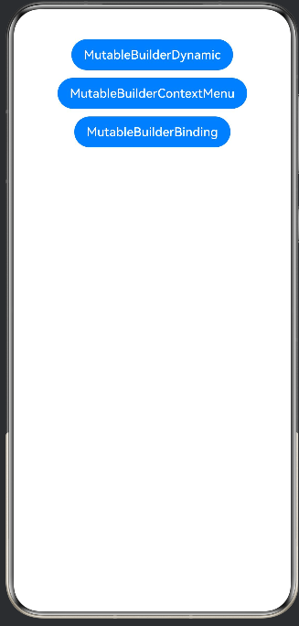
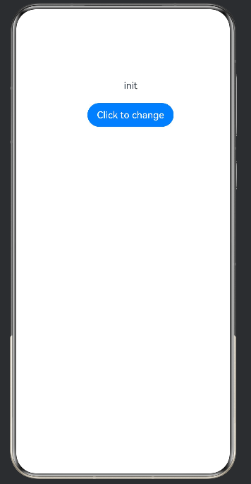
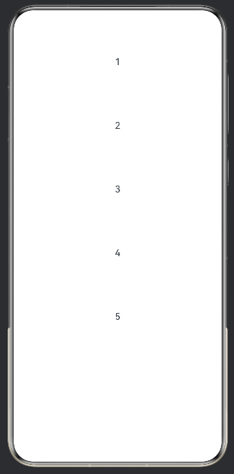
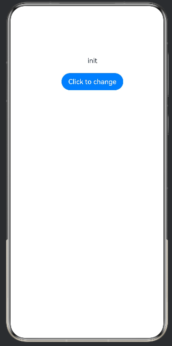

# mutableBuilder：实现全局@Builder动态更新

## 介绍

在组件开发中，如果需要在运行时动态切换不同的全局@Builder函数来更新UI显示效果，使用wrapBuilder无法实现动态替换。此时，可以使用mutableBuilder实现全局@Builder的动态更新。

mutableBuilder是wrapBuilder的增强版本，支持在运行时动态替换全局@Builder，同时支持与@Monitor配合监听Builder变化，以及与MutableBinding配合实现双向数据绑定。

在阅读本文档前，建议阅读：@Builder、wrapBuilder。

在@ComponentV2装饰的自定义组件中，开发者仅可以使用状态变量装饰器，包括@Local、@Param、@Once@Event、@Provider、@Consumer等。

@ComponentV2装饰的自定义组件暂不支持LocalStorage等现有自定义组件的能力。

无法同时使用@ComponentV2与@Component装饰同一个struct结构。

@ComponentV2支持一个可选的boolean类型参数freezeWhenInactive，来实现组件冻结功能。

说明
从API version 22开始使用。

### 示例文档
[状态管理概述](https://gitcode.com/openharmony/docs/blob/master/zh-cn/application-dev/ui/state-management/arkts-state-management-overview.md)。

[@ComponentV2](https://gitcode.com/openharmony/docs/blob/master/zh-cn/application-dev/ui/state-management/arkts-create-custom-components.md#componentv2)。

[mutableBuilder：实现全局@Builder动态更新](https://gitcode.com/openharmony/docs/blob/master/zh-cn/application-dev/ui/state-management/arkts-mutableBuilder.md)。

## 效果预览
| 首页                                              |动态切换Builder页面                                              |上下文菜单页面                                              |数据绑定页面                                              |
| ---------------------------------------------------- | ---------------------------------------------------- | ---------------------------------------------------- | ---------------------------------------------------- |
|  |  |  |  |


## 使用说明

1. 安装编译生成的hap包，并打开应用；
2. 首页面会出现示例界面；
3. 点击"MutableBuilderDynamic"可查看动态切换Builder示例；
4. 点击"MutableBuilderContextMenu"可查看上下文菜单中使用mutableBuilder示例；
5. 点击"MutableBuilderBinding"可查看MutableBinding双向绑定示例。

## 工程目录

```
mutableBuilder
│
 src
    ├── main
    │   ├── ets
    │   │   ├── entryability
    │   │   │   └── EntryAbility.ets
    │   │   ├── entrybackupability
    │   │   │   └── EntryBackupAbility.ets
    │   │   └── pages
    │   │       ├── Index.ets
    │   │       ├── MutableBuilderDynamic.ets   //示例1：动态切换全局@Builder
    │   │       ├── MutableBuilderContextMenu.ets //示例2：上下文菜单中使用mutableBuilder
    │   │       └── MutableBuilderBinding.ets    //示例3：MutableBinding双向数据绑定
    │   ├── module.json5
    │   └── resources
    │       ├── base
    │       │   ├── element
    │       │   │   ├── color.json
    │       │   │   ├── float.json
    │       │   │   └── string.json
    │       │   ├── media
    │       │   │   ├── background.png
    │       │   │   ├── foreground.png
    │       │   │   ├── layered_image.json
    │       │   │   └── startIcon.png
    │       │   └── profile
    │       │       ├── backup_config.json
    │       │       └── main_pages.json
    │       ├── dark
    │       │   └── element
    │       │       └── color.json
    │       └── rawfile
    ├── mock
    │   └── mock-config.json5
    ├── ohosTest
    │   ├── ets
    │   │   └── test
    │   │       ├── Ability.test.ets
    │   │       ├── Index.test.ets
    │   │       └── List.test.ets
    │   └── module.json5
    └── test
        ├── List.test.ets
        └── LocalUnit.test.ets


```

## 具体实现

1. 动态切换Builder：使用mutableBuilder包装全局@Builder函数，返回MutableBuilder对象赋值给@Local状态变量，通过点击按钮动态替换不同的@Builder（如textBuilder与buttonBuilder切换），实现UI内容的动态更新。
2. 上下文菜单使用：将mutableBuilder包装的@Builder对象赋值给组件属性，在bindMenu等API中使用builder属性弹出菜单，实现全局@Builder在组件API场景下的灵活复用。
3. MutableBinding双向绑定：结合UIUtils.makeBinding创建MutableBinding对象，将双向绑定的数据传递给mutableBuilder包装的@Builder，在@Builder内部修改绑定值可同步更新组件状态变量；同时配合@Monitor监听mutableBuilder变量变化，感知Builder动态替换事件。
## 相关权限

不涉及

## 依赖

不涉及

## 约束和限制

1. 本示例支持标准系统上运行，支持设备：RK3568等;

2. 本示例为Stage模型，支持API22版本full-SDK，版本号：6.0.0.47，镜像版本号：OpenHarmony_6.0.0 Release。

3. 本示例需要使用DevEco Studio 6.0.0 Release (Build Version: 6.0.0.858, built on September 24, 2025)及以上版本才可编译运行。

## 下载

如需单独下载本工程，执行如下命令：

```
git init
git config core.sparsecheckout true
echo code/DocsSample/ArkUISample/mutableBuilder > .git/info/sparse-checkout
git remote add origin https://gitcode.com/openharmony/applications_app_samples.git
git pull origin master
```
