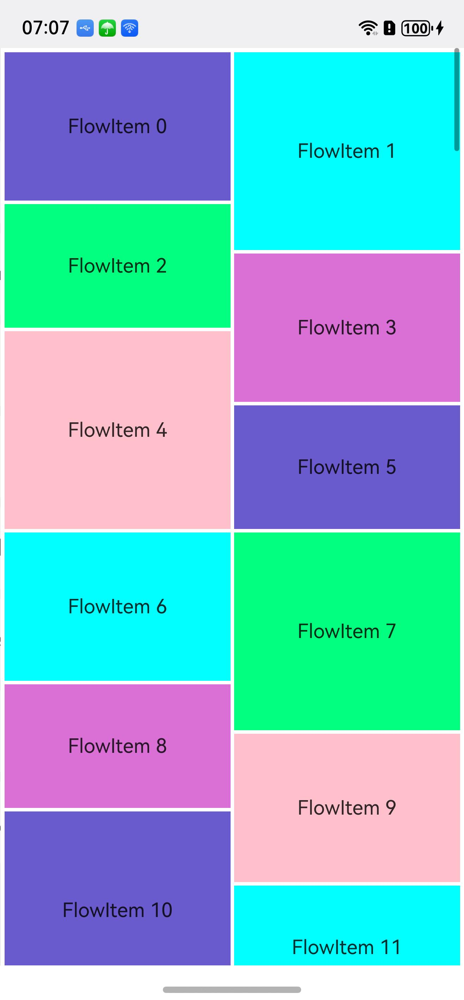

# Native_node_Sample

## 介绍

本示例展示了如何创建文本、输入框、文本域、Grid等组件，配置其样式、属性与事件，还含 UI 任务、反色设置等功能，构建文本页面。

## 效果预览
<table>
  <tr>
    <th>首页</th>
    <th>Text</th>
    <th>Swiper</th>
    <th>WaterFlow</th>
    <th>Grid</th>
    <th>Scroll</th>
    <th>Refresh</th>
    <th>List</th>
  </tr>
  <tr>
    <td></td>
    <td></td>
    <td></td>
    <td></td>
    <td></td>
    <td></td>
    <td></td>
    <td></td>
  </tr>
</table>


## 使用说明
1. 安装编译生成的hap包，并打开应用；
2. 首页面会出现对应text选择框，点击选择框进入text界面；


## 工程目录

```
native_node_sample
entry/src/main/cpp/
├── ArkUINode.h
├── ArkUINodeAdapter.h
├── baseUtils.cpp
├── baseUtils.h
├── CMakeLists.txt (CMake脚本)
├── GridMaker.cpp
├── GridMaker.h
├── ListItemGroup.h
├── ListItemSwipe.h
├── ListMaker.cpp
├── ListMaker.h
├── manager.cpp 
├── manager.h
├── napi_init.cpp
├── RefreshMaker.cpp
├── RefreshMaker.h
├── ScrollEvent.h
├── ScrollMaker.cpp
├── ScrollMaker.h
├── ScrollUtils.cpp
├── ScrollUtils.h
├── SwiperMaker.cpp
├── SwiperMaker.h
├── TextMaker.cpp
├── TextMaker.h
├── WaterFlowMaker.cpp
├── WaterFlowMaker.h
└── WaterFlowSection.h
    └── types/libentry
        ├── Index.d.ts (函数对应的js映射)
        └── oh-package.json5

entry/src/main/ets/
├── entryability
│   └── EntryAbility.ets
├── entrybackupability
│   └── EntryBackupAbility.ets
└── pages
    ├── Index.ets          (获取导航页面)
    ├── page_grid.ets      (Grid页面)
    ├── page_list.ets      (List页面)
    ├── page_refresh.ets   (Refresh页面)
    ├── page_scroll.ets    (Scroll页面)
    ├── page_swiper.ets    (Swiper页面)
    ├── page_text.ets      (文本界面)
    └── page_waterflow.ets (WaterFlow界面)

entry/src/main/resources/
├── base
│   ├── element
│   │   ├── color.json
│   │   ├── float.json
│   │   └── string.json
│   ├── media
│   │   ├── background.png
│   │   ├── foreground.png
│   │   ├── layered_image.json
│   │   └── startIcon.png
│   └── profile
│       ├── backup_config.json
│       └── main_pages.json
├── dark
│   └── element
│       └── color.json
└── rawfile
```

## 相关权限

不涉及

## 依赖

不涉及

## 约束和限制

1. 本示例支持标准系统上运行，支持设备：RK3568;

2. 本示例支持API20版本SDK，版本号：6.0.0.36;

3. 本示例已支持使DevEco Studio 5.1.1 Release (构建版本：5.1.1.840，构建 2025年9月20日)编译运行

## 下载

如需单独下载本工程，执行如下命令：

```
git init
git config core.sparsecheckout true
echo code/DocsSample/ArkUISample/native_node_sample > .git/info/sparse-checkout
git remote add origin https://gitcode.com/openharmony/applications_app_samples.git
git pull origin master
```