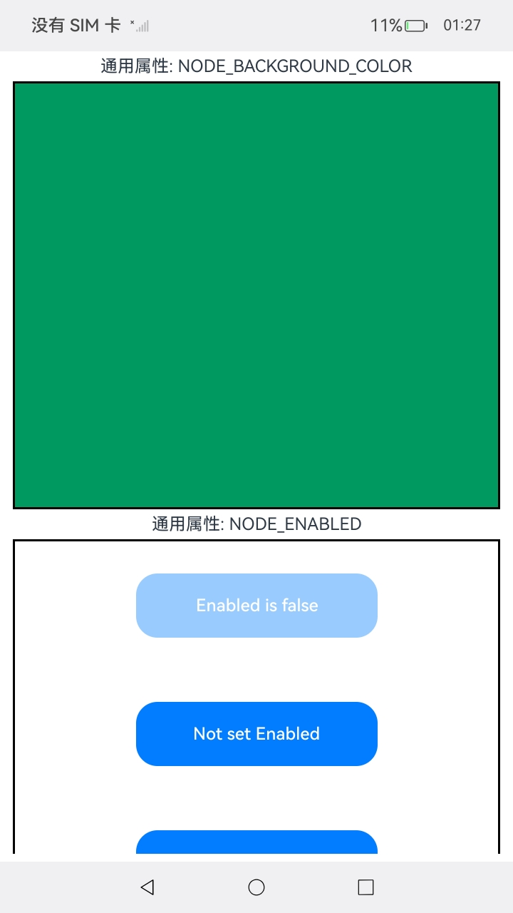

# Native_node_Sample

## 介绍

本示例展示了如何创建文本、输入框、文本域、滚动容器、滑动容器、Form表单类、信息选择图片类等组件，配置其样式、属性与事件，还含 UI 任务、反色设置，可见区域变化监听等功能，构建文本页面。该工程中展示的接口详细描述可查如下链接：

[native_node.h](https://gitcode.com/openharmony/docs/blob/master/zh-cn/application-dev/reference/apis-arkui/capi-native-node-h.md)

## 效果预览
<table>
  <tr>
    <th>首页</th>
    <th>文本输入类</th>
    <th>Swiper</th>
    <th>WaterFlow</th>
    <th>Grid</th>
    <th>Scroll</th>
    <th>Refresh</th>
    <th>List</th>
    <th>Public</th>
    <th>XComponent</th>
    <th>Form表单类</th>
    <th>信息选择图片类</th>
  </tr>
  <tr>
    <td></td>
    <td></td>
    <td></td>
    <td></td>
    <td></td>
    <td></td>
    <td></td>
    <td></td>
    <td></td>
    <td></td>
    <td></td>
    <td></td>
  </tr>
</table>

## 使用说明
1. 安装编译生成的hap包，并打开应用；
2. 进入首页，可选择不同模块页面。
3. 点击"文本输入类"选择框进入TextInput、TextArea组件和Text及其子组件Span、ImageSpan的CAPI接口展示界面；
  "文本输入类"界面分布如下（数字顺序是页面显示元素从上至下）：<br/>
   a.第一个使用了[styled_string.h](https://gitcode.com/openharmony/docs/blob/master/zh-cn/application-dev/reference/apis-arkui/capi-styled-string-h.md)展示了不同字体样式设置的内容文本。<br/>
   b.第二个展示了在Text下挂子组件Span并给Span设置背景色、基线偏移以及长按事件。<br/>
   c.第三个展示了如何给Text设置字体风格、字符间距、最大行数以及内容超长时跑马灯样式，。<br/>
   d.第四个展示了如何给Text设置水平对齐方式、首行缩进、文本大小写、自适应字号和调整方式、装饰线样式、最大行数以及内容超长时省略样式，并开启了设备内可可复制和AI识别-类型邮箱。<br/>
   e.第五个展示了如何给Text设置行高、基线偏移、文字阴影、字体族、字体粗细（不跟随系统字体粗细变化）。<br/>
   f.第六个和第七个分别展示了给Text设置线性渐变和径向渐变样式效果。<br/>
   g.第八个展示了在Text下挂子组件ImageSpan并给ImageSpan设置图片基于行高对齐方式和基线偏移量。<br/>
   h.第九个展示了给Text设置最小行数效果。<br/>
   i.第十、十一个分别展示了给Text设置倍数模式行高、最大最小行高效果。<br/>
   j.第十二个展示了当Text内容区高度超过组件高度时设置内容区垂直对齐方式为居中对齐的效果。<br/>
   k.第十三个展示了如何给TextInput设置提示文本及其字体风格、光标样式、TextInput通过点击以外方式获焦时是否主动拉起软键盘、输入框类型及密码小眼睛图标显隐方式、文本选中背景色等属性样式，以及注册输入内容发生变化回调事件、输入法回车键发生回调事件、点击文本选择菜单剪切粘贴回调事件、文本选择区域变化回调事件、输入状态变化回调事件、文本内容滚动回调事件监听。<br/>
   l.第十四个展示了如何获取TextInput组件上已编辑文本相对组件的位置大小行数和如何注册输入内容发生变化回调事件、输入完成时回调事件、删除完成时回调事件、内容改变时（包含预上屏内容）回调事件、内容将要改变时（包含预上屏内容）回调事件监听，并给TextInput设置内联风格、默认显示文本、文本字符间距、长按或双击或右键选中文本是否弹菜单、回车键类型、是否开启预上屏、拉起键盘样式。<br/>
   m.第十五个展示了给TextInput设置下划线样式、清除按钮样式、正则过滤、光标位置、submit状态是否失焦以及注册将要输入时回调事件、将要删除时回调事件监听。<br/>
   n.第十六个展示了给TextInput设置最大文本数、未达到和超出最大字符数时计数器样式。<br/>
   o.第十七、十八、十九个分别展示了给多行输入框TextArea设置和以上TextInput均有的基本属性、特有的行间距属性、相同的各种事件回调监听。<br/>
   p.第二十个展示了给多行输入框TextArea设置滚动条样式。<br/>
   q.第二十一个展示了给多行输入框TextArea绑定自定义键盘。<br/>
   r.第二十二个展示了给Text组件设置无障碍播报内容。<br/>
4. 点击Swiper选择框进入Swiper组件的CAPI接口展示界面；
5. 点击Public选择框进入通用属性的CAPI接口展示界面；
6. 点击"Form表单类"选择框进入表单组件的CAPI接口展示界面;<br/>
   a.点击“选择节点类型”按钮选择要创建的组件类型，如“TOGGLE”<br/>
   b.点击"创建"按钮进行节点创建，当前状态会显示创建成功<br/>
   c.点击下边“选择节点属性”，先选择对应节点类型，如“TOGGLE”，再选择要设置的属性类型<br/>
   d.点击“设置属性值”，进行属性设置；点击“获取属性值”，返回值文本框中可以显示当前属性值；点击“重置属性值”会进行属性重置<br/>
   e.点击“清理”清理已创建“TOGGLE”节点。
7. 点击"信息选择图片类"选择框进入多个组件的CAPI接口展示界面；属性值设置为“none”时，图片效果以代码默认值展示。
   "信息选择图片类"界面使用步骤如下：<br/>
   a.点击“选择节点类型”按钮选择要创建的组件类型，如“IMAGE_SPAN”<br/>
   b.点击"创建"按钮进行节点创建，当前状态会显示创建成功<br/>
   c.点击下边“选择节点属性”，先选择对应节点类型，如“IMAGE_SPAN”，再选择要设置的属性类型<br/>
   d.点击“设置属性值”，进行属性设置；点击“获取属性值”，返回值文本框中可以显示当前属性值；点击“重置属性值”会进行属性重置<br/>
   e.创建DatePicker、TimePicker、TextPicker、CalendarPicker组件时，会自动触发相关事件注册，
   可以在DevEco Studio开发环境中的日志界面看到如下相关日志信息：
8. 点击WaterFlow选择框进入WaterFlow组件的CAPI接口展示界面；
9. 点击Scroll选择框进入Scroll组件的CAPI接口展示界面；
10. 点击List选择框进入List组件的CAPI接口展示界面；
11. 点击Grid选择框进入Grid组件的CAPI接口展示界面；
12. 点击Refresh选择框进入Refresh组件的CAPI接口展示界面；
13. 点击XComponent选择框进入XComponent组件的CAPI接口展示界面<br>(该示例在OpenHarmony与HarmonyOS上运行效果不同)；
```
"BIND_EVENT success"
```

## 工程目录

```
native_node_sample
entry/src/main/cpp/
├── ArkUINode.h
├── ArkUINodeAdapter.h
├── baseUtils.cpp
├── baseUtils.h
├── CMakeLists.txt (CMake脚本)
├── form_manager.cpp
├── form_manager.h
├── GridIrregularIndexesMaker.cpp
├── GridIrregularIndexesMaker.h
├── GridMaker.cpp
├── GridMaker.h
├── GridRectByIndexMaker.cpp
├── GridRectByIndexMaker.h
├── imagespan_manager.cpp
├── imagespan_manager.h
├── ListItemGroup.h
├── ListItemSwipe.h
├── ListMaker.cpp
├── ListMaker.h
├── manager.cpp 
├── manager.h
├── napi_init.cpp
├── PublicEvent.cpp
├── PublicEvent.h
├── RefreshMaker.cpp
├── RefreshMaker.h
├── ScrollEvent.h
├── ScrollMaker.cpp
├── ScrollMaker.h
├── ScrollUtils.cpp
├── ScrollUtils.h
├── SwiperMaker.cpp
├── SwiperMaker.h
├── TextMaker.cpp
├── TextMaker.h
├── WaterFlowMaker.cpp
├── WaterFlowMaker.h
├── WaterFlowSection.h
├── XComponentMaker.cpp
└── XComponentMaker.h
    └── types/libentry
        ├── Index.d.ts (函数对应的js映射)
        └── oh-package.json5

entry/src/main/ets/
├── entryability
│   └── EntryAbility.ets
├── entrybackupability
│   └── EntryBackupAbility.ets
└── pages
    ├── Index.ets          (获取导航页面)
    ├── page_form.ets      (Form页面)
    ├── PageGrid.ets       (Grid页面)
    ├── page_imagespan.ets (imagespan页面)
    ├── page_list.ets      (List页面)
    ├── page_refresh.ets   (Refresh页面)
    ├── page_scroll.ets    (Scroll页面)
    ├── page_swiper.ets    (Swiper页面)
    ├── page_text.ets      (文本界面)
    ├── page_waterflow.ets (WaterFlow界面)
    ├── page_xcomponent.ets (XComponent界面)
    ├── page_public_event.ets (通用属性界面)
    └── grid
         ├── PageGridNormal.ets (普通Grid页面)
         ├── PageGridIrregularIndexes.ets (可滚动Grid设置跨行跨列节点页面)
         └── PageGridGetRectByIndex.ets (固定行列Grid页面)

entry/src/main/resources/
├── base
│   ├── element
│   │   ├── color.json
│   │   ├── float.json
│   │   └── string.json
│   ├── media
│   │   ├── background.png
│   │   ├── foreground.png
│   │   ├── layered_image.json
│   │   └── startIcon.png
│   └── profile
│       ├── backup_config.json
│       └── main_pages.json
├── dark
│   └── element
│       └── color.json
└── rawfile

entry/src/ohosTest/ets/test
├── Ability.test.ets
├── List.test.ets
└── Public.test.ets (通用属性测试用例)
```

## 相关权限

不涉及

## 依赖

不涉及

## 约束和限制

1. 本示例支持标准系统上运行，支持设备：RK3568;

2. 本示例支持API22版本SDK，版本号：6.0.2.54;

3. 本示例已支持使DevEco Studio 5.1.1 Release (构建版本：5.1.1.840，构建 2025年9月20日)编译运行

## 下载

如需单独下载本工程，执行如下命令：

```
git init
git config core.sparsecheckout true
echo code/DocsSample/ArkUISample/native_node_sample > .git/info/sparse-checkout
git remote add origin https://gitcode.com/openharmony/applications_app_samples.git
git pull origin master
```