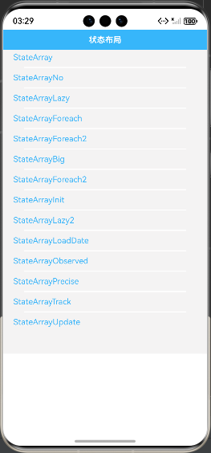
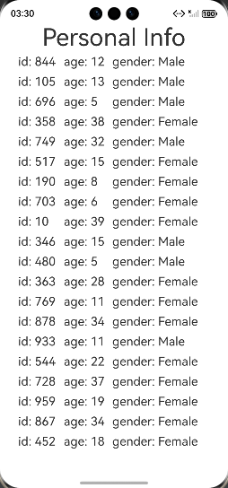

# 状态管理合理使用开发指导

### 介绍

statemanagementguide
本示例通过使用[ArkUI指南文档](https://gitcode.com/openharmony/docs/tree/master/zh-cn/application-dev/ui)
中各场景的开发示例，展示在工程中，帮助开发者更好地理解ArkUI提供的组件及组件属性并合理使用。该工程中展示的代码详细描述可查如下链接：

1. [合理使用属性](https://gitcode.com/tianlongdevcode/docs_zh/blob/master/zh-cn/application-dev/ui/state-management/properly-use-state-management-to-develope.md)。

### 1. [合理使用属性]

### 效果预览

| 首页                                 | statemanagementguide示例             
|------------------------------------|------------------------------------|
|  |  |

### 使用说明

1. 在主界面，可以点击对应卡片，选择需要参考的组件示例。

2. 在组件目录选择详细的示例参考。

3. 进入示例界面，查看参考示例。

4. 通过自动测试框架可进行测试及维护。

### 工程目录

```
entry/src/main/ets/
|---entryability
|---pages
|   |---statemanagementguide                  //状态管理合理使用
|   |       |---StateArray.ets
|   |       |---StateArrayBig.ets
|   |       |---StateArrayForeach.ets
|   |       |---StateArrayForeach2.ets
|   |       |---StateArrayInit.ets
|   |       |---StateArrayLazy.ets
|   |       |---StateArrayLazy2.ets
|   |       |---StateArrayLoadDate.ets
|   |       |---StateArrayNo.ets
|   |       |---StateArrayNo2.ets
|   |       |---StateArrayObserved.ets
|   |       |---StateArrayPrecise.ets
|   |       |---StateArrayTrack.ets
|   |       |---StateArrayUpdate.ets
|---pages
|   |---Index.ets                       // 应用主页面
entry/src/ohosTest/
|---ets
|   |---StateManagementGuide.test.ets           // 状态管理合理使用示例代码测试代码
```

### 具体实现

实现状态管理合理使用，以下是详细实现过程：
1、点击某一条信息中年龄的Text组件时，可以通过日志发现的19条信息中年龄的Text组件也进行了刷新
2、点击“X”按钮删除其中一条内容时，变量childList就能够观测到变化，触发了ForEach的刷新，最终UI渲染刷新

### 相关权限

不涉及。

### 依赖

不涉及。

### 约束与限制

1.本示例仅支持标准系统上运行, 支持设备：RK3568。

2.本示例为Stage模型，支持API21版本SDK，版本号：6.0.0.254，镜像版本号：OpenHarmony_6.0.2.57。

3.本示例需要使用DevEco Studio NEXT Developer Preview2 (Build Version: 6.0.5.306， built on December 12, 2024)及以上版本才可编译运行。

### 下载

如需单独下载本工程，执行如下命令：

````
git init
git config core.sparsecheckout true
echo code/DocsSample/ArkUISample/StateManagementProject > .git/info/sparse-checkout
git remote add origin https://gitCode.com/openharmony/applications_app_samples.git
git pull origin master
````