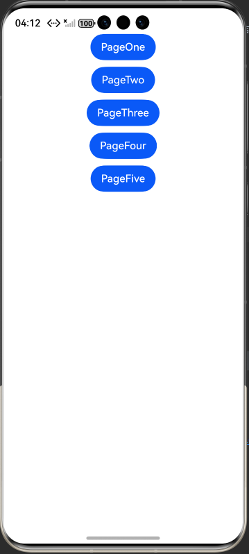
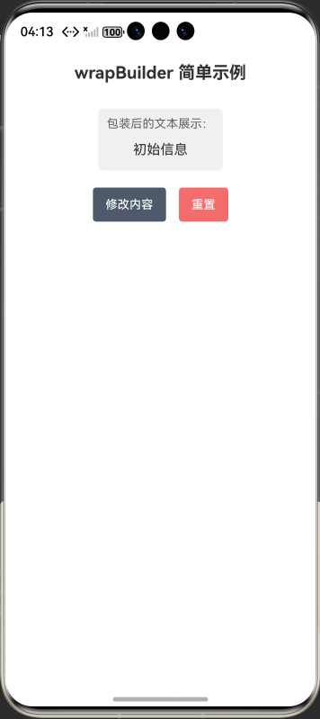
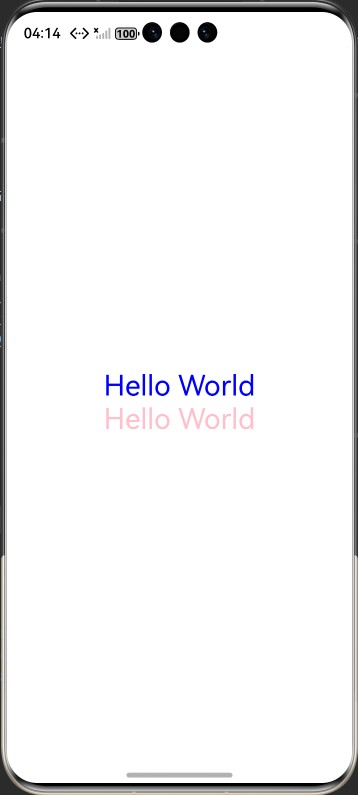

# com.samples.wrapbuilder

## 介绍

当在一个struct内使用多个全局@Builder函数实现UI的不同效果时，代码维护将变得非常困难，且页面不够整洁。此时，可以使用wrapBuilder封装全局@Builder。

在阅读本文档前，建议阅读：@Builder。

在@ComponentV2装饰的自定义组件中，开发者仅可以使用状态变量装饰器，包括@Local、@Param、@Once@Event、@Provider、@Consumer等。

@ComponentV2装饰的自定义组件暂不支持LocalStorage等现有自定义组件的能力。

无法同时使用@ComponentV2与@Component装饰同一个struct结构。

@ComponentV2支持一个可选的boolean类型参数freezeWhenInactive，来实现组件冻结功能。

说明
从API version 11开始使用。

从API version 12开始，wrapBuilder支持在元服务中使用。

[@ComponentV2装饰器](https://gitcode.com/openharmony/docs/blob/master/zh-cn/application-dev/ui/state-management/arkts-new-componentV2.md)。

[wrapBuilder：封装全局@Builder](https://gitcode.com/openharmony/docs/blob/master/zh-cn/application-dev/ui/state-management/arkts-wrapBuilder.md)。

## 效果预览
| 首页                                              | CustomDialogController_CAPI页面                             |OpenCustomDialog_CAPI页面                                              |
| ---------------------------------------------------- |---------------------------------------------------------| ------------------------------------------------------- |
|  |  |  |


## 使用说明

1. 安装编译生成的hap包，并打开应用；
2. 首页面会出现示例界面；

## 工程目录

```
wrapbuilder
│
 src
    ├── main
    │   ├── ets
    │   │   ├── entryability
    │   │   │   └── EntryAbility.ets
    │   │   ├── entrybackupability
    │   │   │   └── EntryBackupAbility.ets
    │   │   └── pages
    │   │       ├── Index.ets
    │   │       └── PageComponentV2.ets //示例：@ComponentV2装饰器：自定义组件
    │   │       ├── PageFive.ets  //示例5：重复定义wrapBuilder失效
    │   │       ├── PageFour.ets  //示例4：引用传递
    │   │       ├── PageOne.ets   //示例1：wrapBuilder是一个模板函数，返回一个WrappedBuilder对象
    │   │       ├── PageThree.ets //示例3：@Builder方法赋值给变量在UI语法中使用
    │   │       └── PageTwo.ets   //示例2：@Builder方法赋值给变量
    │   ├── module.json5
    │   └── resources
    │       ├── base
    │       │   ├── element
    │       │   │   ├── color.json
    │       │   │   ├── float.json
    │       │   │   └── string.json
    │       │   ├── media
    │       │   │   ├── background.png
    │       │   │   ├── foreground.png
    │       │   │   ├── layered_image.json
    │       │   │   └── startIcon.png
    │       │   └── profile
    │       │       ├── backup_config.json
    │       │       └── main_pages.json
    │       ├── dark
    │       │   └── element
    │       │       └── color.json
    │       └── rawfile
    ├── mock
    │   └── mock-config.json5
    ├── ohosTest
    │   ├── ets
    │   │   └── test
    │   │       ├── Ability.test.ets
    │   │       └── List.test.ets
    │   └── module.json5
    └── test
        ├── List.test.ets
        └── LocalUnit.test.ets


```

## 具体实现

1. 基础封装：用wrapBuilder包装包装全局
包装全局@Builder函数，返回WrappedBuilder对象赋值给变量，通过对象的builder属性在组件中调用，解决全局@Builder直接赋值后无法使用的问题。
2. 数组管理：将多个同参数类型的WrappedBuilder对象存入数组，在组件中通过ForEach遍历调用，实现多@Builder批量渲染，保持代码整洁。
3. 状态联动：向WrappedBuilder包装的@Builder传递引用类型参数（如类实例），修改状态变量关联的实例属性时，可触发@Builder内 UI 自动刷新。
4. 避坑要点：同一WrappedBuilder变量重复赋值新的wrapBuilder实例无效，需通过状态变量控制不同WrappedBuilder的显示逻辑实现动态切换。
5. 用@ComponentV2（API 12+）装饰自定义组件，仅可使用@Local/@Param/@Once/@Event/@Provider/@Consumer等 V2 版状态装饰器，无法使用旧版装饰器及LocalStorage等能力，且不可与@Component同装饰一个 struct。
6. 可给@ComponentV2传可选 boolean 参数freezeWhenInactive实现组件冻结，组件基础结构含struct声明与build方法，除特殊限制外，行为与@Component装饰的组件基本一致，混合使用需参考专用混用文档。
## 相关权限

不涉及

## 依赖

不涉及

## 约束和限制

1. 本示例支持标准系统上运行，支持设备：RK3568等;

2. 本示例支持API20版本SDK，版本号：6.0.0.36;

3. 本示例已支持使DevEco Studio 6.0.0.848 (构建版本：6.0.0.848，构建 2025年10月17日)编译运行

## 下载

如需单独下载本工程，执行如下命令：

```
git init
git config core.sparsecheckout true
echo code/DocsSample/ArkUISample/wrapbuilder > .git/info/sparse-checkout
git remote add origin https://gitcode.com/openharmony/applications_app_samples.git
git pull origin master
```
