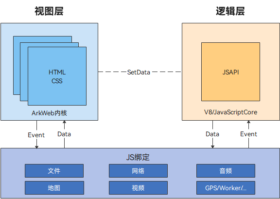
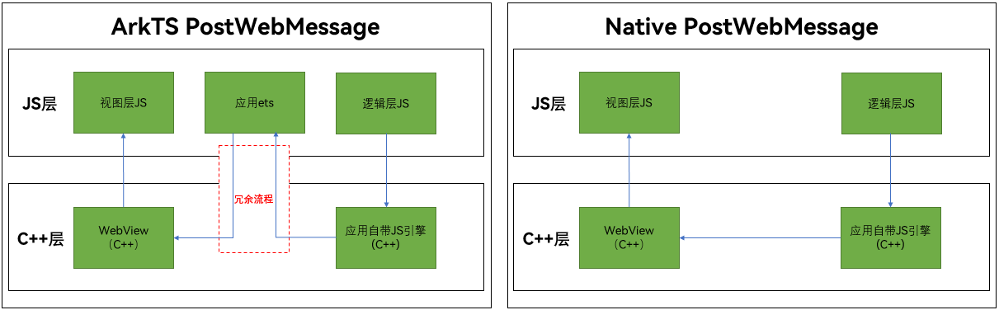

## 建立应用侧与前端页面数据通道(C/C++)

### 介绍

1. 实现对以下文档中提供中 https://docs.openharmony.cn/pages/v6.1/zh-cn/application-dev/web/arkweb-ndk-page-data-channel.md 示例代码片段的工程化，保证指南中示例代码与sample工程文件同源。

### 效果预览

| 适用架构                                                     | 通信方案对比                                                 |
| ------------------------------------------------------------ | ------------------------------------------------------------ |
|  |  |

### 使用说明

1. 点击createNoControllerTagPort按钮ETS侧调用testNapi.createWebMessagePorts("noTag")。
2. 点击createPort按钮ETS侧调用 testNapi.createWebMessagePorts(this.webTaag)。
3. 点击setHandler按钮ETS侧调用testNapi.setMessageEventHandler(this.webTag(3))。
4. 点击setHandlerThread按钮ETS侧调用 testNapi.setMessageEventHandlerThread(this.webTag)。
5. 点击SendString按钮ETS侧清空h5Log,调用 testNapi.postMessage(this.webTag)，通过消息端口将内容发送到前端页面。

### 工程目录

```
├──entry/src/main
│  ├──cpp                                 // C++代码区
│  │  ├──CMakeLists.txt                   // CMake配置文件
│  │  ├──hello.cpp                        // Native业务代码实现
|  |  ├──types						      //定义接口文件
│  │  │  └── libentry                     // C++接口导出
│  │  │  │   ├── Index.d.ts
│  │  │  │   └── oh-package.json5
│  ├──ets                                 // ets代码区
│  │  ├──entryability
│  │  │  └──EntryAbility.ts               // 程序入口类
│  │  ├── entrybackupability
│  │  │   └── EntryBackupAbility.ets      // 备份恢复框架
│  │  └──pages                            // 页面文件
│  │     └──Index.ets                     // 主界面
|  ├──resources         			      // 资源文件目录
```

### 具体实现
* 调用ArkWeb在Native侧接口实现环境初始化、创建端口、发送接收消息等功能，并暴露给arkts侧。源码参考[hello.cpp](./entry/src/main/cpp/hello.cpp)
* 在arkts侧通过import引入testNapi模块调用Native接口。源码参考[Index.ets](./entry/src/main/ets/pages/Index.ets)
* H5侧消息端口交互与数据编解码功能封装在前端页面。源码参考[index.html](./entry/src/main/resources/rawfile/index.html)

### 相关权限

无。

## 依赖

不涉及。

## 约束与限制

1. 本示例仅支持标准系统上运行，支持设备：RK3568。
2. 本示例支持API20版本SDK，SDK版本号(API Version 20 Release)。
3. 本示例需要使用DevEco Studio 版本号(6.0.0Release)及以上版本才可编译运行。

## 下载

如需单独下载本工程，执行如下命令：

```
git init
git config core.sparsecheckout true
echo code/DocsSample/ArkWeb/ArkWebJsBridge > .git/info/sparse-checkout
git remote add origin https://gitcode.com/openharmony/applications_app_samples.git
git pull origin master
```