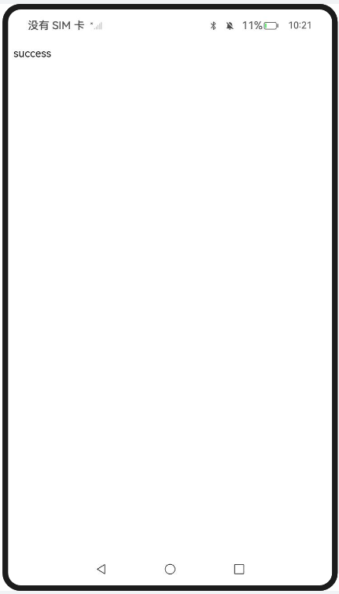
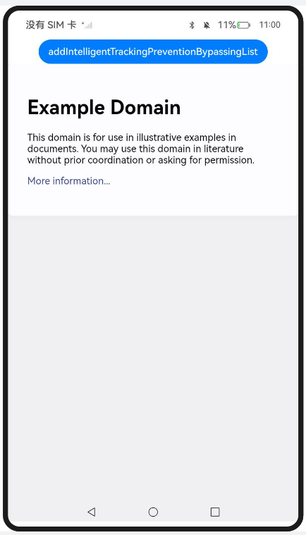
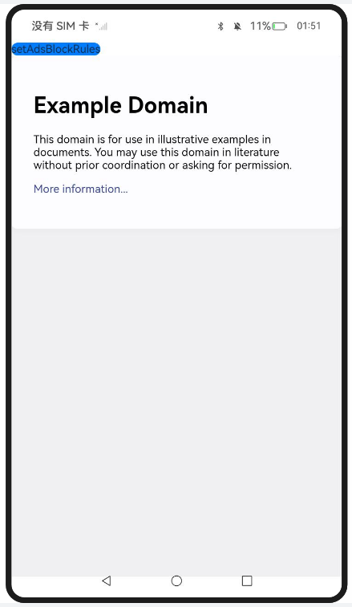
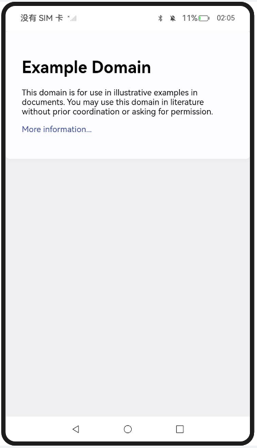

# 管理Web组件安全与隐私功能

### 介绍

本示例主要展示了Web组件安全与隐私相关的功能，使用[onInterceptRequest()](https://docs.openharmony.cn/pages/v5.0/zh-cn/application-dev/reference/apis-arkweb/arkts-basic-components-web-events.md#oninterceptrequest9) 、[setPathAllowingUniversalAccess()](https://docs.openharmony.cn/pages/v5.0/zh-cn/application-dev/reference/apis-arkweb/arkts-apis-webview-WebviewController.md#setpathallowinguniversalaccess12) 、[enableIntelligentTrackingPrevention()](https://docs.openharmony.cn/pages/v5.0/zh-cn/application-dev/reference/apis-arkweb/arkts-apis-webview-WebviewController.md#enableintelligenttrackingprevention12) 、[addIntelligentTrackingPreventionBypassingList()](https://docs.openharmony.cn/pages/v5.0/zh-cn/application-dev/reference/apis-arkweb/arkts-apis-webview-WebviewController.md#addintelligenttrackingpreventionbypassinglist12) 、[AdsBlockManager.setAdsBlockRules()](https://docs.openharmony.cn/pages/v5.0/zh-cn/application-dev/reference/apis-arkweb/arkts-apis-webview-AdsBlockManager.md#setadsblockrules12) 、[enableAdsBlock()](https://docs.openharmony.cn/pages/v5.0/zh-cn/application-dev/reference/apis-arkweb/arkts-apis-webview-WebviewController.md#enableadsblock12) 等接口，实现了解决本地资源跨域、智能防跟踪以及广告过滤等功能。

本示例包含以下三部分：

1. 实现对以下指南文档中 [解决Web组件本地资源跨域问题](https://docs.openharmony.cn/pages/v5.0/zh-cn/application-dev/web/web-cross-origin.md) 示例代码片段的工程化，保证指南中示例代码与sample工程文件同源。
2. 实现对以下指南文档中 [使用智能防跟踪功能](https://docs.openharmony.cn/pages/v5.0/zh-cn/application-dev/web/web-intelligent-tracking-prevention.md) 示例代码片段的工程化，保证指南中示例代码与sample工程文件同源。
3. 实现对以下指南文档中 [使用Web组件的广告过滤功能](https://docs.openharmony.cn/pages/v5.0/zh-cn/application-dev/web/web-adsblock.md) 示例代码片段的工程化，保证指南中示例代码与sample工程文件同源。

### 效果预览

| 本地资源跨域                                              | 智能防跟踪                                                  | 广告过滤规则设置                                           | 广告过滤信息收集                                            |
| ------------------------------------------------------------ | ------------------------------------------------------------ | ------------------------------------------------------------ | ------------------------------------------------------------ |
|  |  |  |  |

使用说明

1. 在主界面，点击对应按钮进入各功能页面；
2. 本地资源跨域页面（LocCrossOriginResAccSol_one）：针对本地index.html，使用http或https协议代替file或resource协议，构造一个属于自己的域名；
3. 本地资源跨域页面（LocCrossOriginResAccSol_two）：通过setPathAllowingUniversalAccess设置路径列表，使用file协议访问列表中的资源时允许进行跨域访问本地文件，页面加载完成后点击stealFile按钮，触发getFile函数跨域访问本地resfile/js/script.js文件；
4. 智能防跟踪页面（EnableIntTrackPrevent）：点击按钮调用enableIntelligentTrackingPrevention接口使能或关闭智能防跟踪功能；
5. 智能防跟踪页面（IsIntTrackPreventEnabled）：点击按钮调用isIntelligentTrackingPreventionEnabled接口判断当前Web组件是否开启了智能防跟踪功能；
6. 智能防跟踪页面（AddIntTrackPreventByPassList）：点击按钮调用addIntelligentTrackingPreventionBypassingList接口设置需要绕过智能防跟踪功能的域名；
7. 智能防跟踪页面（ClearIntTrackPreventByPassList）：点击按钮调用clearIntelligentTrackingPreventionBypassingList接口清除设置的所有域名；
8. 智能防跟踪页面（RemoveIntTrackPreventByPassList）：点击按钮调用removeIntelligentTrackingPreventionBypassingList接口移除部分域名列表；
9. 智能防跟踪页面（OnIntTrackPreventResult）：点击按钮调用onIntelligentTrackingPreventionResult接口，以回调方式获取被拦截的跟踪型网站域名和访问的网站域名信息；
10. 广告过滤页面（EnablingAdsBlocking）：点击setAdsBlockRules按钮，通过文件选择器设置自定义的easylist过滤规则；
11. 广告过滤页面（DisAdsBlockSpecDomPages_one）：点击addAdsBlockDisallowedList按钮关闭特定域名页面的广告过滤；
12. 广告过滤页面（DisAdsBlockSpecDomPages_two）：点击addAdsBlockDisallowedList按钮添加域名；
13. 广告过滤页面（CollectingAdsBlockingInformation）：使用onAdsBlocked接口收集广告过滤的信息。

### 工程目录

```
entry/src/main/
|---ets
|---|---entryability
|---|---|---EntryAbility.ets
|---|---pages
|---|---|---Index.ets						// 首页
|---|---|---LocCrossOriginResAccSol_one.ets	// 解决本地资源跨域（构造自定义域名）
|---|---|---LocCrossOriginResAccSol_two.ets	// 解决本地资源跨域（路径白名单）
|---|---|---EnableIntTrackPrevent.ets		// 使能或关闭智能防跟踪
|---|---|---IsIntTrackPreventEnabled.ets		// 判断是否开启智能防跟踪
|---|---|---AddIntTrackPreventByPassList.ets	// 设置绕过智能防跟踪的域名
|---|---|---ClearIntTrackPreventByPassList.ets	// 清除绕过智能防跟踪的域名
|---|---|---RemoveIntTrackPreventByPassList.ets	// 移除部分绕过智能防跟踪的域名
|---|---|---OnIntTrackPreventResult.ets		// 异步获取被拦截的跟踪信息
|---|---|---EnablingAdsBlocking.ets			// 使能广告过滤并设置过滤规则
|---|---|---DisAdsBlockSpecDomPages_one.ets	// 关闭特定域名页面的广告过滤
|---|---|---DisAdsBlockSpecDomPages_two.ets	// 添加豁免或拦截的域名
|---|---|---CollectingAdsBlockingInformation.ets	// 收集广告过滤信息
|---resources								// 静态资源
|---ohosTest
|---|---ets
|---|---|---tests
|---|---|---|---Ability.test.ets            // 自动化测试用例
```

### 具体实现

* 解决Web组件本地资源跨域问题：
  * 构造自定义域名与本地rawfile资源的映射关系及MIME类型对照表，通过onInterceptRequest接口拦截页面网络请求，命中映射规则时通过$rawfile接口读取本地资源流，手动构建WebResourceResponse对象并返回。参考源码：[LocCrossOriginResAccSol_one.ets](./entry/src/main/ets/pages/LocCrossOriginResAccSol_one.ets)
  * 通过UIContext获取应用沙箱内的资源目录与文件目录，构建本地路径列表，调用setPathAllowingUniversalAccess接口将其设置为跨域访问白名单，并通过loadUrl完成页面加载。参考源码：[LocCrossOriginResAccSol_two.ets](./entry/src/main/ets/pages/LocCrossOriginResAccSol_two.ets)
* 使用智能防跟踪功能：
  * 调用enableIntelligentTrackingPrevention接口使能智能防跟踪功能。参考源码：[EnableIntTrackPrevent.ets](./entry/src/main/ets/pages/EnableIntTrackPrevent.ets)
  * 调用isIntelligentTrackingPreventionEnabled接口获取当前WebView实例的智能防跟踪功能启用状态。参考源码：[IsIntTrackPreventEnabled.ets](./entry/src/main/ets/pages/IsIntTrackPreventEnabled.ets)
  * 调用addIntelligentTrackingPreventionBypassingList接口将受信任域名列表注册到Web内核的全局配置中。参考源码：[AddIntTrackPreventByPassList.ets](./entry/src/main/ets/pages/AddIntTrackPreventByPassList.ets)
  * 调用clearIntelligentTrackingPreventionBypassingList接口移除所有设置的受信任域名白名单。参考源码：[ClearIntTrackPreventByPassList.ets](./entry/src/main/ets/pages/ClearIntTrackPreventByPassList.ets)
  * 调用removeIntelligentTrackingPreventionBypassingList接口将指定域名从豁免白名单中剔除。参考源码：[RemoveIntTrackPreventByPassList.ets](./entry/src/main/ets/pages/RemoveIntTrackPreventByPassList.ets)
  * 开启智能防跟踪功能后注册onIntelligentTrackingPreventionResult回调，当追踪者cookie被拦截时获取host与trackerHost信息。参考源码：[OnIntTrackPreventResult.ets](./entry/src/main/ets/pages/OnIntTrackPreventResult.ets)
* 使用Web组件的广告过滤功能：
  * 使用DocumentViewPicker调用系统文件选择器动态导入符合EasyList语法的过滤规则文件，通过setAdsBlockRules接口将解析后的规则注入Web内核，并调用enableAdsBlock接口使能广告过滤。参考源码：[EnablingAdsBlocking.ets](./entry/src/main/ets/pages/EnablingAdsBlocking.ets)
  * 调用addAdsBlockDisallowedList接口将目标域名注册为广告过滤的"例外名单"。参考源码：[DisAdsBlockSpecDomPages_one.ets](./entry/src/main/ets/pages/DisAdsBlockSpecDomPages_one.ets)、[DisAdsBlockSpecDomPages_two.ets](./entry/src/main/ets/pages/DisAdsBlockSpecDomPages_two.ets)
  * 注册onAdsBlocked事件回调，通过AdsBlockedDetails参数获取被拦截的URL列表并完成过滤信息收集与统计。参考源码：[CollectingAdsBlockingInformation.ets](./entry/src/main/ets/pages/CollectingAdsBlockingInformation.ets)

### 相关权限

[ohos.permission.INTERNET](https://docs.openharmony.cn/pages/v5.0/zh-cn/application-dev/security/AccessToken/permissions-for-all.md#ohospermissioninternet)

### 依赖

不涉及。

### 约束与限制

1. 本示例仅支持标准系统上运行，支持设备：RK3568。
2. 本示例支持API20版本SDK，SDK版本号(API Version 20 Release)。
3. 本示例需要使用DevEco Studio 版本号(6.0.0Release)及以上版本才可编译运行。

### 下载

如需单独下载本工程，执行如下命令：

```
git init
git config core.sparsecheckout true
echo code/DocsSample/ArkWeb-Sta/ManageWebCompSecPriv/ > .git/info/sparse-checkout
git remote add origin https://gitcode.com/openharmony/applications_app_samples.git
git pull origin master
```
