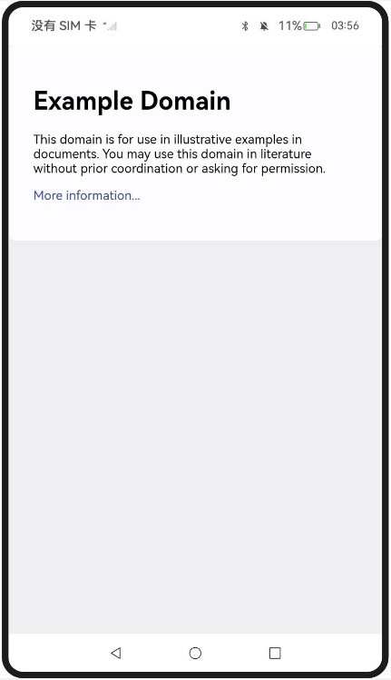
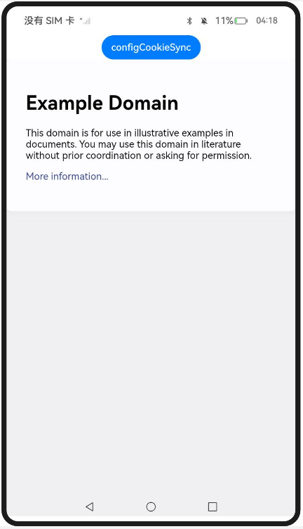

# 管理Cookie及数据存储与定制UserAgent

### 介绍

本示例主要展示了Web组件管理Cookie及数据存储与定制UserAgent相关的功能，使用[cacheMode()](https://docs.openharmony.cn/pages/v5.0/zh-cn/application-dev/reference/apis-arkweb/arkts-basic-components-web-attributes.md#cachemode) 、[removeCache()](https://docs.openharmony.cn/pages/v5.0/zh-cn/application-dev/reference/apis-arkweb/arkts-apis-webview-WebviewController.md#removecache) 、[webview.WebCookieManager.configCookieSync()](https://docs.openharmony.cn/pages/v5.0/zh-cn/application-dev/reference/apis-arkweb/arkts-apis-webview-WebCookieManager.md#configcookiesync11) 、[domStorageAccess()](https://docs.openharmony.cn/pages/v5.0/zh-cn/application-dev/reference/apis-arkweb/arkts-basic-components-web-attributes.md#domstorageaccess) 、[getUserAgent()](https://docs.openharmony.cn/pages/v5.0/zh-cn/application-dev/reference/apis-arkweb/arkts-apis-webview-WebviewController.md#getuseragent) 、[setCustomUserAgent()](https://docs.openharmony.cn/pages/v5.0/zh-cn/application-dev/reference/apis-arkweb/arkts-apis-webview-WebviewController.md#setcustomuseragent10) 、[getCustomUserAgent()](https://docs.openharmony.cn/pages/v5.0/zh-cn/application-dev/reference/apis-arkweb/arkts-apis-webview-WebviewController.md#getcustomuseragent10) 、[setAppCustomUserAgent()](https://docs.openharmony.cn/pages/v5.0/zh-cn/application-dev/reference/apis-arkweb/arkts-apis-webview-WebviewController.md#setappcustomuseragent20) 等接口，实现了配置页面资源的缓存模式、清除已缓存的资源、设置单个Cookie的值、配置Dom Storage、获取默认及自定义用户代理、设置应用级自定义用户代理等功能。

本示例包含以下两部分：

1. 实现对以下指南文档中 [管理Cookie及数据存储](https://docs.openharmony.cn/pages/v5.0/zh-cn/application-dev/web/web-cookie-and-data-storage-mgmt.md) 示例代码片段的工程化，保证指南中示例代码与sample工程文件同源。
2. 实现对以下指南文档中 [User-Agent开发指导](https://docs.openharmony.cn/pages/v5.0/zh-cn/application-dev/web/web-default-userAgent.md) 示例代码片段的工程化，保证指南中示例代码与sample工程文件同源。

### 效果预览

| 缓存模式配置                                             | Cookie管理                                                  | Dom Storage                                               | UserAgent定制                                              |
| ------------------------------------------------------------ | ------------------------------------------------------------ | ------------------------------------------------------------ | ------------------------------------------------------------ |
|  |  |  |  |

使用说明

1. 在主界面，点击对应按钮进入各功能页面；
2. 缓存模式配置页面（Cache_one）：使用cacheMode()接口配置页面资源的缓存模式为None，加载资源时优先使用缓存，如果缓存中无该资源则从网络中获取；
3. 缓存清除页面（Cache_two）：点击按钮触发removeCache()接口清除已经缓存的资源；
4. Cookie管理页面（CookieManagement）：点击按钮使用configCookieSync()接口为https://www.example.com设置单个Cookie的值；
5. Dom Storage页面（DomStorage）：通过Web组件的属性接口domStorageAccess()配置Dom Storage；
6. 默认UserAgent页面（UserAgent_one）：点击按钮获取当前默认用户代理；
7. 自定义UserAgent页面（UserAgent_two）：通过getUserAgent()获取当前的默认UserAgent字符串，并与自定义字符串' DemoApp'进行拼接，再通过setCustomUserAgent()将定制后的UserAgent设置到Web组件中；
8. 自定义UserAgent获取页面（UserAgent_three）：点击按钮，通过getCustomUserAgent()接口获取自定义用户代理；
9. 应用级自定义UserAgent页面（UserAgent_four）：通过setAppCustomUserAgent()设置应用级自定义用户代理，并通过setUserAgentForHosts()对特定网站设置应用级自定义用户代理。

### 工程目录

```
entry/src/main/
|---ets
|---|---entryability
|---|---|---EntryAbility.ets
|---|---pages
|---|---|---Index.ets						// 首页
|---|---|---Cache_one.ets					// 配置页面资源的缓存模式
|---|---|---Cache_two.ets					// 清除已缓存的资源
|---|---|---CookieManagement.ets			// 设置单个Cookie的值
|---|---|---CookieManagement_LazyInitializeWebEngine.ets
|---|---|---DomStorage.ets					// 配置Dom Storage
|---|---|---UserAgent_one.ets				// 获取默认用户代理
|---|---|---UserAgent_two.ets				// 设置自定义用户代理
|---|---|---UserAgent_three.ets				// 获取自定义用户代理
|---|---|---UserAgent_four.ets				// 设置应用级自定义用户代理
|---resources								// 静态资源
|---ohosTest
|---|---ets
|---|---|---tests
|---|---|---|---Ability.test.ets            // 自动化测试用例
```

### 具体实现

1. 缓存与存储管理：通过cacheMode()接口配置页面资源的缓存模式，通过removeCache()接口清除已经缓存的资源。参考源码：[Cache_one.ets](./entry/src/main/ets/pages/Cache_one.ets)、[Cache_two.ets](./entry/src/main/ets/pages/Cache_two.ets)
2. Cookie管理：通过webview.WebCookieManager.configCookieSync()接口设置单个Cookie的值。参考源码：[CookieManagement.ets](./entry/src/main/ets/pages/CookieManagement.ets)
3. Dom Storage：通过domStorageAccess()接口配置Dom Storage。参考源码：[DomStorage.ets](./entry/src/main/ets/pages/DomStorage.ets)
4. UserAgent定制：通过getUserAgent()、setCustomUserAgent()、getCustomUserAgent()接口获取或设置自定义用户代理，通过setAppCustomUserAgent()和setUserAgentForHosts()接口设置应用级自定义用户代理。参考源码：[UserAgent_one.ets](./entry/src/main/ets/pages/UserAgent_one.ets)、[UserAgent_two.ets](./entry/src/main/ets/pages/UserAgent_two.ets)、[UserAgent_three.ets](./entry/src/main/ets/pages/UserAgent_three.ets)、[UserAgent_four.ets](./entry/src/main/ets/pages/UserAgent_four.ets)

### 相关权限

[ohos.permission.INTERNET](https://docs.openharmony.cn/pages/v5.0/zh-cn/application-dev/security/AccessToken/permissions-for-all.md#ohospermissioninternet)

### 依赖

不涉及。

### 约束与限制

1. 本示例仅支持标准系统上运行，支持设备：RK3568。
2. 本示例支持API20版本SDK。
3. 本示例建议使用最新DevEco Studio版本。

### 下载

如需单独下载本工程，执行如下命令：

```
git init
git config core.sparsecheckout true
echo code/DocsSample/ArkWeb-Sta/SetBasicAttrsEvts/SetBasicAttrsEvtsTwo/ > .git/info/sparse-checkout
git remote add origin https://gitcode.com/openharmony/applications_app_samples.git
git pull origin master
```
