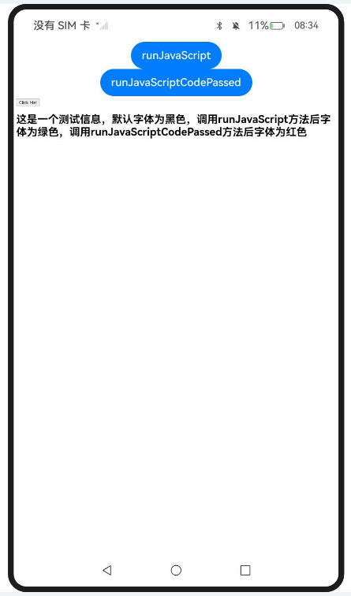
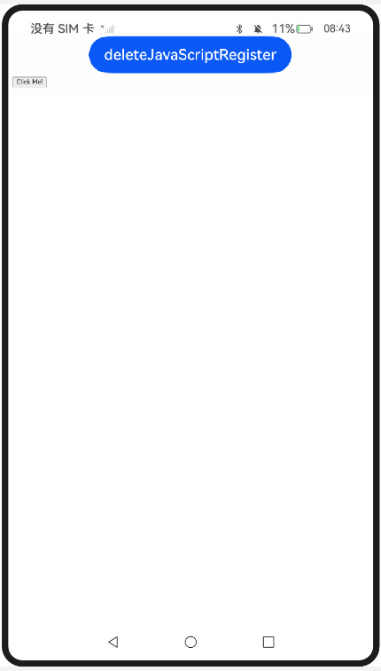
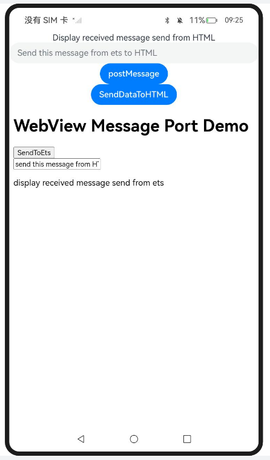
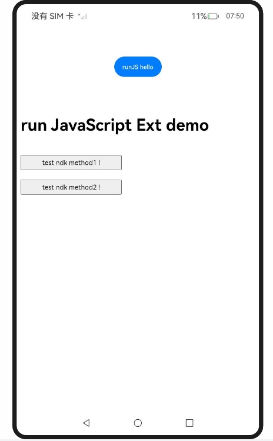

# 应用侧与前端页面的交互

### 介绍

本示例主要介绍Web组件应用侧与前端页面的交互功能，包含5个模块，分别实现对以下指南文档中示例代码片段的工程化，保证指南中示例代码与sample工程文件同源：

1. entry模块：应用侧调用前端页面函数，对应指南[web-in-app-frontend-page-function-invoking](https://docs.openharmony.cn/pages/v5.0/zh-cn/application-dev/web/web-in-app-frontend-page-function-invoking.md)，应用侧通过[runJavaScript()](https://docs.openharmony.cn/pages/v5.0/zh-cn/application-dev/reference/apis-arkweb/arkts-apis-webview-WebviewController.md#runjavascript)和[runJavaScriptExt()](https://docs.openharmony.cn/pages/v5.0/zh-cn/application-dev/reference/apis-arkweb/arkts-apis-webview-WebviewController.md#runjavascriptext10)方法调用前端页面的JavaScript相关函数；
2. entry2模块：前端页面调用应用侧函数，对应指南[web-in-page-app-function-invoking](https://docs.openharmony.cn/pages/v5.0/zh-cn/application-dev/web/web-in-page-app-function-invoking.md)，在Web组件初始化时使用[javaScriptProxy()](https://docs.openharmony.cn/pages/v5.0/zh-cn/application-dev/reference/apis-arkweb/arkts-basic-components-web-attributes.md#javascriptproxy)接口注册应用侧代码，或初始化完成后使用[registerJavaScriptProxy()](https://docs.openharmony.cn/pages/v5.0/zh-cn/application-dev/reference/apis-arkweb/arkts-apis-webview-WebviewController.md#registerjavascriptproxy)接口注册应用侧代码，并通过[deleteJavaScriptRegister](https://docs.openharmony.cn/pages/v5.0/zh-cn/application-dev/reference/apis-arkweb/arkts-apis-webview-WebviewController.md#deletejavascriptregister)接口反注册，防止内存泄漏；
3. entry3模块：建立应用侧与前端页面数据通道，对应指南[web-app-page-data-channel](https://docs.openharmony.cn/pages/v5.0/zh-cn/application-dev/web/web-app-page-data-channel.md)，通过[createWebMessagePorts()](https://docs.openharmony.cn/pages/v5.0/zh-cn/application-dev/reference/apis-arkweb/arkts-apis-webview-WebviewController.md#createwebmessageports)创建消息端口，通过[postMessage()](https://docs.openharmony.cn/pages/v5.0/zh-cn/application-dev/reference/apis-arkweb/arkts-apis-webview-WebviewController.md#postmessage)发送消息，端口使用完毕后通过[close](https://docs.openharmony.cn/pages/v5.0/zh-cn/application-dev/reference/apis-arkweb/arkts-apis-webview-WebMessagePort.md#close)接口关闭端口；
4. entry4、entry6模块：应用侧与前端页面的相互调用(C/C++)，对应指南[arkweb-ndk-jsbridge](https://docs.openharmony.cn/pages/v6.0/zh-cn/application-dev/web/arkweb-ndk-jsbridge.md)，在ArkTS侧通过Node-API将webTag传至Native侧，Native侧通过[OH_ArkWeb_GetNativeAPI](https://docs.openharmony.cn/pages/v6.0/zh-cn/application-dev/reference/apis-arkweb/capi-arkweb-interface-h.md#oh_arkweb_getnativeapi)获取API结构体，调用[ArkWeb_ControllerAPI](https://docs.openharmony.cn/pages/v6.0/zh-cn/application-dev/reference/apis-arkweb/capi-web-arkweb-controllerapi.md)结构体里的接口；
5. entry5模块：建立应用侧与前端页面数据通道(C/C++)，对应指南[arkweb-ndk-page-data-channel](https://docs.openharmony.cn/pages/v5.0/zh-cn/application-dev/web/arkweb-ndk-page-data-channel.md)，通过ArkWeb NDK接口实现环境初始化、创建端口、发送接收消息等功能，并暴露给ArkTS侧调用。

### 效果预览

| 应用侧调用前端页面函数 | 前端页面调用应用侧函数 | 建立应用侧与前端页面数据通道 | 应用侧与前端页面相互调用(C/C++) |
| ------------------------------------------------------------ | ------------------------------------------------------------ | ------------------------------------------------------------ | ------------------------------------------------------------ |
|  |  |  |  |

使用说明

1. entry模块（应用侧调用前端页面函数）：
   - 点击 runJavaScript 按钮，调用前端无参函数htmlTest()，文本字体变黄；
   - 点击 runJavaScriptParam 按钮，调用前端有参函数htmlTestParam(param)，文本字体变绿；
   - 点击 runJavaScriptCodePassed 按钮，向前端传递自定义JavaScript代码changeColor()，文本字体变红；
   - 点击 Click Me! 按钮，触发前端callArkTS()函数。
2. entry2模块（前端页面调用应用侧函数）：首页提供JavaScriptProxy、Promise_one、Promise_two、RegisterJavaScriptProxy、RegisterJavaScriptProxyOne、RegisterJavaScriptProxyTwo、UsageOfComplexTypes_one至UsageOfComplexTypes_five共11个场景入口，进入场景页面后：
   - 点击 Register JavaScript To Window 按钮，将testObj注册到前端；
   - 点击 Click Me! 按钮，触发callArkTS函数；
   - 点击 deleteJavaScriptRegister 按钮，删除Web端注册的testObjName对象；
   - 点击 refresh 按钮刷新网页。
3. entry3模块（建立应用侧与前端页面数据通道）：
   - 点击 postMessage 按钮初始化消息端口；
   - 点击 SendDataToHTML 按钮，从ArkTS向HTML发送消息；
   - 点击前端页面的 SendToEts 按钮，从HTML向ArkTS发送消息；
   - 点击 closePort 按钮关闭端口。
4. entry4、entry6模块（应用侧与前端页面的相互调用(C/C++)）：点击 runJS hello 按钮，调用testNapi.runJavaScript。
5. entry5模块（建立应用侧与前端页面数据通道(C/C++)）：点击 createNoControllerTagPort、createPort、setHandler、setHandlerThread、SendString、SendStringThread、SendBuffer、SendNone、closePort、destroyNullPort、destroyPort按钮，调用testNapi对应Native接口，前端页面提供 H5String、H5Buffer、H5Number、H5Json、H5Array、H5Object 按钮接收不同类型的消息。

### 工程目录

```
entry/src/main/ets/
|---entryability
|---|---EntryAbility.ets
|---entrybackupability
|---|---EntryBackupAbility.ets
|---pages
|---|---Index.ets                      // 应用侧调用前端页面函数入口
entry2/src/main/ets/
|---entry2ability
|---|---Entry2Ability.ets
|---entry2backupability
|---|---Entry2BackupAbility.ets
|---pages
|---|---Index.ets                      // 前端页面调用应用侧函数入口
|---|---JavaScriptProxy.ets            // javaScriptProxy()接口注册应用侧代码
|---|---Promise_one.ets                // 应用侧new Promise场景
|---|---Promise_two.ets                // 前端页面new Promise场景
|---|---RegisterJavaScriptProxy.ets    // registerJavaScriptProxy()接口注册应用侧代码
|---|---RegisterJavaScriptProxyOne.ets // 初始化时注册应用侧代码
|---|---RegisterJavaScriptProxyTwo.ets // 页面加载完成后注册应用侧代码
|---|---UsageOfComplexTypes_one.ets    // 应用侧和前端页面之间传递Array
|---|---UsageOfComplexTypes_two.ets    // 传递基础类型等非Function复杂类型
|---|---UsageOfComplexTypes_three.ets  // 应用侧调用前端页面的Callback
|---|---UsageOfComplexTypes_four.ets   // 应用侧调用前端页面Object里的Function
|---|---UsageOfComplexTypes_five.ets   // 前端页面调用应用侧Object里的Function
entry3/src/main/ets/
|---entry3ability
|---|---Entry3Ability.ets
|---pages
|---|---Index.ets                      // 建立应用侧与前端页面数据通道
entry4/src/main/ets/
|---entry4ability
|---|---Entry4Ability.ets
|---pages
|---|---Index.ets                      // 应用侧与前端页面相互调用(C/C++)
entry4/src/main/cpp/
|---hello.cpp                         // Native侧应用侧与前端页面相互调用实现
|---jsbridge_object.cpp               // JavaScript对象与前端交互实现
|---napi_init.cpp                     // Node-API注册入口
entry5/src/main/ets/
|---entry5ability
|---|---Entry5Ability.ets
|---pages
|---|---Index.ets                      // 建立应用侧与前端页面数据通道(C/C++)
entry5/src/main/cpp/
|---hello.cpp                         // Native侧数据通道实现
|---napi_init.cpp                     // Node-API注册入口
entry6/src/main/ets/
|---entry6ability
|---|---Entry6Ability.ets
|---pages
|---|---Index.ets                      // 应用侧与前端页面相互调用(C/C++)
entry6/src/main/cpp/
|---hello.cpp                         // Native侧应用侧与前端页面相互调用实现
|---jsbridge_object.cpp               // JavaScript对象与前端交互实现
|---napi_init.cpp                     // Node-API注册入口
```

### 具体实现

* entry模块：应用侧调用前端页面函数，源码参考：[Index.ets](./entry/src/main/ets/pages/Index.ets)、[index.html](./entry/src/main/resources/rawfile/index.html)
    * 使用[runJavaScript()](https://docs.openharmony.cn/pages/v5.0/zh-cn/application-dev/reference/apis-arkweb/arkts-apis-webview-WebviewController.md#runjavascript)调用前端页面无参函数htmlTest()；
    * 使用runJavaScript调用前端页面有参函数htmlTestParam(param)；
    * 使用runJavaScript向前端页面传递自定义JavaScript代码changeColor()。

* entry2模块：前端页面调用应用侧函数，源码参考：[Index.ets](./entry2/src/main/ets/pages/Index.ets)
    * 在Web组件初始化时通过[javaScriptProxy()](https://docs.openharmony.cn/pages/v5.0/zh-cn/application-dev/reference/apis-arkweb/arkts-basic-components-web-attributes.md#javascriptproxy)接口注册应用侧代码，源码参考：[JavaScriptProxy.ets](./entry2/src/main/ets/pages/JavaScriptProxy.ets)；
    * 在Web组件初始化完成后通过[registerJavaScriptProxy()](https://docs.openharmony.cn/pages/v5.0/zh-cn/application-dev/reference/apis-arkweb/arkts-apis-webview-WebviewController.md#registerjavascriptproxy)接口注册应用侧代码，注册后在下次加载或者重新加载后生效，源码参考：[RegisterJavaScriptProxy.ets](./entry2/src/main/ets/pages/RegisterJavaScriptProxy.ets)；
    * 通过[deleteJavaScriptRegister](https://docs.openharmony.cn/pages/v5.0/zh-cn/application-dev/reference/apis-arkweb/arkts-apis-webview-WebviewController.md#deletejavascriptregister)接口反注册JavaScript对象，防止内存泄漏；
    * Promise使用场景分别在应用侧new Promise和前端页面new Promise，源码参考：[Promise_one.ets](./entry2/src/main/ets/pages/Promise_one.ets)、[Promise_two.ets](./entry2/src/main/ets/pages/Promise_two.ets)；
    * 复杂类型使用场景覆盖Array、非Function复杂类型、Callback、Object里的Function的传递，源码参考：[UsageOfComplexTypes_one.ets](./entry2/src/main/ets/pages/UsageOfComplexTypes_one.ets)至[UsageOfComplexTypes_five.ets](./entry2/src/main/ets/pages/UsageOfComplexTypes_five.ets)。

* entry3模块：建立应用侧与前端页面数据通道，源码参考：[Index.ets](./entry3/src/main/ets/pages/Index.ets)、[index.html](./entry3/src/main/resources/rawfile/index.html)
    * 通过[createWebMessagePorts()](https://docs.openharmony.cn/pages/v5.0/zh-cn/application-dev/reference/apis-arkweb/arkts-apis-webview-WebviewController.md#createwebmessageports)方法创建两个消息端口，再把其中一个端口通过[postMessage()](https://docs.openharmony.cn/pages/v5.0/zh-cn/application-dev/reference/apis-arkweb/arkts-apis-webview-WebviewController.md#postmessage)接口发送到前端页面，实现前端页面和应用侧之间互相发送消息；
    * 端口使用完毕后或Webview对象销毁前通过[close](https://docs.openharmony.cn/pages/v5.0/zh-cn/application-dev/reference/apis-arkweb/arkts-apis-webview-WebMessagePort.md#close)接口关闭端口。

* entry4、entry6模块：应用侧与前端页面的相互调用(C/C++)，源码参考：[Index.ets](./entry4/src/main/ets/pages/Index.ets)、[hello.cpp](./entry4/src/main/cpp/hello.cpp)
    * 在ArkTS侧自定义一个标识webTag，并将webTag通过Node-API传至应用Native侧；
    * 在Native侧，通过函数[OH_ArkWeb_GetNativeAPI](https://docs.openharmony.cn/pages/v6.0/zh-cn/application-dev/reference/apis-arkweb/capi-arkweb-interface-h.md#oh_arkweb_getnativeapi)先获取API结构体，调用结构体里的Native API；
    * Native侧，通过ArkWeb_ComponentAPI注册组件生命周期回调；
    * 前端页面通过registerJavaScriptProxyEx将应用侧函数注册至前端页面，注册后在下次加载或者重新加载后生效；
    * 应用侧使用runJavaScript调用前端页面函数。

* entry5模块：建立应用侧与前端页面数据通道(C/C++)，源码参考：[Index.ets](./entry5/src/main/ets/pages/Index.ets)、[hello.cpp](./entry5/src/main/cpp/hello.cpp)、[index.html](./entry5/src/main/resources/rawfile/index.html)
    * 调用ArkWeb在Native侧接口实现环境初始化、创建端口、发送接收消息等功能，并暴露给ArkTS侧；
    * 在ArkTS侧通过import引入testNapi模块调用Native接口；
    * H5侧消息端口交互与数据编解码功能封装在前端页面。

### 相关权限

entry2模块需要配置[ohos.permission.INTERNET](https://docs.openharmony.cn/pages/v5.0/zh-cn/application-dev/security/AccessToken/permissions-for-all.md#ohospermissioninternet)，其余模块无特殊权限。

### 依赖

不涉及。

### 约束与限制

1. 本示例仅支持标准系统上运行，支持设备：RK3568。
2. 本示例支持API20版本SDK，SDK版本号(API Version 20 Release)。
3. 本示例需要使用DevEco Studio 版本号(6.0.0Release)及以上版本才可编译运行。

### 下载

如需单独下载本工程，执行如下命令：

```
git init
git config core.sparsecheckout true
echo code/DocsSample/ArkWeb-Sta/UseFrontendJSApp/ > .git/info/sparse-checkout
git remote add origin https://gitcode.com/openharmony/applications_app_samples.git
git pull origin master
```
