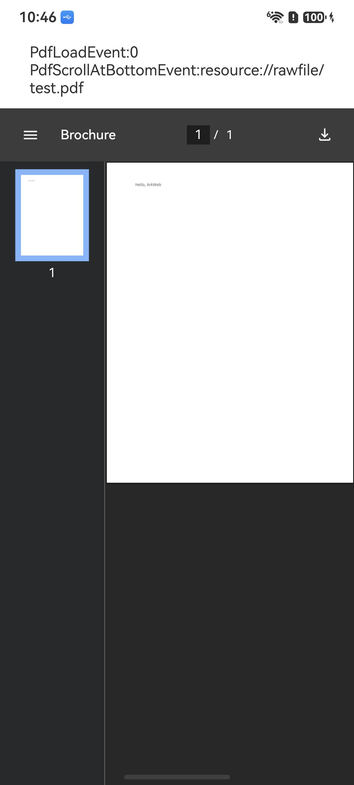

# 使用Web组件的PDF文档预览能力

## 介绍

1. 本工程主要实现了对指南文档 [使用Web组件的PDF文档预览能力](https://gitcode.com/openharmony/docs/blob/master/zh-cn/application-dev/web/web-pdf-preview.md) 中示例代码片段的工程化，主要目标是实现指南中示例代码需要与sample工程文件同源。

## PreviewPDF

### 介绍

1. 本示例主要介绍使用Web组件的PDF文档预览能力。Web组件提供了在网页中预览PDF的能力。应用可以通过Web组件的src参数和loadUrl()接口中传入PDF文件，来加载PDF文档。根据PDF文档来源不同，可以分为三种常用场景：加载网络PDF文档、加载本地PDF文档、加载应用内resource资源PDF文档。

### 效果预览

| 主页                                                    |
| ------------------------------------------------------- |
|  |

### 具体实现

1. 使用Web组件的src参数传入不同来源的PDF文件，以加载PDF文档，参考源码：[PreviewPDF.ets](./entry/src/main/ets/pages/PreviewPDF.ets)

## LoadNetworkPdf

### 介绍

1. 本示例主要介绍使用Web组件加载网络PDF文档。应用通过Web组件的src参数传入网络PDF地址，直接预览线上PDF文件。

### 效果预览

| 主页                                                         |
| ------------------------------------------------------------ |
|  |

### 使用说明

1. 点击首页LoadNetworkPdf按钮，进入页面后自动加载网络PDF文档。

### 具体实现

1. 使用Web组件的src参数传入网络PDF地址，以加载网络PDF文档，参考源码：[LoadNetworkPdf.ets](./entry/src/main/ets/pages/LoadNetworkPdf.ets)

## LoadSandboxPdf

### 介绍

1. 本示例主要介绍使用Web组件加载应用沙箱中的PDF文档。应用通过Web组件的src参数传入应用沙箱目录下的PDF路径，实现本地PDF预览。

### 效果预览

| 主页                                                         |
| ------------------------------------------------------------ |
|  |

### 使用说明

1. 点击首页LoadSandboxPdf按钮，进入页面后自动加载应用沙箱中的PDF文档。

### 具体实现

1. 使用Web组件的src参数传入应用沙箱路径，并开启fileAccess访问本地文件，参考源码：[LoadSandboxPdf.ets](./entry/src/main/ets/pages/LoadSandboxPdf.ets)

## LoadRawfilePdf

### 介绍

1. 本示例主要介绍使用Web组件加载应用rawfile中的PDF文档。应用通过资源路径加载随应用打包的PDF文件，实现离线预览。

### 效果预览

| 主页                                                        |
| ----------------------------------------------------------- |
|  |

### 使用说明

1. 点击首页LoadRawfilePdf按钮，进入页面后自动加载rawfile中的PDF文档。

### 具体实现

1. 使用Web组件的src参数传入`resource://rawfile/test.pdf`资源路径，以加载本地PDF文档，参考源码：[LoadRawfilePdf.ets](./entry/src/main/ets/pages/LoadRawfilePdf.ets)

## PdfEvent

### 介绍

1. 本示例主要介绍Web组件在预览PDF文档时的事件回调能力。应用加载PDF文档后，可通过onPdfLoadEvent监听PDF加载结果，通过onPdfScrollAtBottom监听PDF滚动到底部事件。

### 效果预览

| 主页                                                |
| --------------------------------------------------- |
|  |

### 使用说明

1. 点击首页PdfEvent按钮，进入页面后自动加载PDF文档，并在回调中获取文档地址与加载结果；滚动到底部时触发滚动到底部事件回调。

### 具体实现

1. 使用Web组件的onPdfLoadEvent接口监听PDF加载事件，使用onPdfScrollAtBottom接口监听PDF滚动到底部事件，参考源码：[PdfEvent.ets](./entry/src/main/ets/pages/PdfEvent.ets)

## 工程目录

```
entry/src/main/
|---ets
|---|---entryability
|---|---|---EntryAbility.ets
|---|---pages
|---|---|---Index.ets                       // 首页
|---|---|---PreviewPDF.ets
|---|---|---LoadNetworkPdf.ets
|---|---|---LoadSandboxPdf.ets
|---|---|---LoadRawfilePdf.ets
|---|---|---PdfEvent.ets
|---resources                              // 静态资源
|---ohosTest
|---|---ets
|---|---|---test
|---|---|---|---Ability.test.ets            // 自动化测试用例
```


## 相关权限

[ohos.permission.INTERNET](https://gitcode.com/openharmony/docs/blob/master/zh-cn/application-dev/security/AccessToken/permissions-for-all.md#ohospermissioninternet)

## 依赖

不涉及。

## 约束与限制

1. 本示例仅支持标准系统上运行，支持设备：RK3568。
2. 本示例支持API 26.0.0.0版本SDK，SDK版本号(API Version 26.0.0.0)。
3. 本示例需要使用DevEco Studio 版本号(6.0.0.94SP4)才可编译运行。

## 下载

如需单独下载本工程，执行如下命令：

```
git init
git config core.sparsecheckout true
echo code/DocsSample/ArkWeb-Sta/WebPreviewPdf > .git/info/sparse-checkout
git remote add origin https://gitcode.com/openharmony/applications_app_samples.git
git pull origin OpenHarmony_feature_sta_20260331
```
