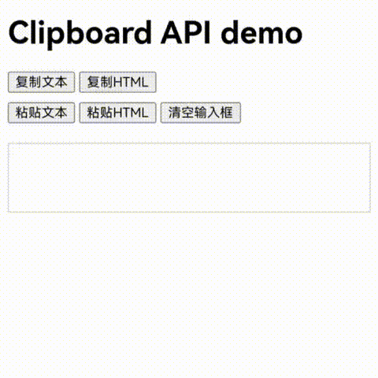
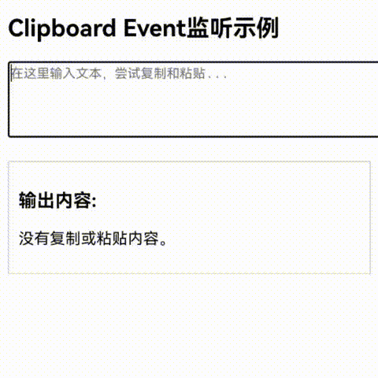

# 使用Web组件与系统剪贴板交互处理网页内容

### 介绍

1. 开发者能够通过Web组件和系统剪贴板进行交互，实现各种类型数据的复制和粘贴。支持通过[菜单](https://gitcode.com/openharmony/docs/blob/master/zh-cn/application-dev/web/web_menu.md)、键盘快捷键以及[W3C剪贴板接口](https://www.w3.org/TR/clipboard-apis/)对网页内容执行剪切、复制和粘贴操作。
2. 本工程主要实现了对以下指南文档中[使用Web组件与系统剪贴板交互处理网页内容](https://gitcode.com/openharmony/docs/blob/master/zh-cn/application-dev/web/web-clipboard.md)示例代码片段的工程化，帮助开发者快速了解Web组件和系统剪贴板之间如何交互。

### 通过W3C异步剪贴板接口与系统剪贴板交互

#### 介绍

[异步剪贴板接口（Async Clipboard API）](https://www.w3.org/TR/clipboard-apis/#async-clipboard-api)提供给网页开发者读写系统剪贴板的方法，这让Web应用程序可以实现剪切、复制和粘贴的功能。

#### 效果预览

| Clipboard API demo                                        |
|-----------------------------------------------------------|
|  |

##### 使用说明

* 通过异步剪贴板接口read()和readText()方法访问系统剪贴板内容，需[申请访问剪贴板权限](https://gitcode.com/openharmony/docs/blob/master/zh-cn/application-dev/basic-services/pasteboard/get-pastedata-permission-guidelines.md)：ohos.permission.READ_PASTEBOARD。
* 使用writeText、write等API将内容写入系统剪贴板。使用readText、read等API从系统剪贴板获取文本内容。

### 通过W3C剪贴板事件接口与系统剪贴板交互

#### 介绍

[剪贴板事件（Clipboard Event）](https://www.w3.org/TR/clipboard-apis/#clipboard-events-and-interfaces)描述了与剪切板相关的cut、copy和paste事件。当用户执行剪切、复制或粘贴操作时，相应的事件将被触发。开发者可以通过监听这些事件，对系统剪贴板进行读写操作，或拦截默认行为，以更改复制或粘贴的结果。
#### 效果预览

| Clipboard Event监听示例                                            |
|----------------------------------------------------------------|
|  |

##### 使用说明
* 通过监听网页的复制、粘贴、剪切事件，获取到内容。
* 使用navigator.clipboard 相关 API，访问剪贴板内容。

#### 工程目录

```
├── entry
│   └── src
│       └── main
│           ├── ets                                 // ArkTS代码区
│           │   ├── entryability
│           │   │   └── EntryAbility.ets            // 入口类
│           │   ├── entrybackupability
│           │   │   └── EntryBackupAbility.ets      // 备份恢复框架
│           │   └── pages
│           │       └── Index.ets                   // 主页
│           └── resources                           // 应用资源文件

├── entry2
│   └── src
│       └── main
│           ├── ets                                 // ArkTS代码区
│           │   ├── entryability
│           │   │   └── EntryAbility.ets            // 入口类
│           │   ├── entrybackupability
│           │   │   └── EntryBackupAbility.ets      // 备份恢复框架
│           │   └── pages
│           │       └── Index.ets                   // 主页
│           └── resources                           // 应用资源文件
```

### 具体实现
* 使用Web组件与系统剪贴板交互处理网页内容
* 通过W3C异步剪贴板接口与系统剪贴板交互
  * [异步剪贴板接口（Async Clipboard API）](https://www.w3.org/TR/clipboard-apis/#async-clipboard-api)提供给网页开发者读写系统剪贴板的方法。
  * writeText：将文本内容写入系统剪贴板。write：将任意类型内容写入系统剪贴板。
  * readText：从系统剪贴板读取文本内容。read()：从系统剪贴板读取任意类型内容。
* 通过W3C剪贴板事件接口与系统剪贴板交互
  * [剪贴板事件（Clipboard Event）](https://www.w3.org/TR/clipboard-apis/#clipboard-events-and-interfaces)描述了与剪切板相关的cut、copy和paste事件。当用户执行剪切、复制或粘贴操作时，相应的事件将被触发。
  * 通过addEventListener的方式监听copy、paste、cut事件，对系统剪贴板进行读写操作
  
### 相关权限

[ohos.permission.INTERNET](https://docs.openharmony.cn/pages/v6.0/zh-cn/application-dev/security/AccessToken/permissions-for-all.md#ohospermissioninternet)

### 依赖

不涉及。

### 约束与限制

1. 本示例仅支持标准系统上运行。
2. 本示例支持API14版本SDK，SDK版本号(API Version 20 Release)。
3. 本示例需要使用DevEco Studio 版本号(6.0.0Release)才可编译运行。

### 下载

如需单独下载本工程，执行如下命令：

```
git init
git config core.sparsecheckout true
echo code/DocsSample/ArkWeb/ArkWebClipboard > .git/info/sparse-checkout
git remote add origin https://gitcode.com/openharmony/applications_app_samples.git
git pull origin master
```