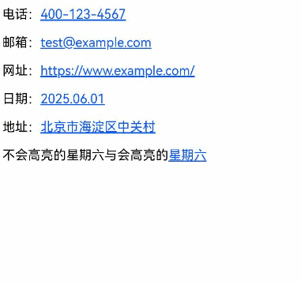
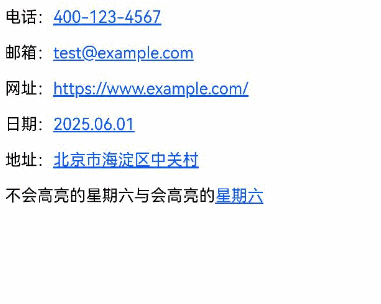

# 使用Web组件的智能分词能力

### 介绍

1. 此功能主要用于单页H5页面内容的实体识别，能够自动识别页面中的电话号码、网址等信息，并提供便捷的交互操作。启用此功能后，用户可以直接在页面中与识别的实体交互，从而提升用户体验。
2. 本工程主要实现了对以下指南文档中[使用Web组件的智能分词能力](https://gitcode.com/openharmony/docs/blob/master/zh-cn/application-dev/web/web-data-detector.md)示例代码片段的工程化，主要目标是实现Web组件上的实体识别。

### 文本分词高亮

#### 介绍

Web组件内的H5页面加载完成后，自动识别并高亮标注页面内的特殊实体。页面变化后新出现的实体不会被高亮标注。

#### 效果预览

| 实体文本                                              |
|----------------------------------------------------------------|
|  |


| 鼠标右键点击、鼠标拖拽将触发超链接的默认行为                                              |
|----------------------------------------------------------------|
|  |

### 分词长按预览

#### 介绍

使用分词长按预览功能时，需要额外配置[dataDetectorConfig](https://gitcode.com/openharmony/docs/blob/master/zh-cn/application-dev/reference/apis-arkweb/arkts-basic-components-web-attributes.md#datadetectorconfig20)

#### 效果预览

| 长按预览功能                                             |
|----------------------------------------------------------------|
|  |


##### 使用说明

从API version 20开始，ArkWeb提供了H5页面内的文本分词识别功能，支持文本分词高亮、分词长按预览及文本选择菜单扩展等。这些功能需将[enableDataDetector](https://gitcode.com/openharmony/docs/blob/master/zh-cn/application-dev/reference/apis-arkweb/arkts-basic-components-web-attributes.md#enabledatadetector20)设置为true，默认为false。

### 工程目录

```
├── entry
│   └── src
│       └── main
│           ├── ets                                     // ArkTS代码区
│           │   ├── entryability
│           │   │   └── EntryAbility.ets                // 入口类
│           │   ├── entrybackupability
│           │   │   └── EntryBackupAbility.ets          // 备份恢复框架
│           │   └── pages
│           │       └── Index.ets                       // 主页
│           │       └── WebDataDetectorHighlighting.ets // 文本分词高亮
│           │       └── WebDataDetectorLongPress.ets    // 分词长按预览
│           └── resources                               // 应用资源文件
```

### 具体实现
* 使用Web组件的智能分词能力
* ArkWeb提供了H5页面内的文本分词识别功能，这些功能需将[enableDataDetector](https://gitcode.com/openharmony/docs/blob/master/zh-cn/application-dev/reference/apis-arkweb/arkts-basic-components-web-attributes.md#enabledatadetector20)设置为true，默认为false。
* 可识别的实体类型包括电话、链接、邮箱、地址和时间，详见[TextDataDetectorType](https://gitcode.com/openharmony/docs/blob/master/zh-cn/application-dev/reference/apis-arkui/arkui-ts/ts-text-common.md#textdatadetectortype11%E6%9E%9A%E4%B8%BE%E8%AF%B4%E6%98%8E)。
* 设置文本识别配置[dataDetectorConfig](https://gitcode.com/openharmony/docs/blob/master/zh-cn/application-dev/reference/apis-arkweb/arkts-basic-components-web-attributes.md#datadetectorconfig20),如分词长按预览功。

### 相关权限

不涉及。

### 依赖

不涉及。

### 约束与限制

1. 本示例仅支持标准系统上运行。
2. 本示例支持API14版本SDK，SDK版本号(API Version 20 Release)。
3. 本示例需要使用DevEco Studio 版本号(6.0.0Release)才可编译运行。

### 下载

如需单独下载本工程，执行如下命令：

```
git init
git config core.sparsecheckout true
echo code/DocsSample/ArkWeb/ArkWebDataDetector > .git/info/sparse-checkout
git remote add origin https://gitcode.com/openharmony/applications_app_samples.git
git pull origin master
```