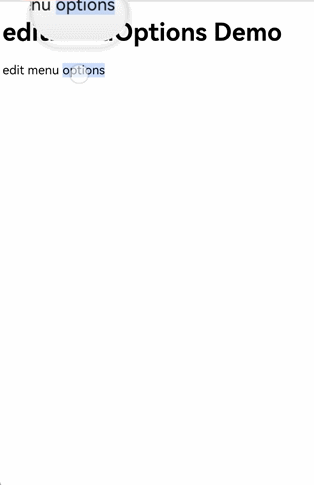
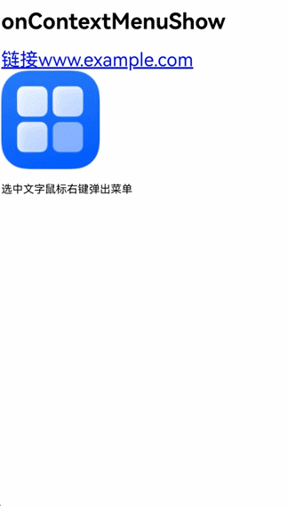
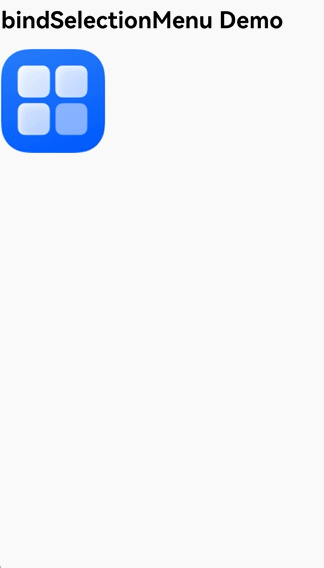
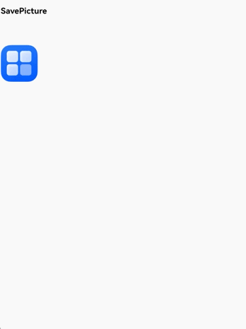
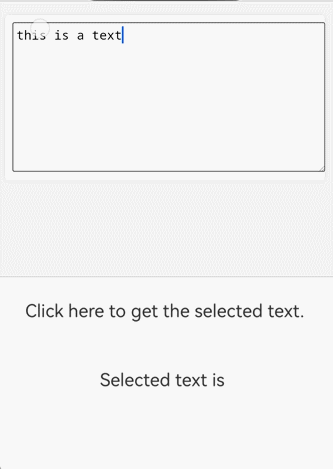

# 使用Web组件菜单处理网页内容

### 介绍

1. 菜单作为用户交互的关键组件，其作用是构建清晰的导航体系，通过结构化布局展示功能入口，使用户能够迅速找到目标内容或执行操作。作为人机交互的重要枢纽，它显著提升了Web组件的可访问性和用户体验，是应用设计中必不可少的部分。Web组件菜单类型包括文本选中菜单、上下文菜单和自定义菜单，应用可根据具体需求灵活选择。
2. 本工程主要实现了对以下指南文档中[使用Web组件菜单处理网页内容](https://gitcode.com/openharmony/docs/blob/master/zh-cn/application-dev/web/web_menu.md)示例代码片段的工程化，主要目标是帮助开发者快速了解如何在Web组件中使用菜单。

### 文本选中菜单

#### 介绍

1. Web组件的文本选中菜单是一种通过自定义元素实现的上下文交互组件，当用户选中文本时会动态显示，提供复制、分享、标注等语义化操作，具备标准化功能与可扩展性，是移动端文本操作的核心功能。文本选中菜单在用户长按选中文本或编辑状态下长按出现单手柄时弹出，菜单项横向排列。系统提供默认的菜单实现。应用可通过[editMenuOptions](https://gitcode.com/openharmony/docs/blob/master/zh-cn/application-dev/reference/apis-arkweb/arkts-basic-components-web-attributes.md#editmenuoptions12)接口对文本选中菜单进行自定义操作。

#### 效果预览

| 文本选中菜单                                              |
|----------------------------------------------------------------|
|  |

##### 使用说明

* 通过onCreateMenu方法自定义菜单项，通过操作Array<TextMenuItem>数组可对显示菜单项进行增减操作，在TextMenuItem中定义菜单项名称、图标、ID等内容。
* 通过onMenuItemClick方法处理菜单项点击事件，当返回false时会执行系统默认逻辑。
* 创建一个EditMenuOptions对象，包含onCreateMenu和onMenuItemClick两个方法，通过Web组件的editMenuOptions方法与Web组件绑定。

#### 工程目录

```
├── entry
│   └── src
│       └── main
│           ├── ets                                 // ArkTS代码区
│           │   ├── entryability
│           │   │   └── EntryAbility.ets            // 入口类
│           │   ├── entrybackupability
│           │   │   └── EntryBackupAbility.ets      // 备份恢复框架
│           │   └── pages
│           │       └── Index.ets                   // 主页
│           └── resources                           // 应用资源文件
```

### 上下文菜单

#### 介绍

上下文菜单是用户通过特定操作（如右键点击或长按富文本）触发的快捷菜单，用于提供与当前操作对象或界面元素相关的功能选项。菜单项纵向排列。系统未提供默认实现，若应用未实现，则不显示上下文菜单。应用需要创建一个Menu组件并与Web绑定，在菜单弹出时可通过Web组件的onContextMenuShow回调接口获取上下文菜单的详细信息，包括点击位置的HTML元素信息及点击位置信息。

#### 效果预览

| 上下文菜单                                                              |
|--------------------------------------------------------------------|
|  |

##### 使用说明

* Menu组件作为弹出的菜单，包含所有菜单项行为与样式。
* 使用bindPopup方法将Menu组件与Web组件绑定。当上下文菜单弹出时，将显示创建的Menu组件。
* 在onContextMenuShow回调中获取上下文菜单事件信息onContextMenuShowEvent。其中param为WebContextMenuParam类型，包含点击位置对应HTML元素信息和位置信息，result为WebContextMenuResult类型，提供常见的菜单能力。


#### 工程目录

```
├── entry2
│   └── src
│       └── main
│           ├── ets                                 // ArkTS代码区
│           │   ├── entryability
│           │   │   └── Entry2Ability.ets            // 入口类
│           │   ├── entrybackupability
│           │   │   └── EntryBackupAbility.ets      // 备份恢复框架
│           │   └── pages
│           │       └── Index.ets                   // 主页
│           └── resources                           // 应用资源文件
```

### 自定义菜单

#### 介绍

自定义菜单赋予开发者调整菜单触发时机与视觉展现的能力，使应用能够依据用户操作场景动态匹配功能入口，简化开发流程中的界面适配工作，同时使应用交互更符合用户直觉。应用可通过bindSelectionMenu接口，实现自定义菜单。目前已额外支持通过长按图片和链接响应自定义菜单。

#### 效果预览

|自定义菜单                                                             |
|--------------------------------------------------------------------|
|  |

##### 使用说明
* 创建Menu组件作为菜单弹窗。
* 通过Web组件的bindSelectionMenu方法绑定MenuBuilder菜单弹窗。将WebElementType设置为WebElementType.IMAGE，responseType设置为WebResponseType.LONG_PRESS，表示长按图片时弹出菜单。在options中定义菜单显示回调onAppear、菜单消失回调onDisappear、预览窗口preview和菜单类型menuType。

#### 工程目录
```
├── entry3
│   └── src
│       └── main
│           ├── ets                                 // ArkTS代码区
│           │   ├── entryability
│           │   │   └── Entry3Ability.ets            // 入口类
│           │   ├── entrybackupability
│           │   │   └── EntryBackupAbility.ets      // 备份恢复框架
│           │   └── pages
│           │       └── Index.ets                   // 主页
│           └── resources                           // 应用资源文件
```

### Web菜单保存图片

#### 介绍

使用安全组件SaveButton保存web图片到图库。

#### 效果预览

|Web菜单保存图片                                                             |
|--------------------------------------------------------------------|
|  |

##### 使用说明
* 创建MenuBuilder组件作为菜单弹窗，使用[SaveButton](https://gitcode.com/openharmony/docs/blob/master/zh-cn/application-dev/reference/apis-arkui/arkui-ts/ts-security-components-savebutton.md)组件实现图片保存，通过bindContextMenu将MenuBuilder与Web绑定。
* 在onContextMenuShow中获取图片url，通过copyLocalPicToDir或copyUrlPicToDir将图片保存至应用沙箱。
* 通过photoAccessHelper将应用沙箱中的图片保存至图库。

#### 工程目录
```
├── entry5
│   └── src
│       └── main
│           ├── ets                                 // ArkTS代码区
│           │   ├── entryability
│           │   │   └── Entry5Ability.ets            // 入口类
│           │   ├── entrybackupability
│           │   │   └── EntryBackupAbility.ets      // 备份恢复框架
│           │   └── pages
│           │       └── Index.ets                   // 主页
│           └── resources                           // 应用资源文件
```
### Web菜单获取选中文本

#### 介绍

Web组件的editMenuOptions接口中没有提供获取选中文本的方式。开发者可通过javaScriptProxy获取到JavaScript的选中文本，实现自定义菜单的逻辑。
#### 效果预览

|Web菜单获取选中文本                                                             |
|----------------------------------------------------------------|
|  |

##### 使用说明
* 创建SelectClass类，通过javaScriptProxy将SelectClass对象注册到Web组件中。
* 在Html侧注册选区变更监听器，在选区变更时通过SelectClass对象将选区设置到ArkTS侧。

#### 工程目录
```
├── entry6
│   └── src
│       └── main
│           ├── ets                                 // ArkTS代码区
│           │   ├── entryability
│           │   │   └── Entry6Ability.ets            // 入口类
│           │   ├── entrybackupability
│           │   │   └── EntryBackupAbility.ets      // 备份恢复框架
│           │   └── pages
│           │       └── Index.ets                   // 主页
│           └── resources                           // 应用资源文件
```

### Web菜单识别图片二维码

#### 介绍

在二维码跳转页面或者付款场景中，开发者可通过实现上下文菜单，获取到onContextMenuShow接口中的二维码图片信息进行处理，提供给用户扫描二维码入口。

#### 效果预览

|Web菜单识别图片二维码                                                             |
|--------------------------------------------------------------------|
|  |

##### 使用说明
* 创建MenuBuilder组件作为菜单弹窗，通过bindContextMenu将MenuBuilder与Web绑定。
* 在onContextMenuShow中获取图片url，通过copyLocalPicToDir或copyUrlPicToDir将图片保存至应用沙箱。
* 通过detectBarcode.decode解析保存在沙箱中的图片，获取到结果。

#### 工程目录
```
├── entry7
│   └── src
│       └── main
│           ├── ets                                 // ArkTS代码区
│           │   ├── entryability
│           │   │   └── Entry7Ability.ets            // 入口类
│           │   ├── entrybackupability
│           │   │   └── EntryBackupAbility.ets      // 备份恢复框架
│           │   └── pages
│           │       └── Index.ets                   // 主页
│           └── resources                           // 应用资源文件
```

### 具体实现
* 使用Web组件菜单处理网页内容
* 文本选中菜单实现：自定义菜单项与点击逻辑
  * 通过 editMenuOptions 接口自定义文本选中时弹出的菜单，支持增减菜单项、控制系统默认行为。
* 上下文菜单实现：绑定自定义弹窗与元素交互
  * 针对超链接、图片等元素，通过 bindPopup 绑定自定义 Menu 组件，实现右键 / 长按触发的上下文菜单。
* 自定义菜单实现：按元素类型绑定长按菜单（图片 / 链接）
  * 通过 bindSelectionMenu 接口，为特定元素（图片 / 超链接）绑定专属长按菜单，支持预览窗口与菜单生命周期控制。
* 菜单保存图片实现：沙箱暂存 + 图库持久化
  * 通过上下文菜单结合文件操作、图库接口，实现 Web 组件中图片的保存功能。
* 菜单获取选中文本实现：JS 与 ArkTS 通信
  * 利用 javaScriptProxy 建立 Web 侧 JS 与 ArkTS 侧的通信，解决 editMenuOptions 无法直接获取选中文本的问题。
* 菜单识别图片二维码实现：长按触发 + 图片解析
  * 通过上下文菜单结合图片处理、二维码解析接口，实现 Web 组件中图片二维码的识
### 相关权限

不涉及

### 依赖

不涉及。

### 约束与限制

1. 本示例仅支持标准系统上运行。
2. 本示例支持API14版本SDK，SDK版本号(API Version 20 Release)。
3. 本示例需要使用DevEco Studio 版本号(6.0.0Release)才可编译运行。

### 下载

如需单独下载本工程，执行如下命令：

```
git init
git config core.sparsecheckout true
echo code/DocsSample/ArkWeb/ArkWebMenu > .git/info/sparse-checkout
git remote add origin https://gitcode.com/openharmony/applications_app_samples.git
git pull origin master
```