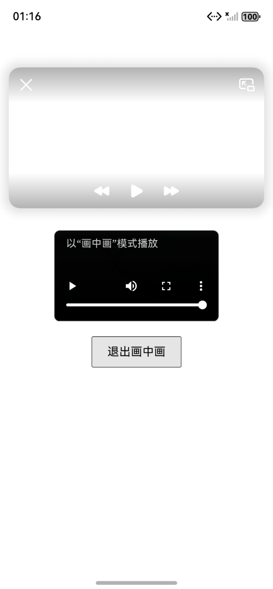
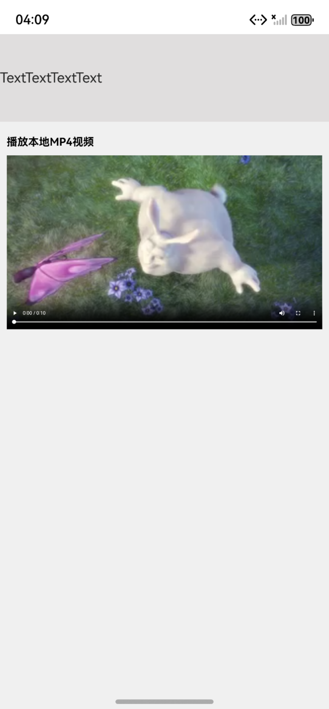
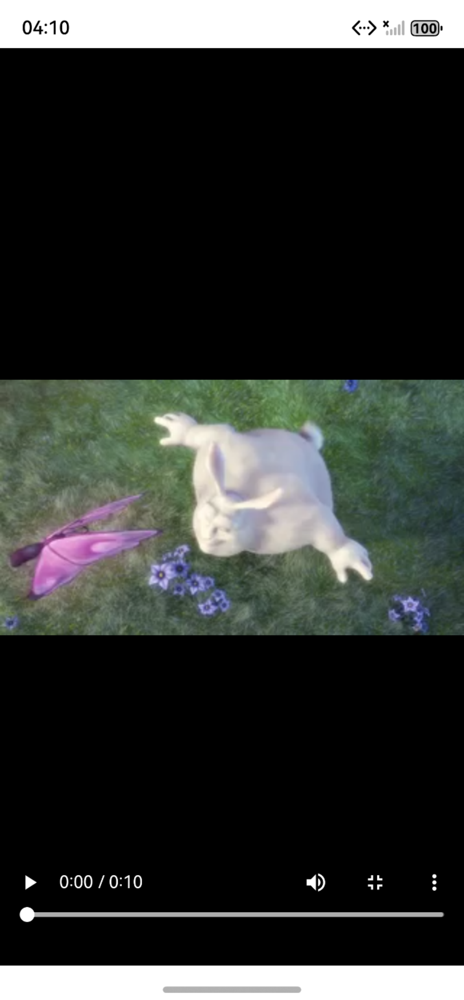

## Web组件支持画中画

### 介绍

1. 本示例主要介绍Web画中画。借助Picture-in-Picture Web API，在网页上拉起一个浮动窗口播放视频，以便用户在浏览器其它网页或者与其它应用交互时通过画中画窗口继续观看视频。
2. 本工程主要实现了对以下指南文档中[Web组件支持画中画](https://gitcode.com/openharmony/docs/blob/master/zh-cn/application-dev/web/web-picture-in-picture.md)示例代码片段的工程化，主要目标是实现指南中示例代码需要与sample工程文件同源。

#### 效果预览

| 进入画中画播放模式                                                        |
|------------------------------------------------------------------|
|  |

##### 使用说明

1. 使用时需要自行替换前端页面视频链接。
2. 点击开启画中画按钮，进入画中画播放模式，在画中画模式时点击退出画中画，恢复原页面播放。
3. 点击画中画窗口，可以显示控制层控件，支持播放、暂停、前进、后退；双击画中画窗口支持放大或缩小窗口。
  
## Web组件支持视频沉浸式全屏播放

### 介绍

1.Web组件提供了视频进入全屏和退出全屏的事件功能，应用可通过监听这些事件实现进入和退出沉浸式全屏模式。
Web组件引用第三方H5页面加载的视频，当点击视频全屏时，视频仅扩展至整个Web组件区域，无法实现系统全屏显示。若要达到系统全屏的沉浸式视频播放效果，则需应用监听进入全屏的事件并调整页面其它组件的属性。
2. 本工程主要实现了对以下指南文档中[Web组件支持视频沉浸式全屏播放](https://gitcode.com/openharmony/docs/blob/master/zh-cn/application-dev/web/web_full_screen.md)示例代码片段的工程化，主要目标是实现指南中示例代码需要与sample工程文件同源。

#### 效果预览

| 原页面显示 | 视频进入全屏播放 |
|------|------|
|      |      |

##### 使用说明

1. 使用时需要自行替换前端页面视频链接。
2. 点击播放控件中的全屏按钮，进入全屏播放模式，同时把web组件大小调整为全屏。
3. 退出全屏模式的是，恢复到初始页面。

### 工程目录

```
├── entry
│   └── src
│       └── main
│           ├── ets                                 // ArkTS代码区
│           │   ├── entryability
│           │   │   └── EntryAbility.ets            // 入口类
│           │   ├── entrybackupability
│           │   │   └── EntryBackupAbility.ets      // 备份恢复框架
│           │   └── pages
│           │       └── Index.ets                   // 主页
│           └── resources                           // 应用资源文件

├── entry1
│   └── src
│       └── main
│           ├── ets                                 // ArkTS代码区
│           │   ├── entryability
│           │   │   └── Entry1Ability.ets            // 入口类
│           │   └── pages
│           │       └── Index.ets                   // 主页
│           └── resources                           // 应用资源文件
```
### 具体实现

* Web组件提供画中画功能支持
  * 应用侧正常加载web组件。
  * 网页中实现[进入画中画](https://gitcode.com/openharmony/docs/blob/master/zh-cn/application-dev/web/web-picture-in-picture.md#%E8%BF%9B%E5%85%A5%E7%94%BB%E4%B8%AD%E7%94%BB),和[退出画中画](https://gitcode.com/openharmony/docs/blob/master/zh-cn/application-dev/web/web-picture-in-picture.md#%E9%80%80%E5%87%BA%E7%94%BB%E4%B8%AD%E7%94%BB)功能。
  * 网页上[监听画中画事件](https://gitcode.com/openharmony/docs/blob/master/zh-cn/application-dev/web/web-picture-in-picture.md#%E7%9B%91%E5%90%AC%E7%94%BB%E4%B8%AD%E7%94%BB%E4%BA%8B%E4%BB%B6)。

* Web组件支持视频沉浸式全屏播放
  * Web组件可通过[onFullScreenEnter](https://gitcode.com/openharmony/docs/blob/master/zh-cn/application-dev/reference/apis-arkweb/arkts-basic-components-web-events.md#onfullscreenenter9)和[onFullScreenExit](https://gitcode.com/openharmony/docs/blob/master/zh-cn/application-dev/reference/apis-arkweb/arkts-basic-components-web-events.md#onfullscreenexit9)回调监听全屏按键的点击事件。onFullScreenEnter表示Web组件进入全屏模式，onFullScreenExit表示Web组件退出全屏模式。
  * 监听这两个回调函数，拿到状态变化值。开发者可通过设置组件属性[visibility](https://gitcode.com/openharmony/docs/blob/master/zh-cn/application-dev/reference/apis-arkui/arkui-ts/ts-universal-attributes-visibility.md#visibility)的不同值，控制组件的显隐状态。

### 相关权限

[ohos.permission.INTERNET](https://docs.openharmony.cn/pages/v5.0/zh-cn/application-dev/security/AccessToken/permissions-for-all.md#ohospermissioninternet)

### 依赖

不涉及。

### 约束与限制

1. 本示例仅支持标准系统上运行。
2. 本示例支持API14版本SDK，SDK版本号(API Version 20 Release)。
3. 本示例需要使用DevEco Studio 版本号(6.0.0Release)才可编译运行。

### 下载

如需单独下载本工程，执行如下命令：

```
git init
git config core.sparsecheckout true
echo code/DocsSample/ArkWeb/ArkWebPictureInPicture > .git/info/sparse-checkout
git remote add origin https://gitcode.com/openharmony/applications_app_samples.git
git pull origin master
```