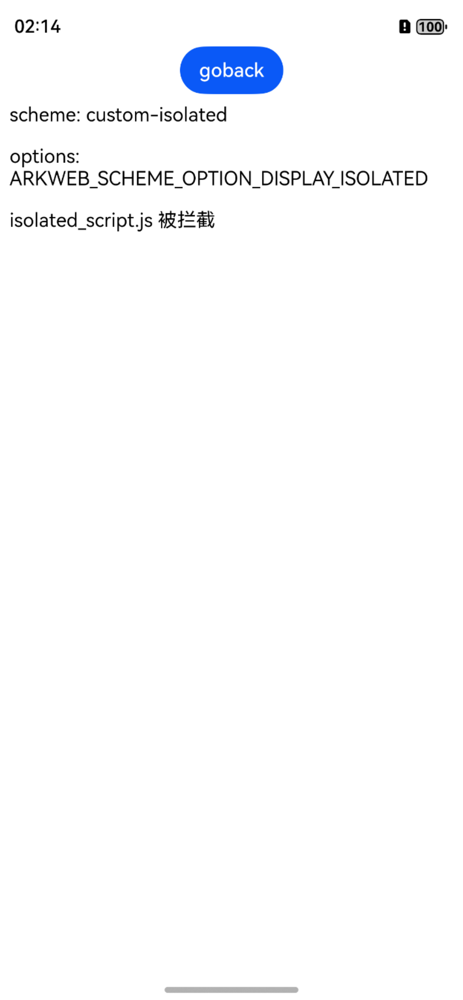
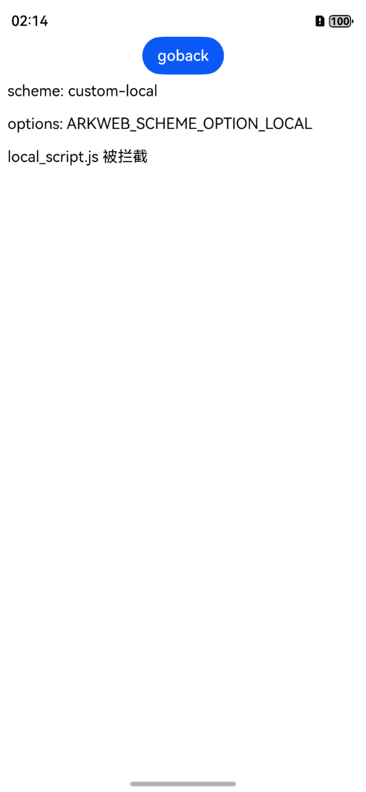

# 拦截Web组件发起的网络请求

### 介绍
本示例通过使用arkweb_scheme_handler.h相关API实现对Web组件发出的请求进行拦截，并为被拦截的请求提供自定义的响应头以及响应体。

### 效果预览

|                   主页                   |                   拦截视频资源                    |
|:--------------------------------------:|:-----------------------------------------:|
|   |  |
|                忽略csp检查并拦截                |                   拦截ISOLATED属性                   |
|  |  |
|               拦截LOCAL属性               |         拦截service worker
|    |  
| 测试读取blob类型 | 测试读取chunked类型 |
|  |  |

### 使用说明
1. 打开DEMO进入首页，展示html。
2. 点击各链接进入不同属性的拦截结果页面或读取结果页面。

### 工程目录


```
├── entry
│   └── src
│       └── main
│           ├── cpp                                 // C++代码区
│           │   ├── CMakeLists.txt                  // CMAKE配置文件
│           │   ├── hello.cpp                       // Native业务代码实现
│           │   ├── rawfile_request.cpp             // RawfileRequest实现
│           │   ├── rawfile_request.h               // RawfileRequest类
│           │   └── types
│           │       └── libentry                    // C++接口导出
│           │           ├── Index.d.ts
│           │           └── oh-package.json5
│           ├── ets                                 // ArkTS代码区
│           │   ├── entryability
│           │   │   └── EntryAbility.ets            // 入口类
│           │   ├── entrybackupability
│           │   │   └── EntryBackupAbility.ets      // 备份恢复框架
│           │   └── pages
│           │       └── Index.ets                   // 主页
│           └── resources                           // 应用资源文件
```
### 相关权限

不涉及。

### 依赖

不涉及。

### 约束与限制

1. 本示例仅支持标准系统上运行，支持设备：华为手机。

2. HarmonyOS系统：HarmonyOS 5.0.1 Release及以上。

3. DevEco Studio版本：DevEco Studio 5.0.1 Release及以上。

4. HarmonyOS SDK版本：HarmonyOS 5.0.1 Release及以上。