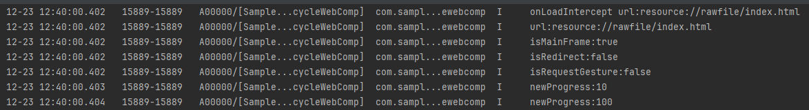

# Web组件的生命周期

### 介绍

本工程主要实现了对以下指南文档中 https://gitee.com/openharmony/docs/blob/OpenHarmony-5.0.1-Release/zh-cn/application-dev/web/web-event-sequence.md 示例代码片段的工程化，主要目标是实现指南中示例代码需要与sample工程文件同源。

### 效果预览

| 日志效果                                |
| --------------------------------------- |
|  |

使用说明

1. 此 Web 组件无页面展示，运行时通过系统日志输出相关信息。

### 工程目录

```
entry/src/main/
|---ets
|---|---entryability
|---|---|---EntryAbility.ets
|---|---pages
|---|---|---Index.ets						// 首页
|---resources								// 静态资源
|---ohosTest
|---|---ets
|---|---|---tests
|---|---|---|---Ability.test.ets            // 自动化测试用例
```


### 相关权限

无。

### 依赖

不涉及。

### 约束与限制

1. 本示例仅支持标准系统上运行，支持设备：RK3568。
2. 本示例支持API14版本SDK，SDK版本号(API Version 14 Release)。
3. 本示例需要使用DevEco Studio 版本号(5.0.1Release)才可编译运行。

### 下载

如需单独下载本工程，执行如下命令：

```
git init
git config core.sparsecheckout true
echo code/DocsSample/ArkWeb/LifecycleWebComp > .git/info/sparse-checkout
git remote add origin https://gitee.com/openharmony/applications_app_samples.git
git pull origin master
```