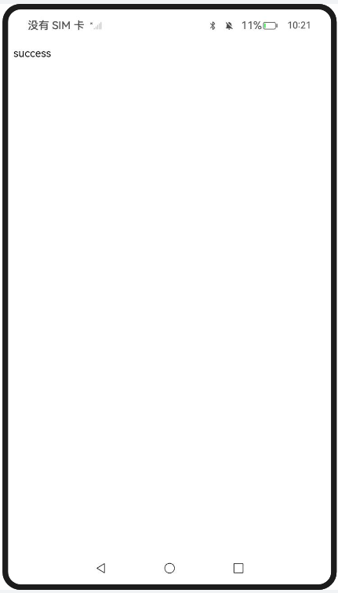
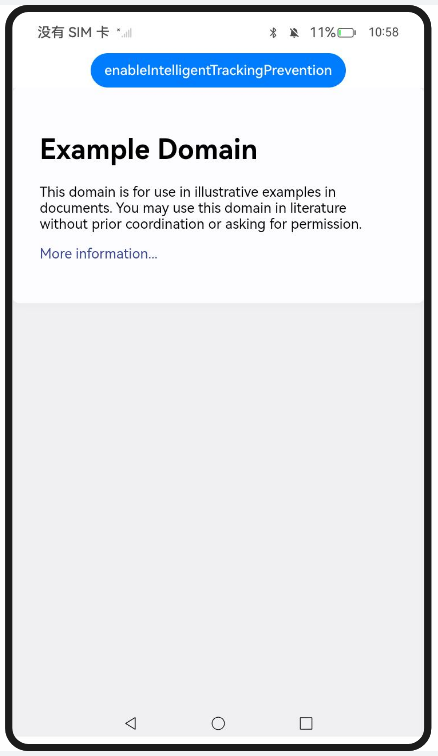
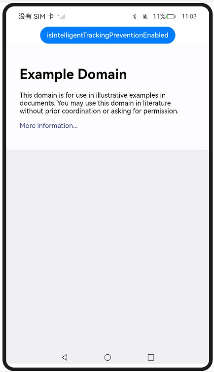
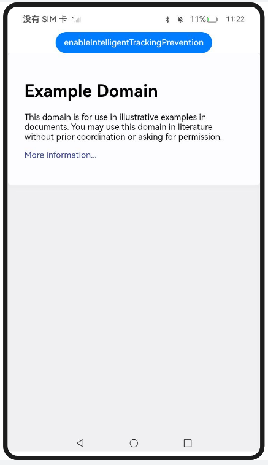
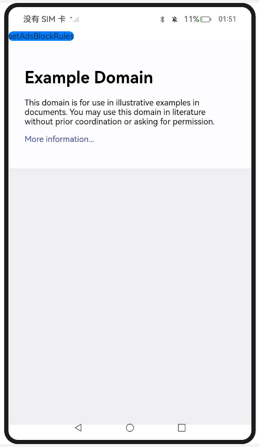
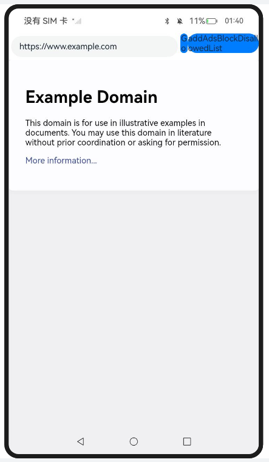
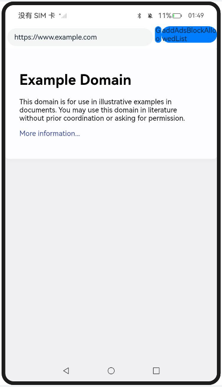

## 解决Web组件本地资源跨域问题

### 介绍

1. 本示例主要介绍解决Web组件本地资源跨域问题，利用Web组件的onInterceptRequest方法，对本地资源进行拦截和相应的替换。
2. 本工程主要实现了对以下指南文档中 https://docs.openharmony.cn/pages/v5.0/zh-cn/application-dev/web/web-cross-origin.md 示例代码片段的工程化，主要目标是实现指南中示例代码需要与sample工程文件同源。

#### LocCrossOriginResAccSol_one

##### 介绍

1. 本示例主要介绍解决Web组件本地资源跨域问题，利用Web组件的onInterceptRequest方法，对本地资源进行拦截和相应的替换。

##### 效果预览

| 主页                                                         |
| ------------------------------------------------------------ |
|  |

使用说明

1. 针对本地index.html,使用http或者https协议代替file协议或者resource协议，构造一个属于自己的域名。

#### LocCrossOriginResAccSol_two

##### 介绍

1. 本示例主要介绍解决Web组件本地资源跨域问题，通过setPathAllowingUniversalAccess设置一个路径列表。当使用file协议访问该列表中的资源时，允许进行跨域访问本地文件。

##### 效果预览

| 主页                                                         | 跨域访问                                                     |
| ------------------------------------------------------------ | ------------------------------------------------------------ |
|  |  |

使用说明

1. 通过setPathAllowingUniversalAccess设置一个路径列表。当使用file协议访问该列表中的资源时，允许进行跨域访问本地文件。
1. index.html页面加载完成后，页面上显示一个按钮stealFile，点击stealFile按钮触发getFile函数跨域访问本地resfile/js/script.js文件。

## 使用智能防跟踪功能

### 介绍

1. 实现对以下指南文档中 https://docs.openharmony.cn/pages/v5.0/zh-cn/application-dev/web/web-intelligent-tracking-prevention.md 示例代码片段的工程化，保证指南中示例代码与sample工程文件同源。

#### AddIntTrackPreventByPassList

##### 介绍

1. 本示例主要介绍使用智能防跟踪功能，调用addIntelligentTrackingPreventionBypassingList接口设置需要绕过智能防跟踪功能的域名列表。

##### 效果预览

| 主页                                                         |
| ------------------------------------------------------------ |
|  |

使用说明

1. 点击addIntelligentTrackingPreventionBypassingList按钮设置需要绕过智能防跟踪功能的域名。

#### ClearIntTrackPreventByPassList

##### 介绍

1. 本示例主要介绍使用智能防跟踪功能，通过调用clearIntelligentTrackingPreventionBypassingList接口清除通过addIntelligentTrackingPreventionBypassingList接口设置的所有域名。

##### 效果预览

| 主页                                                         |
| ------------------------------------------------------------ |
|  |

使用说明

1. 点击clearIntelligentTrackingPreventionBypassingList按钮清除通过addIntelligentTrackingPreventionBypassingList接口设置的所有域名。

#### EnableIntTrackPrevent

##### 介绍

1. 本示例主要介绍使用智能防跟踪功能，调用enableIntelligentTrackingPrevention接口使能或者关闭相应Web组件的智能防跟踪功能。

##### 效果预览

| 主页                                                         |
| ------------------------------------------------------------ |
|  |

使用说明

1. 点击enableIntelligentTrackingPrevention按钮使能相应Web组件的智能防跟踪功能。

#### IsIntTrackPreventEnabled

##### 介绍

1. 本示例主要介绍使用智能防跟踪功能，通过调用isIntelligentTrackingPreventionEnabled接口判断当前Web组件是否开启了智能防跟踪功能。

##### 效果预览

| 主页                                                         |
| ------------------------------------------------------------ |
|  |

使用说明

1. 点击isIntelligentTrackingPreventionEnabled按钮判断当前Web组件是否开启了智能防跟踪功能。

#### OnIntTrackPreventResult

##### 介绍

1. 本示例主要介绍使用智能防跟踪功能，通过调用onIntelligentTrackingPreventionResult接口，以回调的方式异步获取拦截的跟踪型网站的域名和访问的网站域名信息。

##### 效果预览

| 主页                                                         |
| ------------------------------------------------------------ |
|  |

使用说明

1. 点击onIntelligentTrackingPreventionResult按钮，获取拦截的跟踪型网站的域名和访问的网站域名信息。

#### RemoveIntTrackPreventByPassList

##### 介绍

1. 本示例主要介绍使用智能防跟踪功能，通过调用removeIntelligentTrackingPreventionBypassingList接口移除通过addIntelligentTrackingPreventionBypassingList接口设置的部分域名列表。

##### 效果预览

| 主页                                                         |
| ------------------------------------------------------------ |
|  |

使用说明

1. 点击removeIntelligentTrackingPreventionBypassingList按钮，移除通过addIntelligentTrackingPreventionBypassingList接口设置的部分域名列表。

## 使用Web组件的广告过滤功能

### 介绍

1. 实现对以下指南文档中 https://docs.openharmony.cn/pages/v5.0/zh-cn/application-dev/web/web-adsblock.md 示例代码片段的工程化，保证指南中示例代码与sample工程文件同源。

#### EnablingAdsBlocking

##### 介绍

1. 本示例主要介绍使用Web组件的广告过滤功能，应用可以通过AdsBlockManager提供的setAdsBlockRules()接口设置自定义的easylist过滤规则，并通过Web组件的enableAdsBlock()接口使能广告过滤特性。

##### 效果预览

| 主页                                                         | 文件选择器                                                   |
| ------------------------------------------------------------ | ------------------------------------------------------------ |
| /> |  |

使用说明

1. 点击setAdsBlockRules按钮，通过文件选择器设置自定义的easylist过滤规则。

#### DisAdsBlockSpecDomPages_one

##### 介绍

1. 本示例主要介绍使用Web组件的广告过滤功能，在Web组件的广告过滤开关开启后，应用有时候会期望关闭一些特定页面的广告过滤功能，AdsBlockManager提供了addAdsBlockDisallowedList()接口完成此功能。

##### 效果预览

| 主页                                                         |
| ------------------------------------------------------------ |
|  |

使用说明

1. 点击addAdsBlockDisallowedList按钮关闭特定域名页面的广告过滤。

#### DisAdsBlockSpecDomPages_two

##### 介绍

1. 本示例主要介绍使用Web组件的广告过滤功能，使用addAdsBlockDisallowedList()接口添加域名。

##### 效果预览

| 主页                                                         |
| ------------------------------------------------------------ |
|  |

使用说明

1. 点击addAdsBlockDisallowedList按钮添加域名。

#### CollectingAdsBlockingInformation

##### 介绍

1. 本示例主要介绍使用Web组件的广告过滤功能，在Web组件的广告过滤开关开启后，访问的网页如果发生了广告过滤，会通过Web组件的onAdsBlocked()回调接口通知到应用，应用可根据需要进行过滤信息的收集和统计。

##### 效果预览

| 主页                                                         |
| ------------------------------------------------------------ |
|  |

使用说明

1. 使用onAdsBlocked接口收集广告过滤的信息。

### 工程目录

```
entry/src/main/
|---ets
|---|---entryability
|---|---|---EntryAbility.ets
|---|---pages
|---|---|---CollectingAdsBlockingInformation
|---|---|---DisAdsBlockSpecDomPages_one
|---|---|---DisAdsBlockSpecDomPages_two
|---|---|---LocCrossOriginResAccSol_one
|---|---|---LocCrossOriginResAccSol_two
|---|---|---AddIntTrackPreventByPassList
|---|---|---ClearIntTrackPreventByPassList
|---|---|---EnableIntTrackPrevent
|---|---|---IsIntTrackPreventEnabled
|---|---|---OnIntTrackPreventResult 
|---|---|---RemoveIntTrackPreventByPassList
|---|---|---EnablingAdsBlocking
|---|---|---Index.ets						// 首页
|---resources								// 静态资源
|---ohosTest
|---|---ets
|---|---|---tests
|---|---|---|---Ability.test.ets            // 自动化测试用例
```


### 相关权限

[ohos.permission.INTERNET](https://docs.openharmony.cn/pages/v5.0/zh-cn/application-dev/security/AccessToken/permissions-for-all.md#ohospermissioninternet)

## 依赖

不涉及。

## 约束与限制

1. 本示例仅支持标准系统上运行，支持设备：RK3568。
2. 本示例支持API14版本SDK，SDK版本号(API Version 14 Release)。
3. 本示例需要使用DevEco Studio 版本号(5.0.1Release)才可编译运行。

## 下载

如需单独下载本工程，执行如下命令：

```
git init
git config core.sparsecheckout true
echo code/DocsSample/ArkWeb/ManageWebCompSecPriv > .git/info/sparse-checkout
git remote add origin https://gitee.com/openharmony/applications_app_samples.git
git pull origin master
```
