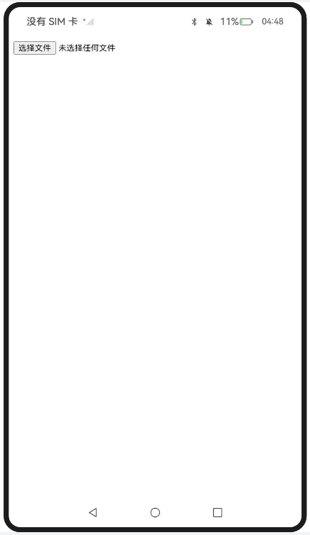
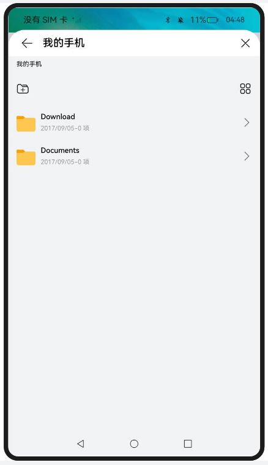
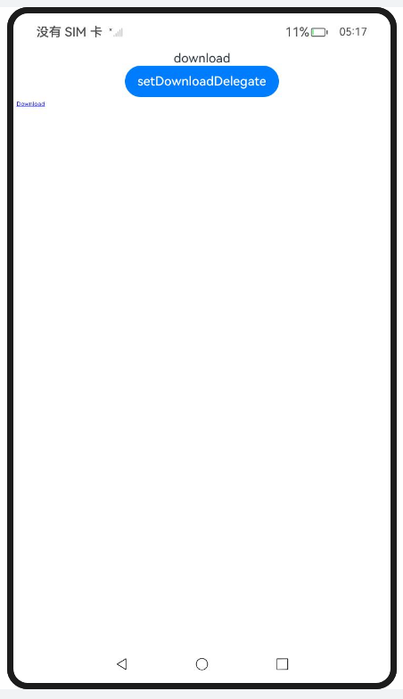
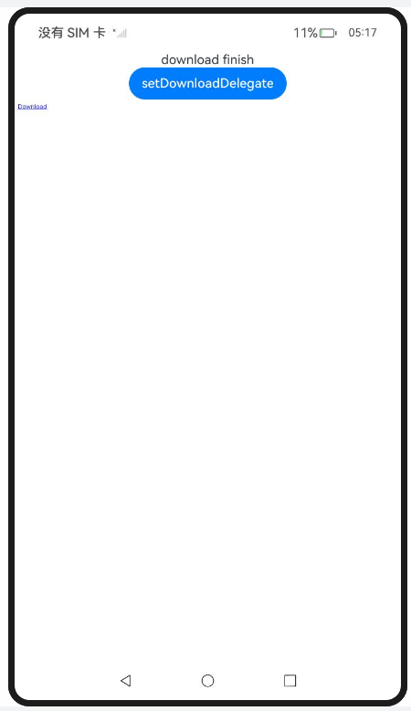
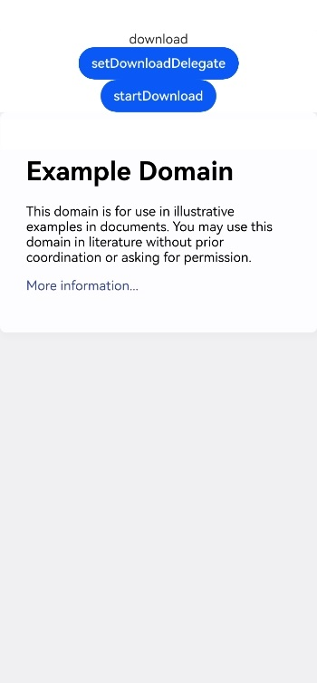
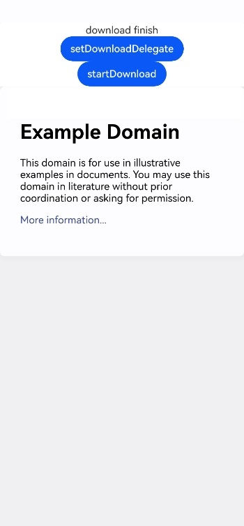
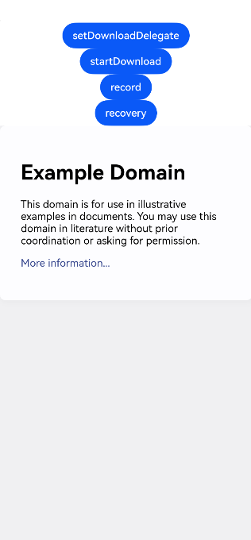

## 上传文件

### 介绍

1. 本工程主要实现了对以下指南文档中 https://docs.openharmony.cn/pages/v5.0/zh-cn/application-dev/web/web-file-upload.md 示例代码片段的工程化，主要目标是实现指南中示例代码需要与sample工程文件同源。

### UploadFiles

#### 介绍

1. 本示例主要介绍Web组件上传文件功能，Web组件支持前端页面选择文件上传功能,应用开发者可以使用onShowvfileSelector)接口来处理前端页面文件上传的请求,如果应用开发者不做任何处理,Web会提供默认行为来处理前端页面文件上传的请求。

#### 效果预览

| 主页                                                       |                                                            |
| ---------------------------------------------------------- | ---------------------------------------------------------- |
|  |  |

使用方法

1. 在主页点击选择文件按钮触发onShowFileSelector事件创建DocumentSelectOptions和DocumentViewPicker，用于打开文件选择器，弹出文件选择器，用户可选择一个文件。

## 使用Web组件的下载能力

### 介绍

1. 本工程主要实现了对以下指南文档中 https://docs.openharmony.cn/pages/v5.0/zh-cn/application-dev/web/web-download.md 示例代码片段的工程化，主要目标是实现指南中示例代码需要与sample工程文件同源。

### ListenForPageDown

#### 介绍

1. 本示例主要介绍使用Web组件监听页面触发的下载功能，通过setDownloadDelegate()向Web组件注册一个DownloadDelegate来监听页面触发的下载任务。资源由Web组件来下载，Web组件会通过DownloadDelegate将下载的进度通知给应用。

#### 效果预览

| 主页                                                         | 下载                                                         |
| ------------------------------------------------------------ | ------------------------------------------------------------ |
|  |  |

使用说明

1. 点击setDownloadDelegate按钮，定义下载委托回调。
2. 点击下载download.html链接，触发下载任务。

### InitiatingADownloadTask

#### 介绍

1. 本示例主要介绍使用Web组件的下载能力。在Web组件启动时，可通过resumeDownload()接口恢复未完成的下载任务。


#### 效果预览

| 主页                                                         | 下载                                                         |
| ------------------------------------------------------------ | ------------------------------------------------------------ |
|  |  |

使用说明

1. 点击setDownloadDelegate按钮，定义下载委托回调。
1. 使用startDownload()接口发起一个下载。 

### ResumeDownload

#### 介绍

1. 本示例主要介绍使用Web组件的下载能力。使用startDownload()接口发起一个下载，Web组件发起的下载会根据当前显示的url以及Web组件默认的Referrer Policy来计算referrer。


#### 效果预览

| 主页                                                        |
| ----------------------------------------------------------- |
|  |

使用说明

1. 点击setDownloadDelegate按钮，定义下载委托回调。
1. 使用startDownload()接口发起一个下载。 
1. 通过record按钮将当前下载任务保存至持久化文件中，记录下载任务信息。
1. 点击recovery按钮恢复下载任务。

### 工程目录

```
entry/src/main/
|---ets
|---|---entryability
|---|---|---EntryAbility.ets
|---|---pages
|---|---|---UploadFiles.ets
|---|---|---downloadUtil.ets
|---|---|---Index.ets						// 首页
|---|---|---InitiatingADownloadTask.ets
|---|---|---ListenForPageDown.ets
|---|---|---ResumeDownload.ets
|---resources								// 静态资源
|---ohosTest
|---|---ets
|---|---|---tests
|---|---|---|---Ability.test.ets            // 自动化测试用例
```

### 相关权限

[ohos.permission.INTERNET](https://docs.openharmony.cn/pages/v5.0/zh-cn/application-dev/security/AccessToken/permissions-for-all.md#ohospermissioninternet)

### 依赖

不涉及。

### 约束与限制

1. 本示例仅支持标准系统上运行，支持设备：RK3568。
2. 本示例支持API14版本SDK，SDK版本号(API Version 14 Release)。
3. 本示例需要使用DevEco Studio 版本号(5.0.1Release)才可编译运行。

### 下载

如需单独下载本工程，执行如下命令：

```
git init
git config core.sparsecheckout true
echo code/DocsSample/ArkWeb/ManageWebPageFileIO > .git/info/sparse-checkout
git remote add origin https://gitee.com/openharmony/applications_app_samples.git
git pull origin master
```