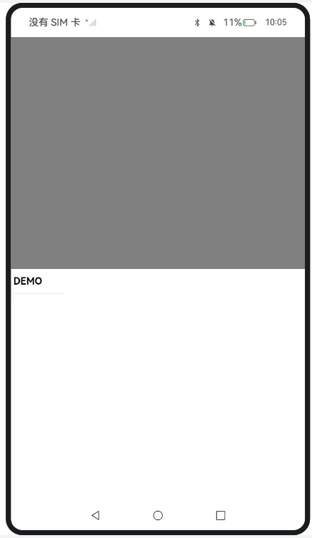
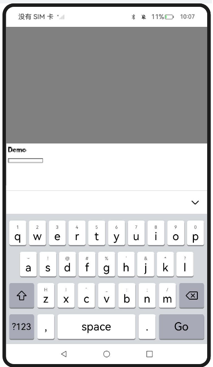
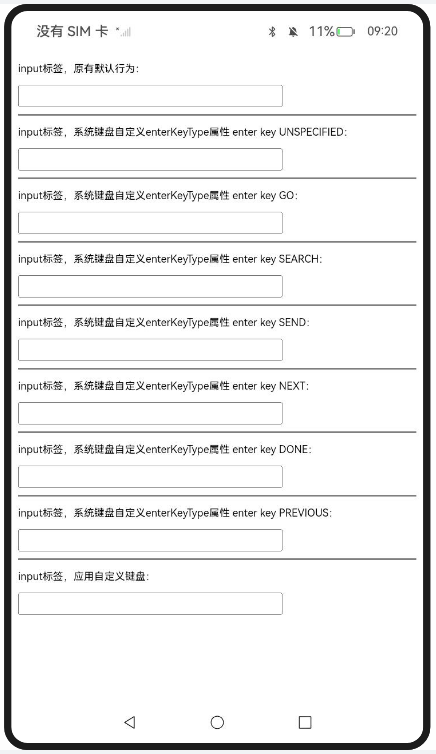

# entry:

## Web组件嵌套滚动

### 介绍

#### ImpNestedScroll

1. 实现对以下指南文档中 https://docs.openharmony.cn/pages/v5.0/zh-cn/application-dev/web/web-nested-scrolling.md 示例代码片段的工程化，保证指南中示例代码与sample工程文件同源。

##### 效果预览

| 主页                                                       |
| ---------------------------------------------------------- |
|  |

##### 使用说明

1. 设置滚动模式（前）
   - 在 切换前滚动模式 区域，点击 SELF_ONLY、SELF_FIRST、PARENT_FIRST、PARALLEL 按钮，可分别将 NestedScrollModeF 设置为相应的滚动模式，此模式用于控制 Web 视图向前滚动（scrollForward）时与父组件的交互方式。
2. 设置滚动模式（后）
   - 在 切换后滚动模式 区域，同样点击上述按钮，可设置NestedScrollModeB，用于控制 Web 视图向后滚动（scrollBackward）时的交互模式。

## Web组件对接软键盘

### 介绍

1. 实现对以下指南文档中 https://docs.openharmony.cn/pages/v5.0/zh-cn/application-dev/web/web-docking-softkeyboard.md 示例代码片段的工程化，保证指南中示例代码与sample工程文件同源。

#### SetSKBMode_one

##### 介绍

1. 本示例主要介绍Web组件对接软键盘，在UIContext的键盘避让模式为Offset模式情况下，通过WebKeyboardAvoidMode()设置ArkWeb组件的键盘避让模式。

##### 效果预览

| 主页                                                         | 软键盘                                                       |
| ------------------------------------------------------------ | ------------------------------------------------------------ |
|  |  |

使用说明

1. 点击输入框拉起软键盘。

#### OnIntKbdAttachSysCustIn

##### 介绍

1. 本示例主要介绍拦截系统软键盘与自定义软键盘输入，调用onInterceptKeyboardAttach来拦截系统软键盘的弹出。


##### 效果预览

| 主页                                                         |
| ------------------------------------------------------------ |
|  |

使用说明

1. 点击未设置特殊属性的输入框，将默认使用系统默认键盘。
2. 点击设置了keyboard-return属性的输入框，根据属性值获取对应的enterKeyType，以改变系统键盘回车键的行为。

### 工程目录

```
entry/src/main/
|---ets
|---|---entryability
|---|---|---EntryAbility.ets
|---|---pages
|---|---|---Index.ets						// 首页
|---|---|---OnIntKbdAttachSysCustIn.ets	
|---|---|---SetSKBMode_one.ets
|---|---|---ImpNestedScroll.ets
|---resources								// 静态资源
|---ohosTest
|---|---ets
|---|---|---tests
|---|---|---|---Ability.test.ets            // 自动化测试用例
```


### 相关权限

[ohos.permission.INTERNET](https://docs.openharmony.cn/pages/v5.0/zh-cn/application-dev/security/AccessToken/permissions-for-all.md#ohospermissioninternet)

## entry2:

### SetSKBMode_two

#### 介绍

1. 本示例主要介绍Web组件对接软键盘，设置UIContext的软键盘避让模式setKeyboardAvoidMode(KeyboardAvoidMode.RESIZE)，应用窗口高度可缩小避开软键盘，ArkWeb组件跟随ArkUI重新布局。

#### 效果预览

| 主页                                                        | 软键盘                                                      |
| ----------------------------------------------------------- | ----------------------------------------------------------- |
|  |  |

使用说明

1. 点击输入框拉起软键盘。

### 工程目录

```
entry2/src/main/
|---ets
|---|---entry2ability
|---|---|---Entry2Ability.ets
|---|---pages
|---|---|---Index.ets						// 首页
|---resources								// 静态资源
|---ohosTest
|---|---ets
|---|---|---tests
|---|---|---|---Ability.test.ets            // 自动化测试用例
```


### 相关权限

无。

## 依赖

不涉及。

## 约束与限制

1. 本示例仅支持标准系统上运行，支持设备：RK3568。
2. 本示例支持API14版本SDK，SDK版本号(API Version 14 Release)。
3. 本示例需要使用DevEco Studio 版本号(5.0.1Release)才可编译运行。

## 下载

如需单独下载本工程，执行如下命令：

```
git init
git config core.sparsecheckout true
echo code/DocsSample/ArkWeb/ManageWebPageInteracts > .git/info/sparse-checkout
git remote add origin https://gitee.com/openharmony/applications_app_samples.git
git pull origin master
```