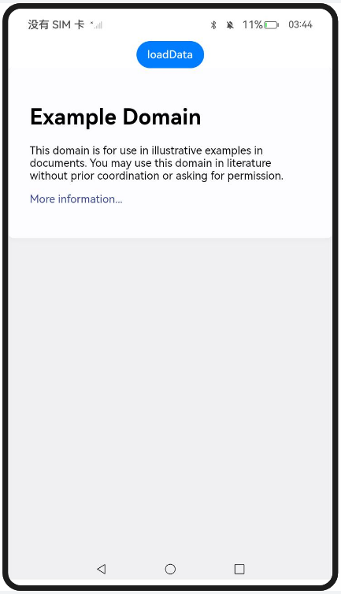
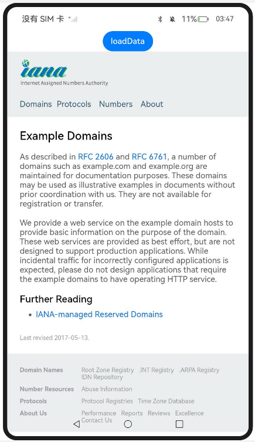
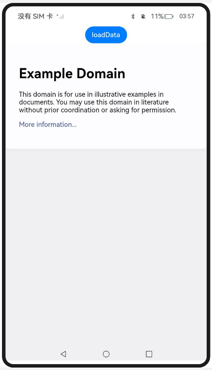
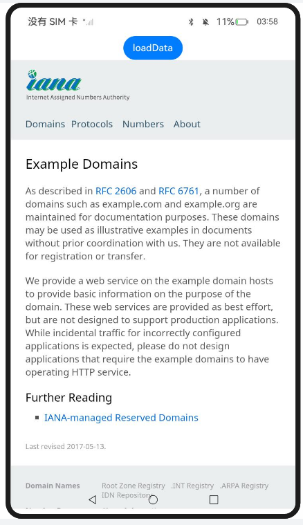
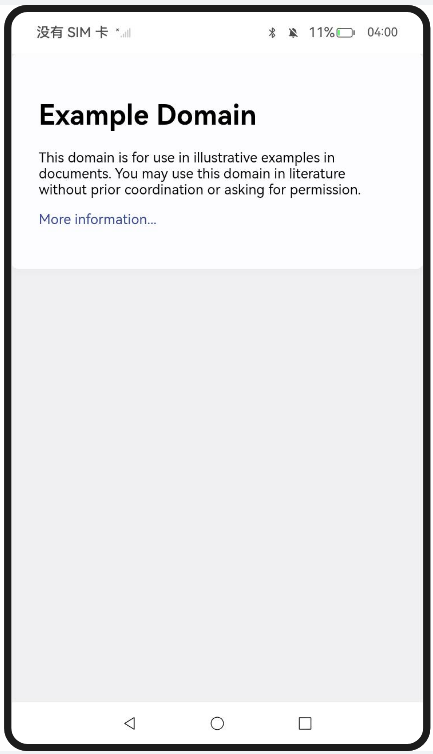

# 加速Web页面的访问

### 介绍

1. 本工程主要实现了对以下指南文档中 https://docs.openharmony.cn/pages/v5.0/zh-cn/application-dev/web/web-predictor.md 示例代码片段的工程化，主要目标是实现指南中示例代码需要与sample工程文件同源。

### Entry:

#### PrepareForPageLoad_one

##### 介绍

1. 本示例主要介绍加速Web页面的访问，可以通过prepareForPageLoad()来预解析或者预连接将要加载的页面。

##### 效果预览

| 主页                                                         | loadDate                                                     |
| ------------------------------------------------------------ | ------------------------------------------------------------ |
|  |  |

使用说明

1. 在Web组件的onAppear中对要加载的页面进行预连接。
1. 点击超链接跳转下一界面。
1. 点击loadData按钮返回上个界面。

### Entry1:

#### PrepareForPageLoad_two

##### 介绍

1. 本示例主要介绍加速Web页面的访问，可以通过initializeBrowserEngine()来提前初始化内核，然后在初始化内核后调用 prepareForPageLoad()对即将要加载的页面进行预解析、预连接。
##### 效果预览

| 主页                                                         | loadDate                                                     |
| ------------------------------------------------------------ | ------------------------------------------------------------ |
|  |  |

使用说明

1. Ability的onCreate中提前初始化Web内核并对首页进行预连接。

### Entry2:

#### Prefetching

##### 介绍

1. 本示例主要介绍加速Web页面的访问，如果能够预测到Web组件将要加载的页面或者即将要跳转的页面，可以通过prefetchPage()来预加载即将要加载页面。

##### 效果预览

| 主页                                                     |
| -------------------------------------------------------- |
|  |

使用说明

1. 在onPageEnd的时候触发下一个要访问的页面的预加载。

#### PrefetchingAPOSTRequest_one

##### 介绍

1. 本示例主要介绍加速Web页面的访问，通过prefetchResource()预获取将要加载页面中的post请求。在页面加载结束时，可以通过clearPrefetchedResource()清除后续不再使用的预获取资源缓存。

##### 效果预览

| 主页                                                         |
| ------------------------------------------------------------ |
|  |

使用说明

1. 对要加载页面中的post请求进行预获取。在onPageEnd中，可以清除预获取的post请求缓存。

#### PrefetchingAPOSTRequest_two

##### 介绍

1. 本示例主要介绍加速Web页面的访问，如果能够预测到Web组件将要加载页面或者即将要跳转页面中的post请求。可以通过prefetchResource()预获取即将要加载页面的post请求。

##### 效果预览

| 主页                                                         |
| ------------------------------------------------------------ |
|  |

使用说明

1. 在onPageEnd中，触发预获取一个要访问页面的post请求。

#### PrefetchingAPOSTRequest_three

##### 介绍

1. 本示例主要介绍加速Web页面的访问，通过initializeBrowserEngine()提前初始化内核，然后在初始化内核后调用prefetchResource()预获取将要加载页面中的post请求。这种方式适合提前预获取首页的post请求。

##### 效果预览

| 主页                                                         |
| ------------------------------------------------------------ |
|  |

使用说明

1. 在Ability的onCreate中，提前初始化Web内核并预获取首页的post请求。

### Entry3:

#### PrecompForCompCache

##### 介绍

1. 本示例主要介绍加速Web页面的访问，通过precompileJavaScript()在页面加载前提前生成脚本文件的编译缓存。

##### 效果预览

| 主页                                                         | 加载页面                                                     |
| ------------------------------------------------------------ | ------------------------------------------------------------ |
|  |  |

使用说明

1. 应用启动时EntryAbility将UIContext存到localstorage，初始化预编译Web组件生成编译缓存。
2. 点击加载页面按钮，创建businessNode，加载业务用Web组件展示business.html页面，此时会使用之前生成的编译缓存。

### Entry4:

#### InjOffResNoInt

##### 介绍

1. 本示例主要介绍加速Web页面的访问，可以通过injectOfflineResources()在页面加载前提前将图片、样式表或脚本资源注入到应用的内存缓存中。

##### 效果预览

| 主页                                                         | 加载页面                                                     |
| ------------------------------------------------------------ | ------------------------------------------------------------ |
|  |  |

使用说明

1. 进入Index.ets页面自动触发aboutToAppear方法。
2. 点击加载页面按钮创建businessNode，加载业务用Web组件，展示business.html页面。

### 工程目录

```
entry/src/main/
|---ets
|---|---entryability
|---|---|---EntryAbility.ets
|---|---pages
|---|---|---Index.ets						// 首页
|---resources								// 静态资源
|---ohosTest
|---|---ets
|---|---|---tests
|---|---|---|---Ability.test.ets            // 自动化测试用例

entry1/src/main/
|---ets
|---|---entryability
|---|---|---EntryAbility.ets
|---|---pages
|---|---|---Index.ets						// 首页
|---resources								// 静态资源
|---ohosTest
|---|---ets
|---|---|---tests
|---|---|---|---Ability.test.ets            // 自动化测试用例

entry2/src/main/
|---ets
|---|---entryability
|---|---|---EntryAbility.ets
|---|---pages
|---|---|---Index.ets						// 首页
|---|---|---Prefetching.ets
|---|---|---PrefetchingAPOSTRequest_one.ets
|---|---|---PrefetchingAPOSTRequest_three.ets
|---|---|---PrefetchingAPOSTRequest_two.ets
|---resources								// 静态资源
|---ohosTest
|---|---ets
|---|---|---tests
|---|---|---|---Ability.test.ets            // 自动化测试用例

entry3/src/main/
|---ets
|---|---entryability
|---|---|---EntryAbility.ets
|---|---pages
|---|---|---BusinessWebview.ets
|---|---|---DynamicComponent.ets
|---|---|---Index.ets						// 首页
|---|---|---PrecompileConfig.ets
|---|---|---Precompile Webview.ets
|---resources								// 静态资源
|---ohosTest
|---|---ets
|---|---|---tests
|---|---|---|---Ability.test.ets            // 自动化测试用例

entry4/src/main/
|---ets
|---|---entryability
|---|---|---EntryAbility.ets
|---|---pages
|---|---|---BusinessWebview.ets
|---|---|---DynamicComponent.ets
|---|---|---Index.ets						// 首页
|---|---|---Inject Webview.ets
|---|---|---Resource.ets
|---resources								// 静态资源
|---ohosTest
|---|---ets
|---|---|---tests
|---|---|---|---Ability.test.ets            // 自动化测试用例
```


### 相关权限

[ohos.permission.INTERNET](https://docs.openharmony.cn/pages/v5.0/zh-cn/application-dev/security/AccessToken/permissions-for-all.md#ohospermissioninternet)

### 依赖

不涉及。

### 约束与限制

1. 本示例仅支持标准系统上运行，支持设备：RK3568。
2. 本示例支持API14版本SDK，SDK版本号(API Version 14 Release)。
3. 本示例需要使用DevEco Studio 版本号(5.0.1Release)才可编译运行。

### 下载

如需单独下载本工程，执行如下命令：

```
git init
git config core.sparsecheckout true
echo code/DocsSample/ArkWeb/ManageWebPageLoadBrowse/AcceleratePageAccess > .git/info/sparse-checkout
git remote add origin https://gitee.com/openharmony/applications_app_samples.git
git pull origin master
```