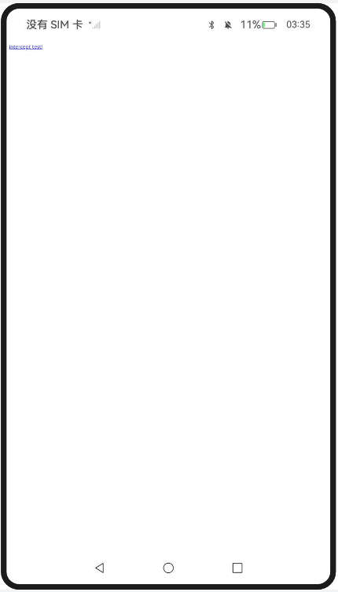
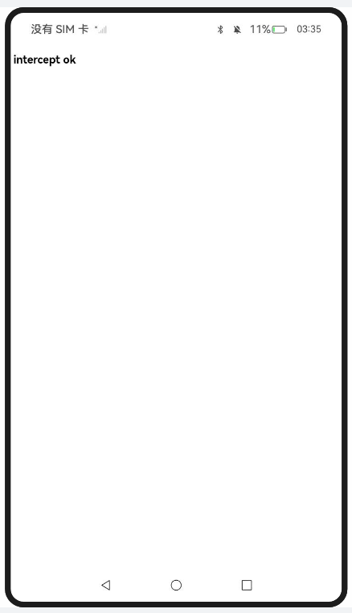
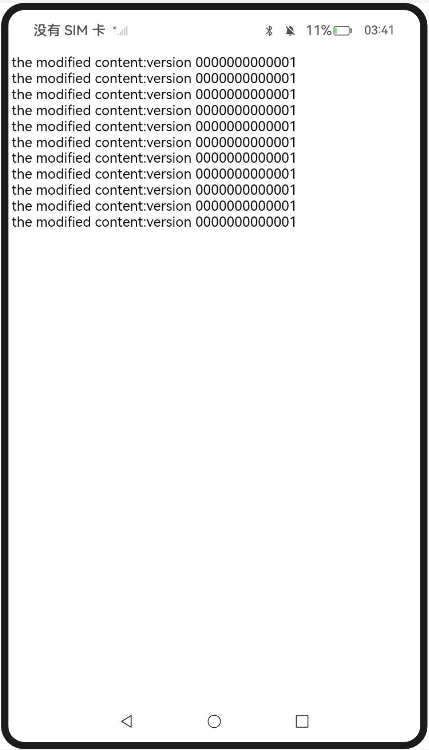

# 自定义页面请求响应

### 介绍

1. 本工程主要实现了对以下指南文档中 https://docs.openharmony.cn/pages/v5.0/zh-cn/application-dev/web/web-resource-interception-request-mgmt.md 示例代码片段的工程化，主要目标是实现指南中示例代码需要与sample工程文件同源。

### OnInterceptRequest_one

#### 介绍

1. 本示例主要介绍自定义页面请求响应，Web网页上发起资源加载请求，应用层收到资源请求消息。应用层构造本地资源响应消息发送给Web内核。Web内核解析应用层响应信息，根据此响应信息进行页面资源加载。

#### 效果预览

| 主页                                                         |                                                              |
| ------------------------------------------------------------ | ------------------------------------------------------------ |
|  |  |

使用说明

1. 通过拦截页面请求，在应用侧代码构建响应资源，实现自定义页面响应场景。

### OnInterceptRequest_two

#### 介绍

1. 本示例主要介绍自定义页面请求响应，Web组件通过拦截页面请求，应用侧代码构建响应资源，在响应头中添加“ResponseDataID”字段，开启生成CodeCache的功能。

#### 效果预览

| 主页                                                         |
| ------------------------------------------------------------ |
|  |

使用说明

1. 拦截页面请求，应用侧代码构建响应资源。

### 工程目录

```
entry/src/main/
|---ets
|---|---entryability
|---|---|---EntryAbility.ets
|---|---pages
|---|---|---Index.ets						// 首页
|---|---|---OnInterceptRequest_one
|---|---|---OnInterceptRequest_two
|---resources								// 静态资源
|---ohosTest
|---|---ets
|---|---|---tests
|---|---|---|---Ability.test.ets            // 自动化测试用例
```


### 相关权限

[ohos.permission.INTERNET](https://docs.openharmony.cn/pages/v5.0/zh-cn/application-dev/security/AccessToken/permissions-for-all.md#ohospermissioninternet)

### 依赖

不涉及。

### 约束与限制

1. 本示例仅支持标准系统上运行，支持设备：RK3568。
2. 本示例支持API14版本SDK，SDK版本号(API Version 14 Release)。
3. 本示例需要使用DevEco Studio 版本号(5.0.1Release)才可编译运行。

### 下载

如需单独下载本工程，执行如下命令：

```
git init
git config core.sparsecheckout true
echo code/DocsSample/ArkWeb/ManageWebPageLoadBrowse/CustomizePageResp > .git/info/sparse-checkout
git remote add origin https://gitee.com/openharmony/applications_app_samples.git
git pull origin master
```