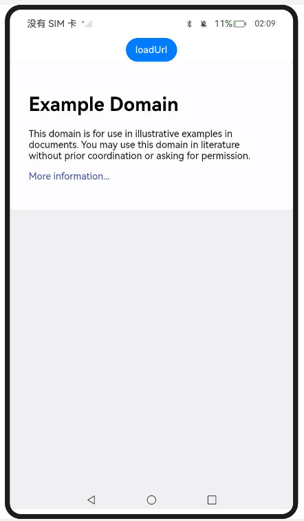
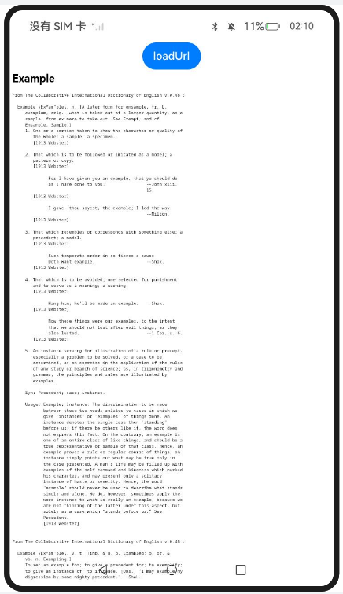
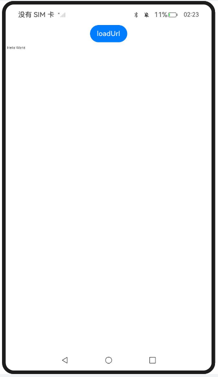
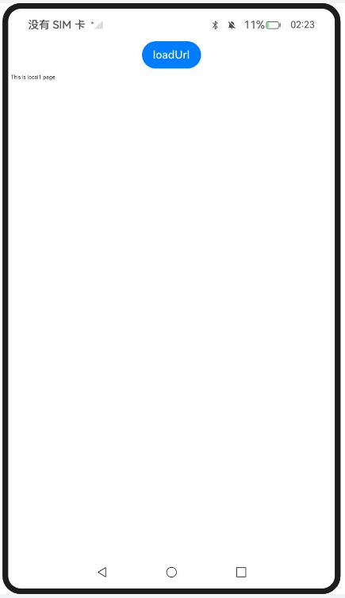
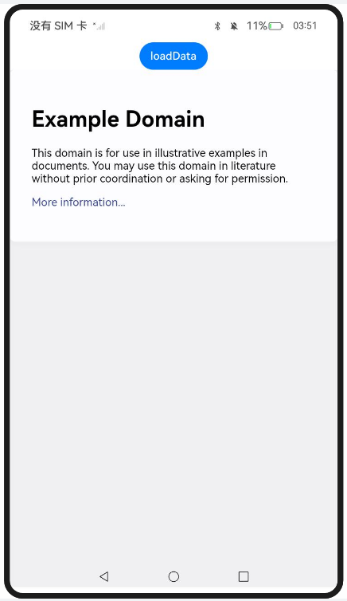
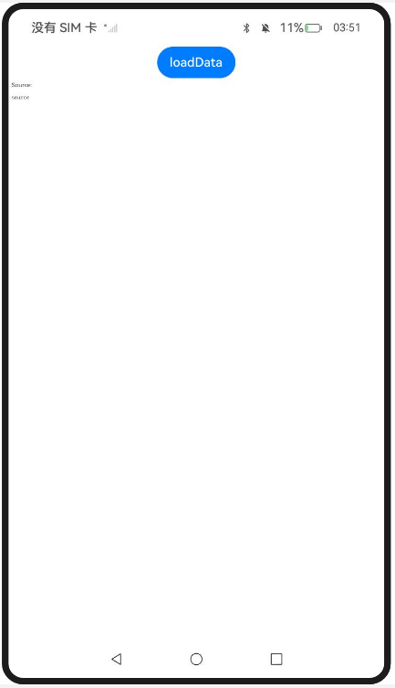
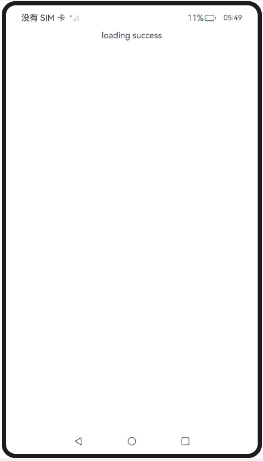
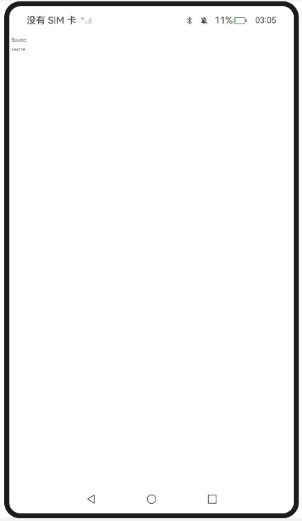

# 使用Web组件加载页面

### 介绍

1. 本工程主要实现了对以下指南文档中 https://docs.openharmony.cn/pages/v5.0/zh-cn/application-dev/web/web-page-loading-with-web-components.md 示例代码片段的工程化，主要目标是实现指南中示例代码需要与sample工程文件同源。

### LoadingWebPages

#### 介绍

1. 本示例主要介绍使用Web组件加载页面，开发者可以在Web组件创建时，指定默认加载的网络页面。在默认页面加载完成后，如果开发者需要变更此Web组件显示的网络页面，可以通过调用loadUrl()接口加载指定的网页。

#### 效果预览

| 主页                                                         | loadUrl                                                      |
| ------------------------------------------------------------ | ------------------------------------------------------------ |
|  |  |

使用说明

1. 点击loadUrl按钮加载指定的网页来变更此Web组件显示的网络页面。

### LoadingLocalPages

#### 介绍

1. 本示例主要介绍使用Web组件加载页面，将本地页面文件放在应用的rawfile目录下，开发者可以在Web组件创建的时候指定默认加载的本地页面 ，并且加载完成后可通过调用loadUrl()接口变更当前Web组件的页面。

#### 效果预览

| 主页                                                         | loadUrl                                                      |
| ------------------------------------------------------------ | ------------------------------------------------------------ |
|  |  |

使用说明

1. 点击loadUrl按钮来变更当前Web组件的页面。

### LoadingHTMLRichTextData

#### 介绍

1. 本示例主要介绍使用Web组件加载页面，Web组件可以通过loadData()接口实现加载HTML格式的文本数据。

#### 效果预览

| 主页                                                         | loadData                                                     |
| ------------------------------------------------------------ | ------------------------------------------------------------ |
|  |  |

使用说明

1. 点击loadUrl按钮加载HTML格式的文本数据。

### LoadLocalPageFileInSandboxPath_one

#### 介绍

1. 本示例主要介绍使用Web组件加载页面，通过构造的单例对象GlobalContext获取沙箱路径，加载沙箱路径下的本地页面文件，需要开启应用中文件系统的访问fileAccess权限。

#### 效果预览

| 主页                                                         |
| ------------------------------------------------------------ |
|  |

使用说明

1. 通过构造的单例对象GlobalContext获取沙箱路径，加载沙箱路径下的本地页面文件。

### LoadLocalPageFileInSandboxPath_two

#### 介绍

1. 本示例主要介绍使用Web组件加载页面，Web组件可以通过data url方式直接加载HTML字符串。

#### 效果预览

| 主页                                                         |
| ------------------------------------------------------------ |
|  |

使用说明

1. 通过data url方式直接加载HTML字符串。

### 工程目录

```
entry/src/main/
|---ets
|---|---entryability
|---|---|---EntryAbility.ets
|---|---pages
|---|---|---GlobalContext.ets
|---|---|---Index.ets						// 首页
|---|---|---LoadingHTMLRichTextData.ets
|---|---|---Loading LocalPages.ets
|---|---|---Loading WebPages.ets
|---|---|---Load LocalPageFileInSandboxPath_one.ets
|---|---|---Load LocalPageFileInSandboxPath_two.ets
|---resources								// 静态资源
|---ohosTest
|---|---ets
|---|---|---tests
|---|---|---|---Ability.test.ets            // 自动化测试用例
```


### 相关权限

[ohos.permission.INTERNET](https://docs.openharmony.cn/pages/v5.0/zh-cn/application-dev/security/AccessToken/permissions-for-all.md#ohospermissioninternet)

### 依赖

不涉及。

### 约束与限制

1. 本示例仅支持标准系统上运行，支持设备：RK3568。
2. 本示例支持API14版本SDK，SDK版本号(API Version 14 Release)。
3. 本示例需要使用DevEco Studio 版本号(5.0.1Release)才可编译运行。

### 下载

如需单独下载本工程，执行如下命令：

```
git init
git config core.sparsecheckout true
echo code/DocsSample/ArkWeb/ManageWebPageLoadBrowse/LoadPages > .git/info/sparse-checkout
git remote add origin https://gitee.com/openharmony/applications_app_samples.git
git pull origin master
```